## 1、android studio 

- hot reload 功能, 快捷键  `command + \`

- hot restart功能, 快捷键  `shift + command + \` 

- 创建StatelessWidget 类, 快捷键 `stless` 后回车

- 创建StatefulWidget 类, 快捷键 `stful` 后回车

- 在android Studio 中, 如果你想要快速给已经编写好的widget包裹一个其它的Widget 的话可以使用快捷键 windows:(`alt + enter`), Mac:(`option + enter`)

- 在flutter中查找, 抽象类具体的子类: `option` + `command` + `b` 

- 将StatelessWidget 转换为StatefulWidget的快捷键: `option` + `enter` 	

  > 我们可以发现, 给一个Widget 包裹一个Container 的快捷键 和 将一个StatelessWidget 转换为StatefulWidget的快捷键 也是`option` + `enter` ,  也就是说, 在 android Studio 中, 相同的快捷键作用在不同的地方(代码上)效果是不同的, 这个需要注意一下.

- 关闭当前 激活的文件页面, 快捷键: `command` + `w`

- 格式化快捷键 `command` + `option` + `L` 

- 快速折叠所有代码,快捷键: `command` + `shift`+ `-` 

- 快速展开所有代码,快捷键: `command` + `shift`+ `+` 

- 快速折叠 当前段代码,快捷键: `command`  + `-` 

- 快速展开 当前段代码,快捷键: `command` + `+` 

- 上下挪动代码,快捷键 `option` + `shift` + `上下键` 

- 复制当前行代码快捷键 `command` + `d`

- 当前文件替换内容, 快捷键 `command` + `shift` + `R` 

- 将StateLessWidget 转为 StatefulWidget, 快捷键, `option`   + `enter` 

- 抽取一段代码为一个方法, 快捷键 `command` + `option` + `m` 

- 当有时我们在编写flutter代码的时候, 已经把Widget写出来的, 但是因为没有import报错, 但是我们这时却不知道怎么导入正确的文件, 这时快捷键 `option` + `enter` 就会有提示

- android studio 快速生成`getter` 、`setter` 、`toString` 、`构造方法` , 以及`==` 运算符重载方法等的快捷键: `command` + `n` 

  注意: 要先选中类再使用快捷键


## flutter 帮助网站

- 官方文档

  flutter.dev

- 中文网站

  flutter.cn
  
- flutter 中文网站

  flutterchina.club

- 查询flutter文档的网站

  https://api.flutter.dev 进入到网站后直接输入 类名搜索即可

- 查看第三方库安装方式

  https://pub.dev 然后搜索 第三方库名, 再选择 install

## 2、设置修改 android studio 快捷键

`android studio` -> `preferences` -> `keymap`  然后在搜索框 搜索对应的快捷键即可.

因为android studio 可以被用作很多语言的开发, 比如: java, kotlin, flutter 等, 因此很有可能同一个快捷键和其它语言冲突, 造成快捷键失效, 因此这时我们要学会解决 android studio 中快捷键冲突的问题.


我们可以通过选中 某一个快捷键, 然后再右键选择 `add keyboard shortcut` 添加一个快捷键, 然后在弹出的快捷键弹窗中看当前快捷键是否有冲突, 示例如下:


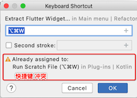  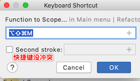 


# 一、Flutter介绍


## 1、Flutter是什么?

Flutter is Google's UI toolkit for building beautiful, natively compiled applications for mobile, web, and desktop from a single codebase.


**对上面话的总结**:

- Flutter 是一个UI SDK (Software Development Kit)

- 可以进行移动端(iOS、Android), web端(Beta), 桌面(techical preview), 跨平台解决方案. 

- 移动端目前已经很多公司在用,Google、阿里、腾讯

- 特别是阿里的咸鱼团队, 为Flutter做了很多的贡献

- Flutter它有一统大前端的野心, 并且它正在侵蚀iOS、Android 这些原生的开发.

  

## 2、Flutter 的特点

- Google 公司在国内做过很多宣讲, 其中多次提到Flutter的几个特点:
  - **美观**:
    - 使用flutter 内置的Material Design 和 Cupertino widget、丰富的motion API、平滑而自然的滑动效果和平台感知, 为用户带来全新体验. 
  - **快速**:
    - Flutter 的UI渲染性能很好, 在生产环境下, Flutter将代码编译成机器码执行, 并且充分利用GPU的图形加速能力, 因此使用Flutter开发的移动端应用, 即使在低配手机上也能实现每秒60帧的UI渲染能力. 
    - Flutter引擎使用C++代码编写, 包括高效的Skia 2D渲染引擎, Dart运行时和文本渲染库. 
  - **高校**:
    - Hot  Reload(热重载), 在前端已经不是什么新鲜的东西了, 但在移动端之前一直是没有的. 
  - **开放**:
    - Flutter 是开放的, 它是一个完全开源项目. 


## 3、跨平台解决方案历史

1、webView

2、ReactNative

3、Flutter

> flutter 出现到现在, 我个人一直非常的看好, 因为它有可能是很久依赖所期望的一种跨平台解决方案


**三种跨平台方案的对比**:

| 步骤\跨平台方案 | flutter on iOS/Android             | 原生Android                        | ReactNative                                     |
| --------------- | ---------------------------------- | ---------------------------------- | ----------------------------------------------- |
| 第一步          | 启动APP                            | 启动App                            | 启动App                                         |
| 第二步          | Flutter框架<br />(Dart)Skia(C/C++) | Android框架<br />(java)Skia(C/C++) | RN 框架<br />Android框架(java)<br />Skia(C/C++) |
| 第三步          | CPU/GPU                            | CPU/GPU                            | CPU/GPU                                         |


## 4、渲染引擎Skia

- Skia就是Flutter向GPU提供数据的途径
- Skia(全称 skia Graphics Library (SGL)), 是一个由C/C++ 编写的开源图形处理库. 
- 能在低端手机上呈现高质量的2D图形, 最初由Skia公司开发, 后来被Google 收购. 

- 应用于Android、Google Chrome、 Chrome OS 等当中
- 目前, Skia已然是 Android官方的图像渲染引擎了, 因此Flutter Android SDK 无需内嵌Skia 引擎就可以获得天然的Skia支撑
- 而对于iOS平台来说, 由于Skia是跨平台的, 因此它作为Flutter iOS渲染引擎被嵌入到Flutter的iOS SDK中, 替代了iOS闭源的Core Graphics/ CoreAnimation/CoreText, 这也正是Flutter iOS SDK打包的App 体积比Android要大一些的原因. 
- 底层渲染能力统一了, 上层开发接口和功能体验也就随即统一了, 开发者再也不用操心平台相关的渲染特性了. 也就是说, Skia保证了同一套代码调用在Android 和iOS平台上的渲染效果是完全一致的. 

  


# 二、flutter 环境搭建


环境搭建流程:

1、执行命令` flutter create helloFlutter` 创建flutter项目.

2、搭建flutter的环境的前提条件是下载 **Flutter SDK** , 如果是苹果电脑就下载 **MacOS 的Flutter SDK**, 如果是windows 电脑就下载 **windows Flutter SDK** .

3、Flutter SDK 下载完成后是一个压缩包, 下载完成后需要解压.

4、配置Flutter环境变量

5、配置Dart环境变量


> 环境搭建有点麻烦, 特别是android 环境的安装, 大家要耐心安装

## 1、操作系统的选择

- 学习阶段:
  - windows 和 macOS 都可以
- 开发阶段:
  - 一般使用macOS, 因为我们需要针对iOS进行调试, 通常方便起见使用macOS. 


## 2、安装 Flutter SDK 

- **Flutter SDK 下载地址 **

  - https://flutter.dev/docs/development/tools/sdk/releases

    - mac: https://flutter.dev/docs/development/tools/sdk/releases?tab=macos

  - 选择自己的操作系统和最新的稳定版本就可以了(stable 版本) 

  - 一般我的做法是下载完成解压后将`flutter` 目录直接拖进`/Users/edz/Library/`  目录中(即, 当前用户下的资源库).  

- **安装Flutter** 

  解压下载好的Flutter SDK, 在Windows 和macOS 都是一样的(选择一个自己想要安装的目录即可), 但是在macOS中, 我们通常会将flutter拖入到当前用户的资源库路径中`/Users/edz/Library`  (这是我的做法, 你也可以选择其它地址)

- **环境变量配置**(flutter 和 dart)

  - **macOS 环境变量配置**

    因为我们之后需要在命令终端执行Flutter的命令, 所以需要配置环境变量.macOS 或 linux环境需要编辑(`~/.bash_profile` 文件) 
  
    ```
    export FLUTTER_HOME=/Users/edz/Library/flutter
    export PATH=$PATH:$FLUTTER_HOME/bin
    export PATH=$PATH:$FLUTTER_HOME/bin/cache/dart-sdk/bin
    ```
  
    > 注意:
    >
    > 因为macOS 10.15.4 之后命令终端默认不在使用bash, 而是使用的是zsh, 在zsh 中配置环境变量和bash中是不一样了的.`zsh` 需要在`~/.zshrc` 文件中配置. zsh 中的`.zshrc` 文件与bash中的`.bash_profile` 文件功能与配置方式都一样, 只是文件名不同. 
    >
    > 新版的MacOS 操作系统和旧版的MacOS 使用的 shell 不同, 可能配置环境变量的方式有差异, 百度一下即可.

  - **Window 环境变量配置**
  
    点击计算机图标 -- 属性 -- 高级系统设置 -- 高级 -- 环境变量,找到path, 在其中添加Flutter SDK目录下bin目录以及Dart的目录
  
  - **检查Flutter配置成功** 
  
    在终端执行`flutter --version` , 出现如下内容, 说明安装flutter 成功.
  
    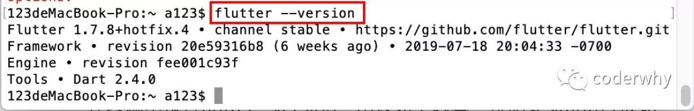 
  
    

## 3、配置镜像

- flutter 项目会依赖一些东西, 在国内下载这些依赖会有一些慢, 所以我们可以将它的安装源换成国内的(也就是设置国内的镜像)

  - **macOS 或者Linux操作系统, 依然是编辑`~/.bash_profile` 文件** 

    ```
    export PUB_HOSTED_URL=https://pub.flutter-io.cn
    export FLUTTER_STORAGE_BASE_URL=https://storage.flutter-io.cn 
    ```

  - **windows用户还是需要修改环境变量** 

    点击计算机图标 -- 属性 -- 高级系统设置 -- 高级 -- 环境变量

    新建变量 `PUB_HOSTED_URL`, 其值为`https://pub.flutter-io.cn`

    新建变量 `FLUTTER_STORAGE_BASE_URL`, 其值为`https://storage.flutter-io.cn` 
    
  
  > 注意: 
  >
  > 此镜像是临时镜像, 并不能保证一直可用, 大家可以参考**Using Flutter in China** 以获取有关镜像服务器的最新动态. 
  
  

## 4、配置iOS环境

如果想为Flutter 配置iOS开发环境, 需要在我们的电脑上安装Xcode( macOS环境), Xcode 安装完成后选择自己想用的iOS模拟器.

打开Xcode -> 左上角点击Xcode -> open Developer Tools -> Simulator

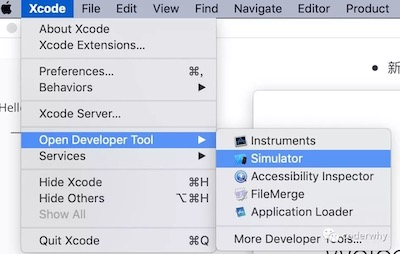 

这个时候会打开一个默认的iOS 模拟器, 也可以在Hardware -> Device ->系统版本中选择自己想要的测试的模拟器

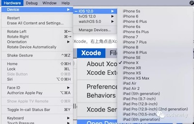 

iOS 模拟器打开后我们就能看到下面的界面了

  

这时,我们执行如下命令:

```
flutter doctor
```

会看到如下信息:

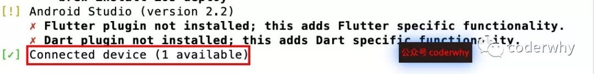 


## 5、配置Android环境

如果想为Flutter配置Adroid开发环境, 需要在我们的电脑上安装一个Android Studio. Android Studio 是Google 官方的android 应用开发工具.

- **Android Studio 的下载&安装 ** 

  官网地址: https://developer.android.com/studio/?utm_source=android-studio

  下载完成后, 双击即可.  具体安装流程百度一下.

- **创建Adroid 模拟器: ** 

  安装好后, 我们就可以去创建模拟器:

  选择 `Configure -> AVD Manager`

  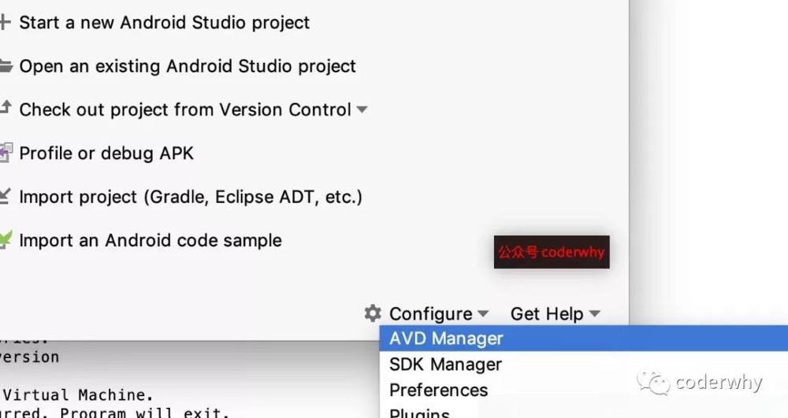 

   

  **选择create virtual device** 

   

  

  **选择一个你想用的设备** 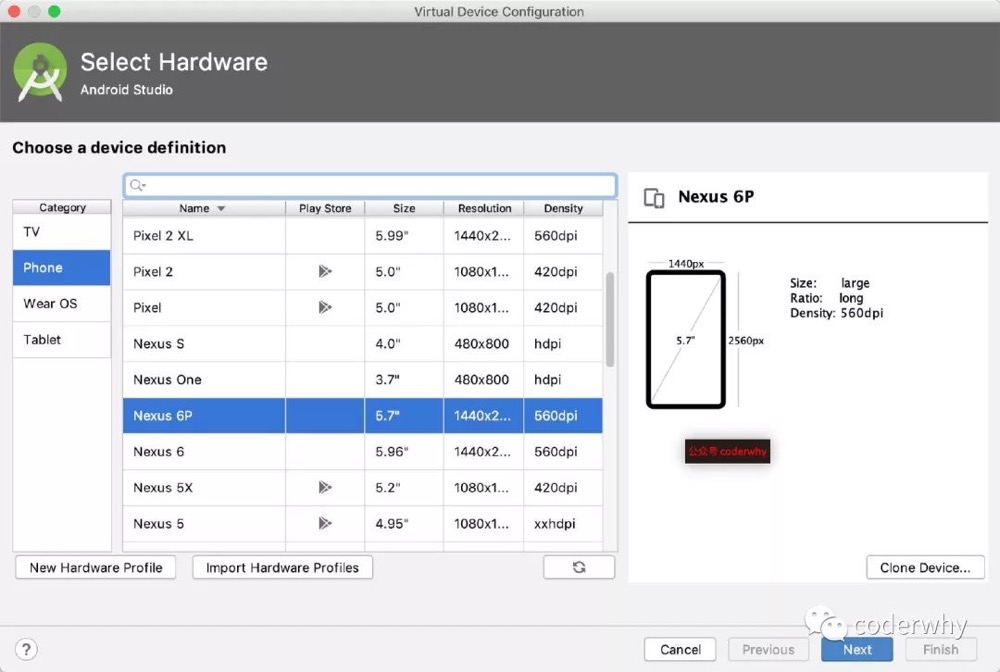   

  **选择Android的版本** (一般现在主要兼容5.0以上, 目前最新的是10.0系统), 点击 download.

  

  下一个界面, 点解`accept next` 就可以了

  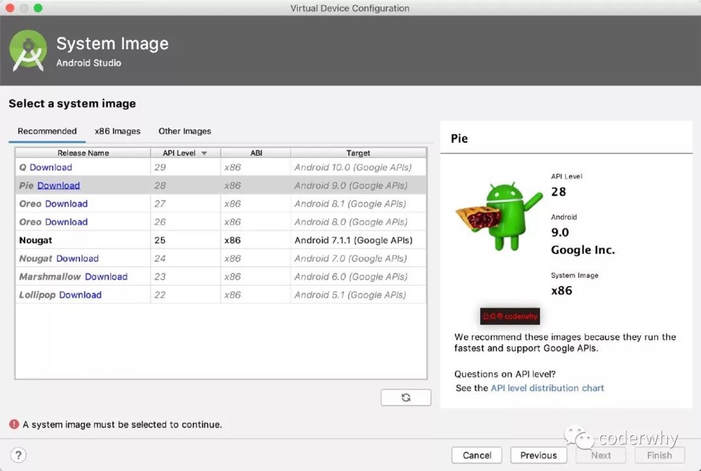 

  

  **接着下一步, 给自己的模拟器起一个名字** 

   

  

  **启动Android 模拟器** 
  
  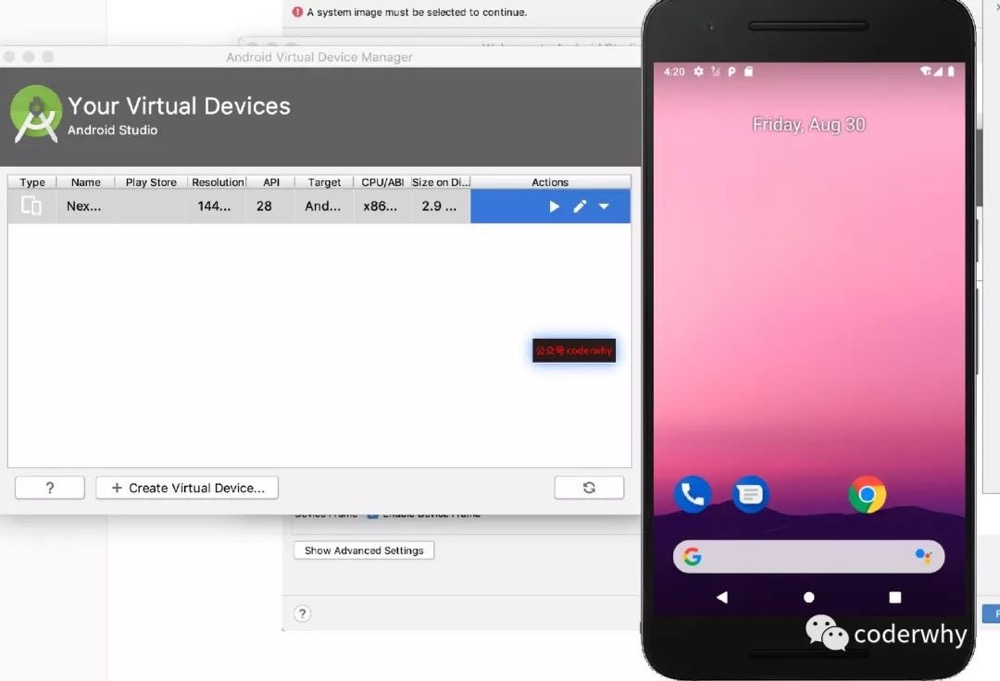 

  

  这个时候, 我们执行一下如下命令;

  ```
  flutter doctor
  ```
  
  看到如下有两个可用的设备
  
  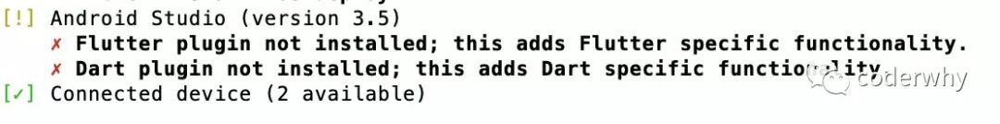 
  
  

## 5、开发工具及插件选择

- 官方推荐两个工具来开发flutter, `Android Studio` 和 `VSCode` 
- **`VSCode` 的优缺点:**  
  - VSCode是非常流行的前端开发工具, 非常好用.  VSCode最近有取代webStorm 作为前端开发的工具的趋势. 
  
  - VSCode 其实并不能称之为一个IDE, 它只是一个编辑器而已. 所有它非常的轻量级, 不会占用你非常大的内存消耗. 电脑配置不高的首选.并且你可以通过安装很多插件来满足自己开发的需求.
  
  - VSCode 没有很多Android Studio 包括的方便操作, 
  
    比如: 点击启动, 热更新点击等. 而且在某些情况下会出一些问题, 比如:  之前在使用的过程中, 有时候热更新不及时常常看不到效果, 必须重启. 还有在某些情况下没有代码提示, 不够灵活. 
- **`Android Studio` 的优缺点:** 
  
  - 对于进行过Android开发或者使用过WebStorm、IDEA、PHPStorm等的同学, 使用Android 肯定没有问题.  Android Studio 是一个集成开发环境, 不用说, 你需要的功能基本都有. 在VSCode上出现的问题在Android Studio上基本不会出现.  它的一个最大的缺点就是**重** 会占用电脑比较大的资源, 启动也比较慢. 电脑配置不高的话可能出现卡顿. 

**不管是VSCode还是Android 我们在开发Flutter时, 都需要安装两个插件`Flutter` 和`Dart` ** 

- 在VSCode 中直接在Extension 中搜索 `Flutter` 和 `Dart` 安装对应的插件即可. 
- 在Android Studio 中选择`Android Studio` 菜单, 打开偏好设置 , 在选择`Plugins` , 然后搜索 `Dart`  和 `Flutter`  安装对应的插件即可 . 


## 6、创建flutter 工程

到此为止的话, 我们的flutter开发环境就算是搭建完成了.

- **检查flutter 和 Dart 是否有安装成功** 

  ```
  打开 终端, 执行命令:
  flutter --version   
  dart --version
  如果正常显示版本信息, 那么就算安装成功完毕了. 
  ```

  > 我们也可以执行命令:` flutter doctor` 看看我们那些环境是搭建好了哪些没好

- **创建flutter 工程** 

  ```
  cd 目录 
  flutter create helloflutter  // 创建flutter项目
  // 注意, 我们在创建flutter工程时, 名称里面不能有特殊符号和大写
  ```

  > flutter 工程项目创建完成 后, 在终端上会提示:

  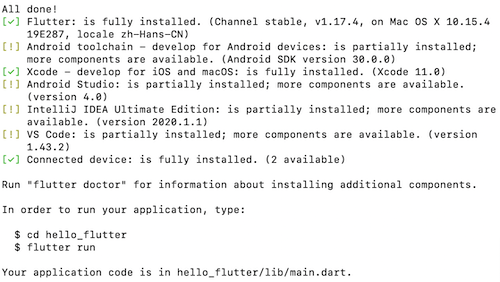 

  

- 使用命令终端选择模拟器打开flutter 项目, 将我们的flutter运行在指定的模拟器上

  - 这时我们直接`cd  helloflutter`   &&  `flutter run` 一般会报错 (如果没有模拟器的情况下), 执行完命令后我们就可以在模拟器上看到我们的程序已经运行起来了, 如下图:

      

- **使用android studio** 打开我们创建的flutter 项目

  - 选择打开已经存在的项目(选择刚才命令终端创建的hello-flutter目录即可)

  - 选择你要启动的设备, 点击 运行 按钮

    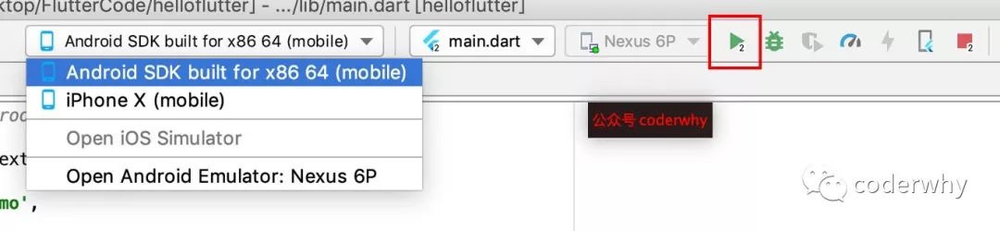 

  // 没完..

  


# 三、Flutter 之Dart介绍和安装

>  若干年后, 你会发现选错公司和选错行业的损失远比选错编程语言更大. 


## 1、认识Dart

Google为Flutter选择了Dart是既定的事实, 无论你多么的想使用你熟悉的语言, 比如: java, javaScript 等等来开发flutter, 至少目前是不可以的.


## 2、安装Dart

> 为什么还需要安装Dart呢?
>
> 事实上, 在安装Flutter SDK的时候, 它里面已经内置了Dart, 我们完全可以直接使用flutter去进行Dart的编写并且运行. 
>
> 但是如果你想单独的学习Dart, 并且运行自己的Dart代码, 最好去安装一个Dart SDK


### 1、下载Dart SDK

- 到Dart 的官网, 根据不同的操作系统下载对应的 Dart SDK 即可.

  > 官方网站: https://dart.dev/get-dart

  

### 2、安装Dart SDK

无论是什么操作系统, 安装方式都有2种:

- `通过工具安装`

- `直接下载 SDK, 配置环境变量`

- 通过工具安装

  - windows可以通过Chocolatey
  - macOS 可以通过homebrew

  > 具体的安装操作, 官方网站都有详细的解释

- 直接下载SDK, 配置环境变量

  - 下载地址: https://dart.dev/tools/sdk/archive
  - 我喜欢采用这种方式, 直接, 直观
  - 下载完成后, 将SDK的包放在你喜欢的地方, 根据路径配置环境变量即可.


## 3、VSCode 配置

### 1、VSCode 必要插件的安装

学习Dart 的过程中, 我使用 `VSCode` 作为编辑器

- 一方面编写代码非常的简单, 而且界面风格我也喜欢
- 另一方 面, 我可以在终端看到我编写代码的效果

使用VSCode编写Dart代码需要安装**Dart插件** , 目前我给这个VSCode装了4个插件

- **Dart插件**
- **Flutter插件**
- **Coder  Runner 插件** , 可以点击右上角的按钮让我快速运行代码
- **Atom One Dark Theme** 是我个人比较喜欢的一个主题

> Dart插件和Flutter 插件是为Flutter开发准备的, 是必须要安装的插件.
>
> Coder Runner插件让我们直接点击右上角的按钮即可快速的运行Dart代码, 否则的话我们每次都要使用命令 `dart  xxx.dart   参数1 参数2 ...` 来运行我们的dart 代码. 

 

### 2、VSCode 的使用介绍

Vscode是一个轻量的编译器，所以默认是通过打开文件夹的功能来打开对应的工程。而且下面会列举出最近打开的工程，方便打开用户打开最近打开的工程进行编辑和修改。


## 4、Hello World


接下来, 就可以步入正题了, 学习编程语言, 从祖传的hello world 开始. 

在VSCode 中新建一个`helloworld.dart`文件, 并编写下面的内容

```
main(List<String> args){
	print('hello world');
}
```

然后在终端执行`dart helloworld.dart`  命令, 就能看到 hello world 的结果了.


### 1、Hello world 程序的分析

1、Dart 语言的入口也是main函数, 并且必须显示的进行定义

2、Dart 的入口函数main是没有返回值的.

3、传递给 main函数的命令行参数是通过` List<String>` 完成的

- 从字面 值可以理解 `List` 是Dart 中的集合类型.
- 其中的每一个`String`都表示传递给main的一个参数

4、在Dart 中, 我们定义字符串可以使用单引号, 也可以使用双引号.

> 其实在Dart 中一种有三种方式可以定义字符串, 还有一种 是使用 `""" """` 3个双引号, 使用3个双引号定义的字符串就可以换行多行书写, 这是单引号和双引号不具备的特点.

5、在Dart 中语句使用分号`;` 结尾,  有很多语言在语句结尾处并不需要分号`;` 比如: swift 和 javaScript , 但是在Dart 中语句结束需要使用`;` 结尾.


# 四、Dart 之变量,数据类型, 函数

## 1、定义变量

### 1、明确声明 (Explicit)

明确声明变量的方式如下: 

```
变量类型 变量名 = 赋值;
```

示例代码:

```
String name = 'zhangsan';
int age = 18;
double height = 1.88;
print(name);
print(age);
print(height);
```

> 注意: 
>
> 定义的变量可以修改值, 但是不能赋值其它类型

```
String content = 'hello dart';
content = 'hello world';
content = 111; // 错误, 将一个int 赋值给String 类型的变量是不允许的
```


### 2、类型推到 (type inference)

类型推到生命变量的方式, 格式如下:

```
var/ dynamic/ const/ final 变量名 = 赋值;
```


#### 1、var 的使用

var 的使用, 示例如下:

- runtimeType 是系统提供的,用于获取变量当前类型

```
var name = 'zhangsan';
print(name.runtimeType); // String
```

> java中获取类的名字:
>
> Person person = new Person();
>
> System.out.println(person.getClass().getName());


var 的错误用法

```
var age = 18; 
age = 'zhangsan'; // var 定义的变量一旦赋值, 变量的类型就确定了
```


#### 2、dynamic 的使用

如果确实希望这样做, 可以使用 dynamic 来声明变量:

- 但在开发中, 通常情况下不使用 dynamic, 因为类型的变化会带来潜在的危险. 

  ```
  dynamic name = 'zhangsan'; 
  print(name.runtimeType);      // String 
  
  name = 18;
  print(name.runtimeType);      // int 
  ```


#### 3、final & const 的使用

final 和 const 都是用于定义常量的, 也就是定义之后值都不可以修改

```
final name = 'zhangsan';
name = 'wangwu';  // 错误

const age = 18;
age = 20;			// 错误

//final 和 const 修饰的都是常量, 赋初值后就不能在改了
```


**final 和 const** 定义的常量的相同点与区别

- 相同点:

  - final 和 const 定义的都是常量, 一旦赋值后就不能改了.

- 不同点:

  - **const 在定义常量时,  赋值的内容必须在编译期就定下来** 

  - final 在赋值时, 可以动态获取, 比如 赋值一个函数

    ```
    String getName() {
      return 'coderwhy';
    }
    
    main(List<String> args) {
      const myName2 = 'xiaohong'; // 错误
      final name2 = 'xiaofang';   // 错误
    
      // const myName1 = getName(); // 错误
      final name1 = getName();   // 正确, final 常量可以赋值函数
    } 
    ```


#### 4、final 和 const 小案例

- 首先, const定义的常量是不可以赋值为 DateTime.now() 的

- 其次, final一旦被赋值后就有确定的结果, 不会再次赋值

  ```
  // const time = DateTime.now(); 错误写法, const 只能赋值常量
  final time = DateTime.now();
  print(time);
  
  print('-----睡2秒--------');
  // 睡2秒
  sleep(Duration(seconds: 2));
  print(time);
   
   
  2020-06-22 14:17:43.601476
  -----睡2秒--------
  2020-06-22 14:17:43.601476
  ```

  

#### 5、const 放在赋值语句右边, 可以共享对象, 提高性能

```
class Person{
  const Person();
}

main(List<String> args) {
 
 final a = const Person();
 final b = const Person();
 print(identical(a,b)); //  identical 是用来判断两个 引用是否是同一个对象的
 

 final m = Person();
 final n = Person();
 print(identical(m,n)); 
}
```


## 2、数据类型

### 1、数字类型 

#### 1、Dart 中的数字类型(int 和 double)

在Dart 中, 对于数值来说, 我们不关心它是否有符号, 以及数据的宽度和精度等问题. 只要记着整数用`int` ,浮点数用`double` 就行了.  

不过, 要说明一下, 在Dart 中`int` 和 `double` 可以表示的范围不是固定的, 它取决于运行Dart 的平台. 

```
// 整形类型
int age = 18;
int myAge = 0x12;

// 浮点数类型
double height = 1.88;
```

> 补充:
>
> 1、在Dart 中 int 整数 和 double 浮点数 都是num 的子类. 
>
> 2、在Dart 中是不能直接将一个 整数 int 直接赋值给浮点数 double的, 也不能直接将一个 浮点数 double 直接赋值给 整数int的, 整数int 也是不能直接和浮点数参与运算的
>
> 3、但是在实际开发过程中, 如果我们不知道传入的是一个整数还是浮点数, 我们可以使用 num 来接收

```
int sum = 10.0 + 1; // 错误写法
num sum = 10.0 + 1; // 正确
```

#### 2、Dart 中字符串和数字之间的转换

```
// 1. 字符串 转 数字
var one = int.parse('111');
var two = double.parse('12.22');
print('${one}, ${one.runtimeType}');
print('${two}, ${two.runtimeType}');
```


```
// 2. 数字 转 字符串
main(List<String> args) {
 
var num1 = 123;
var num2 = 123.123;
var num1Str = num1.toString();
var num2Str = num2.toString();
var num1StrD = num1.toStringAsFixed(3); // 保留3位小数
var num2StrD = num2.toStringAsFixed(2); // 保留2位小数

print('${num1Str}, ${num1Str.runtimeType}');
print('${num2Str}, ${num2Str.runtimeType}');
print('${num1StrD}, ${num1StrD.runtimeType}');
print('${num2StrD}, ${num2StrD.runtimeType}');
} 

123, String
123.123, String
123.000, String
123.12, String
```


### 2、布尔类型

在Dart 中提供了一个布尔数据类型 bool, 取值为 true 和 false

```
// Dart 中的布尔数据类型
var flag = true;
print('${flag}, ${flag.runtimeType}');
```

> 注意:
>
> 在Dart 中, 布尔类型只有 true 和 false 两个取值, 没有非0即真, 非空即真的说法. 

```
var name = 'zhangsan';

// 错误做法
if(name){
	print(name);
}
```


### 3、字符串类型

#### 1、Dart 中的字符串

Dart中字符串是**UTF-16** 编码的单元序列. 你可以使用单引号或者双引号创建一个字符串(单行字符串). 你也可以使用三个单引号或者三个双引号表示一个多行字符串.

```
// 定义单行字符串 
var s1 = 'hello world';
var s2 = "hello world";
var s3 = 'hello\' world';
var s4 = "hello'world";
```

```
// 定义多行字符串
var msg = """
          今天的天气,
          真不错
          """;
```

#### 2、Dart中字符串和其它变量和表达式拼接

在Dart 中我们可以使用`${表达式或变量}` 这种方式将变量和表达式与字符串进行拼接, 示例如下:

```
var name = 'zhangsan';
var age = 18;
var height = 1.88;

print('name: ${name}, age: ${age}, height: ${height}');
// 等价, 如果表达式是一个单个标识符, 可以省略 {}
print('name: $name, age: $age, height: $height');
```


### 5、集合数据类型

对于集合数据类型, Dart 则内置了三种常用的数据类型: **List/ Map/ Set** , 其中, list 可以这样定义;

#### 1、List 

```
// 定义 List

// 1. 使用类型推导 定义
var letters = ['a', 'b', 'c', 'd'];
print('${letters}, ${letters.runtimeType}');

// 2. 明确指定类型 (泛型)
List<int> nums = [1, 2, 4];
print('${nums}, ${nums.runtimeType}');
```


#### 2、Set

在Dart 中我们可以使用`{}` 来定义Set, Set 和 List 的最大区别:

- Set 集合中的元素是无序的, 而 List 中的元素是有顺序的
- Set 集合中的元素是不重复的, 而List 中的元素是可以重复的

```
// 定义 Set

// 1. 使用类型推导 定义
var letterSet = {'a', 'b', 'c'};
print('${letterSet}, ${letterSet.runtimeType}');

// 2. 明确指定类型 泛型
Set<int> numSet = {1, 2, 3};
print('${numSet}, ${numSet.runtimeType}');
```


#### 3、Map

Map 就是我们常说的字典数据类型, 它的定义是这样的. 

```
// 定义 Map

// 1. 使用类型推导 定义
var infoMap = {'name':'zhangsan', 'age':18, 'height': 1.88};
print('${infoMap}, ${infoMap.runtimeType}');

// 2. 明确指定类型 泛型
Map<String, Object> infoMap2 =  {'name':'zhangsan', 'age':18, 'height': 1.88};
print('${infoMap2}, ${infoMap2.runtimeType}');
```


#### 4、集合的常见操作

了解了这三个集合的定义方式后, 我们来看一些集合最基础的公共操作

- 获取集合的长度

  > 所有的集合都支持获取长度

  ```
  var letters = ['a', 'b', 'c', 'd'];
  print('letters_lenght: ${letters.length}');
  
  var letterSet = {'a', 'b', 'c'};
  print('letterSet_length: ${letterSet.length}');
  
  var infoMap = {'name':'zhangsan', 'age':18, 'height': 1.88};
  print('infoMap_length: ${infoMap.length}');
  ```

- **List, Set**   添加/ 删除/ 包含 操作

  并且, 对于`List` 来说, 由于它的元素是有序的, 因此它还提供了删除指定索引位置的元素. 

  ```
  // 添加元素
  var letters = ['a', 'b', 'c'];
  letters.add('d');
  print('${letters}, ${letters.runtimeType}');
  
  var numSet = {1,2,3};
  numSet.add(5);
  print('${numSet}, ${numSet.runtimeType}');
  
  
  
  // 删除元素
  bool deleteLettersOk = letters.remove('a');
  print('${deleteLettersOk}, ${letters}, ${letters.runtimeType}');
  // list 删除指定元素后 会返回对应的元素
  print('被删除了:  ${letters.removeAt(0)}');
  
  bool deleteNumSetOk = numSet.remove(2);
  print('${deleteNumSetOk}, ${numSet}, ${numSet.runtimeType}');
  
  
  // 判断包含元素
  print(letters.contains('b'));
  print(numSet.contains(3));
  ```

- Map 的操作

  由于Map 中有 key 和 name, 因此无论是取值还是操作, 都要明确是基于key的, 还是基于value的, 或者是基于 key/value的. 

  ```
  // Map 的常见操作
  
  var infoMap = {'name': 'zhangsan', 'age':18, 'height': 1.88};
  
  // 1. 根据key 获取 value
  print(infoMap['name']); // zhangsan
  
  // 2. 获取所有的 entries
  print('${infoMap.entries}, ${infoMap.entries.runtimeType}');
  
  // 3. 获取所有的 keys
  print('${infoMap.keys}, ${infoMap.keys.runtimeType}');
  
  // 4. 获取所有的 values
  print('${infoMap.values}, ${infoMap.values.runtimeType}');
  
  // 5. 判断是否包含某个key 或者 value 
  print('${infoMap.containsKey('name')}, ${infoMap.containsValue('zhangsan')}');
  
  // 6. 根据key 删除元素,  会返回被删除的key 对应的value
  var deleteObj = infoMap.remove('name');
  print('删除的元素: ${deleteObj}');
  ```

  

## 3、函数

### 1、函数的基本定义

Dart 是一种真正的面向对象的语言, 所以即使函数也是对象, 所以函数也是有类型的, Dart 中函数的类型是**Function** 

这也就意味着, 函数可以作为变量定义 或者 作为其它函数的参数 或者 返回值. 

- 函数的定义方式

```
返回值  函数的名称(参数列表){
	函数体
	return 返回值
}
```

按照上面的定义方式, 我们定义一个完整的函数;

```
int sum(int num1, int num2){
	return num1 + num2;
}
```

> Effective Dart 建议对公共的API, 使用类型注解, 但是如果我们省略掉了类型, 依然可以正常工作的

```
sum(num1, num2){
	return num1 + num2;
}
```

另外, 如果函数中只有一个表达式, name可以使用箭头函数语法 (arrow syntax)

```
sum(num1, num2)=> num1+num2;
```


### 2、函数的参数问题 

> 在Dart 中函数的参数可以分为两类:  必须参数 和 可选参数

#### 1、可选参数

在Dart 中的可选参数有两种: **命名可选参数, 位置可选参数** , 命名可选参数使用 `{}` 扩起来, 位置可选参数使用`[]` 扩起来. 如下:

```
命名可选参数:{param1, param2,...}
位置可选参数:[param1, param2,...]
```

- 命名可选参数示例;

```
main(List<String> args) {

  printInfo('zhangsan');
  printInfo('zhangsan', age: 18);
  printInfo('zhangsan', height: 1.88);
  printInfo('zhangsan', age:16, height: 1.66);
  printInfo('zhangsan', height: 1.66, age:16);
} 
 

printInfo(String name, {int age, double height}){
  print('name: ${name}, age: ${age}, height: ${height}');
}

name: zhangsan, age: null, height: null
name: zhangsan, age: 18, height: null
name: zhangsan, age: null, height: 1.88
name: zhangsan, age: 16, height: 1.66
name: zhangsan, age: 16, height: 1.66
```

- **命名可选参数, 可以指定某个参数是必须传的(使用 @required)** 

  在dart 中是不能使用 @required 的, 只能在Flutter中使用.

- 位置可选参数示例

```
main(List<String> args) {

printInfo('zhangsan');
printInfo('zhangsan', 18); 
printInfo('zhangsan', 16, 1.66); 
} 
 

printInfo(String name, [int age, double height]){
  print('name: ${name}, age: ${age}, height: ${height}');
}

name: zhangsan, age: null, height: null
name: zhangsan, age: 18, height: null
name: zhangsan, age: 16, height: 1.66
```


#### 2、参数默认值

参数可以有默认值, 在不传入的情况下, 使用默认值

> 注意:
>
> 只有可选参数才可以有默认值, 必须参数不能有默认值

```
// 参数的默认值
printInfo(String name, {int age = 18, double height = 1.88}){
  print('name: ${name}, age: ${age}, height: ${height}');
}
```

Dart 中的main函数就是一个接收可选的列表参数作为参数的, 所以在使用 main 函数时, 我们可以传入参数也可以不传参数. 

#### 3、函数是一等公民

在很多语言中, 函数并不能作为一等公民来使用, 比如: java, 这种限制让编程不够灵活, 所以现代的编程语言基本都支持函数作为一等公民来使用, Dart 也支持. 

这就意味着你可以将函数赋值给一个变量, 也可以将函数作为另外一个函数的参数或者返回值来使用

```
main(List<String> args) {
  // 1.将函数赋值给一个变量
  var bar = foo;
  print(bar);

  // 2.将函数作为另一个函数的参数
  test(foo);

  // 3.将函数作为另一个函数的返回值
  var func =getFunc();
  func('kobe');
}

// 1.定义一个函数
foo(String name) {
  print('传入的name:$name');
}

// 2.将函数作为另外一个函数的参数
test(Function func) {
  func('coderwhy');
}

// 3.将函数作为另一个函数的返回值
getFunc() {
  return foo;
}
```


#### 4、匿名函数的使用

大部分我们定义的函数都会有自己的名字, 比如: 前面定义的 foo、test函数等. 

但是, 在某些情况下, 给函数命名太麻烦了, 我们可以使用没有名字的函数, 这种函数我们可以称为匿名函数(anonymous function), 也可以叫 lambda 或者 closure

```
main(List<String> args) {

 // 1.定义数组
  var movies = ['盗梦空间', '星际穿越', '少年派', '大话西游'];

  movies.forEach((item) { 
    print(item);
  });
 
}
```


#### 5、词法作用域

Dart 中的词法有自己明确的作用域范围, 他是根据代码的结构 `{}` 来 决定作用域范围的, 优先使用自己作用域中的变量, 如果没有找到, 则一层层向外查找. 

```
var name = 'global';
main(List<String> args) {
  // var name = 'main';
  void foo() {
    // var name = 'foo';
    print(name);
  }

  foo();
}
```


#### 6、词法闭包 !!!

闭包可以访问其词法范围内的变量, 即使函数在其他地方被使用, 也可以正常访问. 

```
main(List<String> args) {

 makeAdder(num addBy) {
    return (num i) {
      return i + addBy;
    };
  } 

  var adder2 =makeAdder(2);  // 此处相当于 adder2(num a){ return 2 + a; }
  print(adder2(2));  // 结果为 4
 
}
```


### 3、函数的返回值问题

所有函数都返回一个值, 如果没有指定返回值, 则语句返回 null, 隐士附加到函数体.

```
main(List<String> args) { 
  print(test());  // 返回值为 null
  print(test2()); // 返回值为 2
}

test(){
  print('---test');
}

test2(){
  print('---test2');
  return 2;
}
```


# 五、Dart 之运算符、流程控制、类、对象


## 1、常用的运算符

> 这里, 我只列出相对于其他语言比较特殊的运算符, 因为某些运算符太简单了, 比如: + , - , +=, -=.
>
> 在Dart 中相较于其他编程语言, 新增了一些特殊的运算符,  之所以新增了一些运算符这都是为了我们在后续实际开发过程中方便. 


### 1、除法、整除、取模运算

```
var num = 7;
print(num / 3); 	// 除法操作, 结果2.3333..
print(num ~/ 3); 	// 整除操作, 结果2;
print(num % 3); 	// 取模操作, 结果1;
```


### 2、??= 赋值操作

Dart 有一个很多语言都不具备的赋值运算符

- 当变量为 null 时, 使用 ??= 后面的内容进行赋值
- 当变量有值时, 使用自己原来的值, ??= 后面相当于无效(不执行)

```
main(List<String> args) { 
  int age = 12;
  age ??= myAge();  // 如果age 为null时, 会将 myAge() 的结果赋值给 age 
  print(age); 
}

myAge(){
  print('---查询我的年龄---');
  return 2;
}
```


### 3、条件运算符 ?? 

Dart 中包含一直比较特殊的条件运算符: **expr1 ?? Expr2** 

- 如果expr1 是null , 则返回 expr2的结果.

- 如果 expr1 不是null, 则直接使用 expr1的结果

  ```
  var name = "zhangsan";
  var userName = name ?? "无名氏";
  ```


### 4、级联语法 .. 

- 某些时候, 我们希望对一个对象进行连续的操作, 这个时候可以使用级联语法

  ```
  class Person {
    String name;
  
    void run() {
      print("${name} is running");
    }
  
    void eat() {
      print("${name} is eating");
    }
  
    void swim() {
      print("${name} is swimming");
    }
  }
  
  main(List<String> args) {
    final p1 = Person();
    p1.name = 'zhangsan';
    p1.run();
    p1.eat();
    p1.swim();
  
  	// 下面的操作与上面的操作等价
    final p2 = Person()
                ..name = 'zhangsan';
                ..run()
                ..eat()
                ..swim();
  }
  ```


## 2、流程控制

> Dart 中的流程控制和其他语言中的流程控制差不多, 了解下就好

### 1、if 和 else

Dart 中的 if 和 else 的使用方法和其他语言中的if 和 else 是一样的, 唯一的区别是, 在Dart 中没有非空即真, 非0即真的说法, 必须是明确的 布尔类型 bool

```
var name = 'zhangsan';
if(name){ // 错误写法, () 必须是明确的 布尔类型
	print(name);
}

if(name.length > 0){ // 正确做法
	print(name);
}
```


### 2、循环操作

- 基本的for 循环

  ```
  for(var i = 0; i < 10; i++){
  	print(i);
  }
  ```

- for in 遍历List 和 Set 类型

  ```
  var names = ['zhangsan', 'lisi', 'wangwu'];
  for(var name in names){
  	print(name);
  }
  ```

- while 和 do while 和其他语言也是一样的

- break 和 continue 的用法也是一样的

### 3、switch  case

- 普通 switch 使用

  > 注意:
  >
  > 每一个case语句, 默认情况下必须以一个break结尾

  ```
  main(List<String> args){
  	var direction = 'east';
  	switch(direction){
  		case 'east':{
  			print('东');
  		}break;
  		
  		case 'south':{
  			print('南');
  		}break;
  		
  		case 'west':{
  			print('西);
  		}break;
  		
  		case 'north':{
  			print('北');
  		}break;
  		
  		default:{
  			print('其它方向');
  		}
  	}
  }
  ```

## 3、类和对象

> Dart 是一个面向对象的语言, 面向对象中非常重要的概念就是类, 类产生了对象. 
>
> 这一节, 我们就来具体学习类和对象, Dart中类的类有很多其它语言没有的特性, 所以这里我们会花比较长的篇幅来讲解. 

### 1、类的定义

在Dart 中, 定义类使用关键字 **class** 

类通常有两部分组成: 成员(member) 和 方法(method).

定义类的伪代码如下:

```
class 类名{
	类型 成员名;
	
	返回值类型 方法名(参数列表){
		方法体
	}
}
```


### 2、方法内访问属性时, this关键字可以省略

- 编写一个简单的Person类

  ```
  class Person{
  	String name;
  	
  	eat(){
  		print('${name} 在吃东西');
  	}
  }
  ```

  > 注意:
  >
  > 1、我们在方法中使用属性(成员/ 实例变量)时, 并没有 加 this 关键字.
  >
  > 2、在Dart 的开发风格中, 在方法内使用属性时 会 省略 this, 但是当有命名冲突时 this 关键字 不能省略.

### 3、创建实例对象时, new 关键字可以省略

```
main(List<String> args){
	// 1. 完整写法
	var p = new Person()
	p.name = 'zhangsan';
	p.eat();
	
	// 2. 简单写法 (Dart 语法风格推荐)
	var p2 = Person();
	p2.name = 'lisi';
	p2.eat();
	
	// 写法1和写法2 完全等价, 在Dart 语法风格中, 推荐这种写法. 
}
```


### 4、构造方法

#### 1、普通构造方法

我们知道,当通过一个类创建对象时, 会调用这个类的构造方法. 

- 当类中, `没有明确指定构造方法` 时, 将默认拥有一个`无参的构造方法` . 
- 在前面的Person中, 我们就是调用的默认的无参构造方法. 

我们也可以根据自己的需求, 定义自己的构造方法. 

- 当有了自定义的构造方法后, 系统提供的默认的无参的构造方法将会失效.
  - 当然, 你可能希望明确的写一个默认的构造方法, 但是会和我们自己定义的构造方法冲突
  - 这是因为Dart 本身, **不支持函数重载** (方法名相同, 方法签名不同)

```
main(List<String> args) { 

  var p = Person('zhangsan', 18);
  print(p);
}

 
 class Person{
   String name;
   int age;

   Person(String name, int age){
     this.name = name;
     this.age = age;
   }

   @override
   String toString() {
    
    return 'name: ${name}, age: ${age}';
   }
 }
```

另外, 在实现构造方法时, 通常做的事情就是通过 `参数 给 属性` 赋值.

为了简化这一过程,Dart 提供了一种更简洁的 **语法糖形式** 

上面我们的构造方法可以优化成下面的写法:

```
Person(this.name, this.age);

// 等价于下面
Person(String name, int age){
 this.name = name;
 this.age = age;
}
```

#### 2、命名构造方法

前面说了Dart 不支持函数重载, 如果我们重写了构造函数, 原来的构造函数就不能用了(也就是说在Dart 中我们没办法创建相同名字的构造方法), 但是 有时, 我们确实希望实现更多的构造方法, 方便外面使用, 我们应该怎么办呢? 

为了能进在Dart 中定义多个构造方法, 我们可以使用 **命名构造方法** 

```
main(List<String> args) { 

  var p = Person('zhangsan', 18);
  print(p);

  var p1 = Person.withName('有名字');
  print(p1);

  var p2 = Person.withAge(19);
  print(p2);
}

 
 class Person{
   String name;
   int age;

   // 构造方法1
   Person(String name, int age){
     this.name = name;
     this.age = age;
   }

   // 命名构造方法1
   Person.withName(String name){
     this.name = name;
     this.age = 0;
   }

   // 命名构造方法2
   Person.withAge(int age){
     this.name = '无名氏';
     this.age = age;
   }


   @override
   String toString() {
    
    return 'name: ${name}, age: ${age}';
   }
 }
```

> 有了命名构造方法后, 我们就可以提供更多的构造方法供外部调用.

比如: 我们在开发中, 经常将一个Map 转换成一个对象, 可以提供如下的方法:

```
class Person{
	String name;
	int age;
	
	Person(this.name, this.age);
	
	Person.withMap(Map<String, Object>map){
		this.name = map['name'];
		this.age = map['age'];
	}
}

main(List<String> args){
	Person p = Person.withMap({'name':'zhangsan', 'age':18});
	print(p);
}
```


#### 3、初始化列表

```
main(List<String> args) { 

var pt = Point(3, 4);
print(pt); 
  
}

 class Point{
   final num x;
   final num y;
   final num distance;

  // 错误写法
  //  Point(this.x,this.y){
  //    distance = sqrt(x*x + y*y);
  //  }

   // 正确写法, final 修饰的成员变量, 只能在初始化列表中初始化
   Point(this.x, this.y): distance = sqrt(x*x + y*y);

  @override
  String toString() {
    return 'x: ${x}, y: ${y}, distance: ${distance}';
  }
 }
```

> 1、上面这种写法, 我们就称为 初始化列表
>
> 2、final 修饰的成员 只能在初始化列表中进行初始化


#### 4、重定向 构造方法

在某些情况下, 我们希望在一个构造方法中去调用另外一个构造方法, 这个时候可以使用**重定向构造方法**

> 在一个构造方法中, 去调用另外一个构造方法( 注意: 是在冒号后面使用 this 关键字调用)

```
main(List<String> args) { 

  var p = Person.withAge(18);
  print(p);

  var p2 = Person.withName('xiaofang');
  print(p2);

  
}

 
 class Person{
   String name;
   int age;

   Person(this.name, this.age);
   
   // 构造方法调用构造方法 使用 this
   Person.withName(String name):this(name, 0);

   Person.withAge(int age): this('无名氏', age);

   @override
   String toString() {
   
    return 'name: ${name}, age: ${age}';
   }
 }
```


#### 5、常量构造方法

在某些情况下, `传入相同的值` 时, 我们希望`得到的是同一个对象` , 这个时候, 可以使用常量构造方法.

在默认的情况下, 创建对象时, 即使传入相同的参数, 创建出来的也不是同一个对象, 代码如下;

```
main(List<String> args) {
  var p1 = Person('zhangsan');
  var p2 = Person('zhangsan');
  
  // identical 是Dart 中提供的判断两个 变量是否是同一个对象的方法
  print(identical(p1, p2)); // false
}

class Person {
  String name;
  
  Person(this.name);
}
```

**但是, 如果我们将构造方法的前面加 `const` 进行修饰, 那么可以保证同一个参数, 创建出来的对象是相同的.**  

被`const` 修饰的构造方法, 我们称之为 **常量构造方法** , 如下示例:

```
main(List<String> args) {
  
  var p1 = const Person('zhangsan');
  var p2 = const Person('zhangsan');
  
  // identical 是Dart 中提供的判断两个 变量是否是同一个对象的方法
  print(identical(p1, p2)); // false
}

class Person {
  final String name; 
  
  // 1. 被 const 修饰的构造方法, 是常量构造方法
  // 2. 被const 修饰的构造方法, 的成员变量 必须使用 final 修饰
  // 即, 常量构造方法 中的所有成员都必须是常量
  const Person(this.name);
}
```

**常量构造方法的注意点:**

1、拥有常量构造方法的类中, 所有的成员变量必须是final修饰的, 即成员变量必须是常量.

2、为了可以通过常量构造方法, 创建出相同的对象, 不再使用 new 关键字, 而是使用const 关键字.

如果将结果赋值给非 const 修饰的变量, 构造方法前的 const 不能省略.

如果赋值给const 修饰的变量, 构造方法前的可以省略.

如下:

```
var p1 = const Person('zhangsan');
var p2 = const Person('zhangsan');

// 等价于下面
const p1 = Person('zhangsan');
const p2 = Person('zhangsan');
```

#### 6、工厂构造方法

Dart 提供了 **factory 关键字** , 用于通过工厂去获取对象. 

```
main(List<String> args) {
  var p1 = Person('zhangsan');
  var p2 = Person('lisi');
}

class Person {
  String name;  

  static final Map<String, Person> _cache = <String, Person>{};

  Person._internal(this.name);

  factory Person(String name){

    if(_cache.containsKey(name)){
      return _cache[name];
    }
    else{
      final p = Person._internal(name);
      _cache[name] = p;
      return p;
    }
  }
  
}
```


## 4、setter 和 getter

默认情况下, 在Dart 中类定义成属性(成员变量)是可以直接被外界访问的. 

但是, 在某些情况下, 我们希望监控这个 `类的属性` 被访问的过程, 这个时候就要使用到 `setter 和 getter` 

```
main(List<String> args) {
  var p = Person('zhangsan', 18);
  
  // 访问getter 方法
  print(p.getName);
  // 访问 setter 方法
  p.setName = 'xiaohong';
  print(p.getName);

  // 直接访问成员变量
  print(p.name); 
}

class Person {
  String name;  
  int age;

  Person(this.name, this.age);

  // 定义 getter 方法
  String get getName{
    print('------get name');
    return name;
  }
 
  // 定义 setter 方法
 set setName(String name){
   print('------set name');
   this.name = name;
 }
}
```


## 5、类的继承

面向对象的其中一大特性就是继承, 继承不仅仅可以减少代码的冗余量, 也是多态的使用前提. 

- Dart 中的继承使用 extends 关键字, 子类中使用super 来访问父类.

- 父类中的所有成员变量和方法都会被继承. 但是构造方法除外

  ```
  main(List<String> args) {
    var p = Person();
    p.run();
  }
  
  class Animal{
    int age;
    run(){
      print('在ben跑 ing');
    }
  }
  
  class Person extends Animal {
  
  }
  ```

- 子类可以 `拥有自己的成员变量` , 并且可以`对父类的方法进行重写`

  ```
  class Person extends Animal {
    // 子类自己的成员变量
    String name;
  
  	// 子类重写父类的方法
    @override
    run() {
      print('${name}在ben跑 ing');
    }
  }
  ```

- 子类中可以调用父类的初始化构造方法, 对某些属性进行初始化. 

  - 子类的构造方法在执行前, 将隐士的调用父类的`无参默认构造方法`  (没有参数且与类名同名)

  - 如果父类没有`无参默认构造方法`, 则子类的构造方法必须在初始化列表中通过`super` 显示调用父类的某个构造方法.  

    ```
    class Animal {
      int age;
    
      Animal(this.age);
    
      run() {
        print('在奔跑ing');
      }
    }
    
    class Person extends Animal {
      String name;
    
      // 此处必须使用 super 调用父类的构造方法
      Person(String name, int age) : name=name, super(age);
    
      @override
      run() {
        print('$name在奔跑ing');
      }
    
      @override
      String toString() {
        return 'name=$name, age=$age';
      }
    }
    ```

  ## 6、抽象类

  我们知道, 继承是多态的使用前提. 

  所以在定义很多通用的 **调用接口** 时, 我们通常会让调用者**传入父类** , 通过多态来实现更加灵活的调用方式. 

  但是, 父类本身可能并不需要对某些方法进行具体的实现, 所以父类中定义的方法, 我们可以定义为**抽象方法** 

  

- 什么是抽象方法?

  在Dart 中, 没有具体实现的方法(没有方法体的方法), 就是抽象方法. 

  - Dart 中的抽闲方法, 必须存在于抽象类中
  - 抽象类是使用`abstract` 生命的类

  下面的代码中, Shape 类就是一个抽象类, 其中包含一个抽象方法.

  ```
  // 抽象类
  abstract class Shape{
    // 抽象方法
    getArea();
  }
  
  class Circle extends Shape{
    double r;
  
    Circle(this.r);
  
    @override
    getArea() {
     return r * r * 3.14;
    }
  }
  
  class Reactangle extends Shape{
    double w;
    double h;
  
    Reactangle(this.w, this.h);
  
    @override
    getArea() {
      return w * h;
    }
  }
  ```

  > 注意:
  >
  > 1、抽象类不能实例化
  >
  > 2、抽象类中的抽象方法必须被子类实现, 抽象类中已经实现的方法, 可以不被子类重写.

## 6、隐式接口

- Dart 中的接口比较特殊, 没有一个专门的关键字来声明接口

- 默认情况下, 定义的每个类都相当于默认也声明了一个接口, 可以由其它类来实现.

  > Dart 不支持多继承

- 在开发中, 我们通常将用于给别人实现的类声明为抽象类.

  ```
  abstract class Runner{
    run();
  }
  
  abstract class Flyer{
    fly(){
      print('Flyer 都具备飞的能力');
    }
  }
  
  class SuperMan implements Runner, Flyer{
    String name;
  
    @override
    run() {
      print('${name} 在跑步');
    }
  
    // 通过 implements 实现的接口, 类中所有的方法都必须实现
    // 无论原来类中是否已经实现
    @override
    fly() {
      print('${name} 在 飞');
    }
  }
  ```

  > 注意:
  >
  > 通过 implements 实现的接口, 类中所有的方法都必须被 **重写**  无论这个方法在原来的类中是否有被实现. 

  

## 7、Mixin 混入

- 当我们在通过 `implements` 实现某个类的接口时, **类中所有的方法都必须 重写, 无论这个方法在原来类中是否有实现** 

- 但是在某些情况下, 一个类可能希望直接复用之前类的原有实现方案, 怎么做呢?

  - 使用继承吗? 但是在Dart中只支持单继承, 那么意味着你只能复用一个类的实现.Dart 提供另外一种方案: **Mixin 混入的方式** 
  - 在Dart中, 除了可以通过class 关键字来定义一个类外, 也可以通过 Mixin关键字来定义一个类.

- 通过Mixin 定义的类用于被其它类混入使用, 通过with 关键字来进行混入. 

  ```
  main(List<String> args) {
   
   var sMan = SuperMan();
   sMan.run();
   sMan.fly();
   
  }
  
  mixin Runner{
    run(){
      print('在奔跑');
    }
  }
  
  mixin Flyer{
    fly(){
      print('在 飞行');
    }
  }
  
  // 通过 implements 来实现的 接口, 必须重写原来类中所有的方法
  // class SuperMan implements Runner, Flyer
  
  class SuperMan with Runner, Flyer{
  
  }
  ```


## 8、类成员和类方法

前面我们在类中定义的成员和方法都是属于对象级别的, 在开发中我们有时也需要定义类级别的成员和方法. 

在Dart 中, 我们使用`static` 关键字来定义 `类成员 和 类方法`

```
main(List<String> args) {
 
 var stu = Student();
 stu.name = 'zhangsan';
 stu.stuNum = 123;

 // 类成员需要使用 类名来访问
 Student.time = '早上9点';
 // 类方法需要使用类名来访问
 Student.attendClass();

}

class Student{
  String name;
  int stuNum;

  static String time;

  study(){
    print('${name} 在学习');
  }

  static attendClass(){
    print('去上学');
  }

}
```


# 六、枚举、泛型、扩展


## 1、枚举

枚举在开发中也非常常见, 枚举也是一种特殊的类型, 通常用于表示固定**常量值** 


### 1、枚举的定义

在Dart 中, 枚举使用关键字 **enum** 来进行定义

```
main(List<String> args) {
 print(Colors.red);
}

enum Colors{
  red,
  green,
  blue
}
```


### 2、枚举的属性

枚举类型中有两个比较常见的属性:

- index: 用于表示每个枚举常量的索引, 从0开始.

- values: 包含每个枚举值得List.

  ```
  main(List<String> args) {
    print(Colors.red.index); 		// 0
    print(Colors.green.index); 	// 1
    print(Colors.blue.index); 	// 2
    
    // [Colors.red, Colors.green, Colors.blue]
    print(Colors.values); // List<Colors>
  }
  
  enum Colors {
    red,
    green,
    blue
  }
  ```

  > 枚举类型的注意事项:
  >
  > 1、不能对枚举进行子类化, 混合 或者 实现枚举
  >
  > 2、不能显示实例化一个枚举


## 2、泛型

为甚么要使用泛型呢?  不做过多解释


### 1、List 和 Map 的泛型

- List 中使用泛型的写法:

  ```
  // 创建 list 的方式
  var names = ['zhangsan', 'lisi', 'wangwu', 234];
  print(names.runtimeType); // List<Object>
  
  // List使用泛型1
  var names2 = <String>['zhangsna', 'lisi', 'wangwu'];
  // List使用泛型2
  List<String> names3 = ['zhangsna', 'wanglu'];
  ```

- Map 使用的泛型写法

  ```
  // 使用Map 的方式
  var info = {'name':'zhangsan', 'age':18};
  
  // Map使用泛型1
  Map<String, String> info1 = {'name':'lisi', 'address':'chengdu'};
  // Map使用泛型2
  var info2 = <String, String>{'name':'lisi', 'address':'chengdu'};
  ```

### 2、类定义的泛型

如果我们需要定义一个类, 用于存储位置信息Location, 但是并不确定使用者希望使用的是int类型, 还是double类型, 甚至是一个字符串, 这是后我们如何来定义这个类呢/

- 一种方式是使用 Object类型, 但是在之后使用时, 非常不方便
- 另一种方案就是使用泛型

Location 类的定义: Object 方式

```
class Location{
	Object x;
	Object y;
}

main(<List<String> args>){
 Location lct = Location(10,30);
 print(lct.x.runtimeType); // Object
 print(lct.x.runtimeType); // Object
}
```


Location 类定义: 泛型方式

```
class Location<T>{
	T x;
	T y;
	Location(this.x, this.y);
}


main(List<String> args){
	Location l1 = Location(10, 20);
	print(l1.x.runtimeType);  // int 
	
	Location l2 = Location('12', '13');
	print(l2.x.runtimeType); // String 
}
```


## 3、extension 扩展

做过iOS开的的都知道, 我们可以为某个为通过扩展的形式添加方法,

其实在Dart中现在也是可以的. 


# 七、Dart 中模块(库)的使用


## 1、Dart 模块(库)的介绍

在 Dart 中, 你可以导入一个库来使用它所提供的功能,库的使用可以使代码的重用性得到提高, 并且可以更好的组合代码.**默认情况下, 一个`dart` 文件就是一个模块(或者库文件), 即使你没有使用`library` 关键字声明** 

>  最早的时候我们一般使用`library` 关键字来声明一个模块(或者库文件) 但是现在我们一般没有这样做了. 现在不用`library` 也是可以的. 


## 2、Dart 中库的导入

我们在Dart开发中, 免不了会使用别人提供的库文件, 这时我们就需要将别人写好的`dart` 文件导入到我们的项目中, 这时我们就要使用 **import** 关键字来导入依赖文件, 具体使用情景主要有三种如下: 

- 直接使用 `import '模块路径';` 导入对应的模块并使用
- 使用 `as` 给导入的库取别名, 防止被导入的模块中有类名或者方法名与当前自己编写的dart 代码冲突
- 导出模块时使用关键字`hide` 隐藏部分 或者 关键字 `show` 导出部分
- 使用关键字 `export` 将多个子模块, 组合成一个大的模块, 供外部使用


### 1、直接导入模块(库) 使用

- 我们在使用Dart写代码时, 你会发现一个东西: 我们并没有定义过**List、Map  等等**  , 但是我们是可以直接在我们的代码中使用**List、Map 等类的**且不用导入 ,  说明想**List、Map** 这些类都是Dart系统内部帮我们定义的. 

- 当我们在使用Dart内部帮我们定义的类时, 按道理说我们是需要导入对应的模块的, 但是实际开发中我们并没有导入, 原因很简单, 像**List、Map** 这些类是在dart的核心库里`dart:core`面的. 我们在使用Dart 核心库里面的类时是不需要导入的, 直接使用即可. dart系统默认导入.  

- 当我们在使用非核心库或者其他库时, 我们都需要导入对应的模块并使用, 如下;

  ```
  import 'dart:库名字';
  ```

- 比如: 我们要使用 dart 库中的数据输出就需要导入 `import 'dart:io';` , 如果我们需要使用线程(使用隔离空间) 就需要导入 `import 'dart:isolate';`, 再或者我们使用异步就需要导入 `import 'dart:async';` 或者我们使用数学方的库就需要导入 `import 'dart:math';`,

  以上这些就是我们使用 dart 系统模块(库) 时的导入方式. 

  > 其实, 我们在编写 dart代码时, 有时候并不需要 知道我们要使用的类 在哪个模块里面, 并不需要每次都手动导入, 像vscode 开发工具, 一般都有自动提示导入功能, 这样借助工具我们就可以很容易的导入对应的库文件并使用了. 

  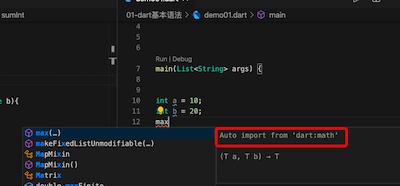 

  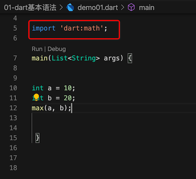 

  

### 2、使用`as` 关键字给导入的模块取别名

- 通常情况下我们使用 `import '模块名';` 导入对应的模块时时可以直接使用的, 如下图示:

  - 左侧是我们自定义的模块, 模块名为`tool/MathTool.dart` 

  - 右侧是我们书写的 dart 代码, 需要使用到左侧的模块.

    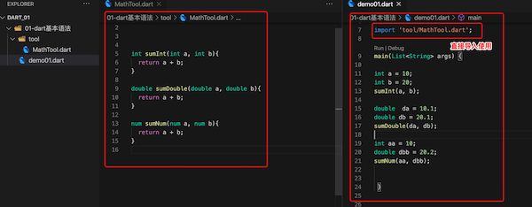 

- 但是, 在有些时候, 我们导入的模块内的 类名或者方法名 与我们自己书写的类名或者方法名冲突(导入模块内的类名或方法名与外部正在书写的类名或者方法名相同), 这是我们不能直接使用导入的模块, 为了解决这种命名冲突的问题, 我们在导入指定的模块时, 可以使用关键字`as` 给被导入的模块起别名, 避免模块内外命名冲突, 如下图:

   

  为了解决使用时 模块命名冲突, 我们使用 `as` 关键字给导入的模块取别名

  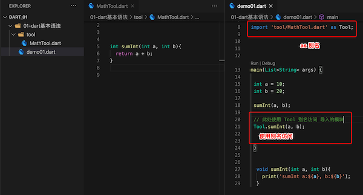 


###  3、hide 隐藏部分, show 导出部分

默认情况下我们使用 `import '模块路径';` 或者 `import '模块路径' as 别名` 这两种方式导出的是模块内部所有的方法和属性, 但是有时候我们不希望将模块内的所有方法和属性全部导出, 仅仅是想导出一部分, 这时我们要怎么做呢? 

这时, 我们可以使用关键字, **show** 来导出部分内容, 或者使用关键字**hide** 来隐藏一部分. 具体示例如下;

- 我们定义了一个模块: `tool/MathTool.dart'

  ```
  int sumInt(int a, int b){
    return a + b;
  }
   
  double sumDouble(double a, double b){
    return a + b;
  }
  
  num sumNum(num a, num b){
    return a + b;
  }
  ```

  - **使用关键字 show, 导出模块中的部分内容** 如下:

    ```
    // 只导出模块中的 sumInt 和 sumDouble , 其它的隐藏
    import 'tool/MathTool.dart' show sumInt, sumDouble;
    ```

  - **使用关键字 hide, 隐藏模块中的部分内容** 如下:

    ```
    // 隐藏模块中的部 sumInt 和 sumDouble, 其它的全部导出
    import 'tool/MathTool.dart' hide sumInt, sumDouble;
    ```

    

### 3、export 关键字

有这么一种需求, 我们有个dateFormat工具类, 这个工具类中有很多功能, 而这些功能又是分文件写在不同的dart文件中的, 如果我们在另外的一个dart文件中想要使用 dateFormat 里面的所有功能的话, 我们就需要在使用的地方挨个 导入dateFormat 中其它的模块文件: 如下

```
// dateFormat 目录下有很多的子模块

dateFormat1.dart 文件
// dateFormat1 文件 具体实现

dateFormat2.dart 文件
// dateFormat2 文件 具体实现

dateFormat3.dart 文件
// dateFormat3 文件 具体实现


// 如果我们想要在 下面这个 test.dart 文件中用到 dateFormat1、dateFormat2、dateFormat2我们
// 就需要在test.dart 中挨个导入, 如下;
import 'dateFormat1.dart';
import 'dateFormat2.dart';
import 'dateFormat2.dart';

这样的话就很麻烦
```

为了解决在使用的地方重复的导入很多文件, 我们可以使用 **export** 关键字将一个子模块导入到一个大模块中, 外面在使用时, 只需要导入一个大模块即可, 如下

```
// 新建一个 dateFormat.dart 文件, 将dateFormat 中的其它小的子模块全部导这个大模块文件中

// 以下是dateFormat.dart 中的内容
export 'dateFormat1.dart';
export 'dateFormat2.dart';
export 'dateFormat2.dart';
```

这样我们在外面使用就简单了, 只需要导入一句

```
// 以下是 test.dart 中的文件内容
import 'dateFormat.dart';

// 下面就可以直接使用 dateFormat1 dateFormat2 dateFormat3  中提供的模块内容了
// 不需要再挨个导入
```


## 3、dart 中的私有成员

在Dart中没有其它语言中 `private` `protected` `public`  这些访问控制的关键字, 默认情况下 dart 文件中的所有的方法, 类都是公开的.

但是有时候, 我们在一个dart 文件中编写的有些`方法` `成员` `类` 这些我们确实不希望外部访问, 只是作为当前模块内部访问的, 这时我们可以在对应的表示前面加上下划线`_`, 这样, 带下划线`_` 前缀的`方法` `成员` `类` 就只能在当前模块(当前dart文件内)访问了, 外部无法访问

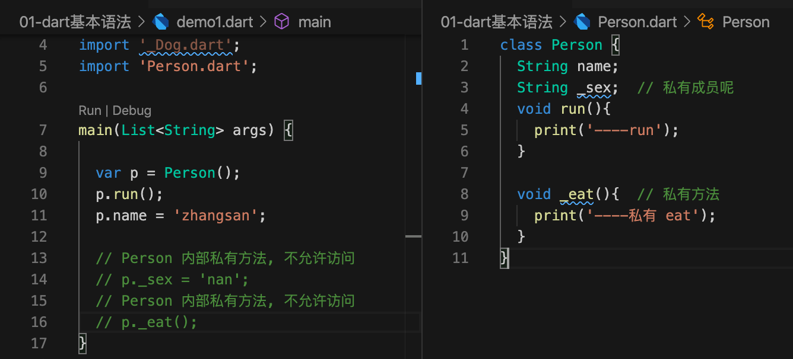


## 4、Dart 中第三方模块的使用

在dart中使用第三方的库和node中使用第三方的库很像.

**Flutter 或者 dart 的第三方库都在`pub.dev` 这地址** .

在Flutter 或者 dart 开发中想要找 第三方库, 直接在 `pub.dev` 这个地址下搜索即可. 搜索到对应的第三方库后, 你会看到对应的安装下载以及使用方法和步骤.


想要在 Dart 中使用第三方的 dart 库, 主要有以下几个步骤:

- 1、在项目中创建一个`pubspec.yaml` 文件, 并在文件描述第三方库信息

  > 其实, `pubspec.yaml` 这个文件就是dart开发中用来管理第三方库的一个配置管理文件.(一个第三方库描述文件), 如下图:

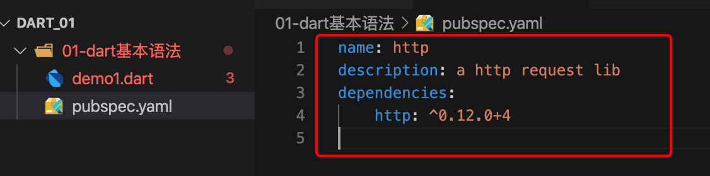 

- 使用 命令终端下载第三方库, 以下命令二选一

  - `pub get` 命令
  - `flutter pub get` 命令

- 导入第三方库到你的Dart 中

  ```
  import 'package:http/http.dart';
  ```

- 在 Dart 文件中使用第三方库即可


# 八、Flutter 开发


## 1、flutter项目的创建

我们在开发时创建flutter项目工程主要有两种方式:

- 通过开发工具创建 

  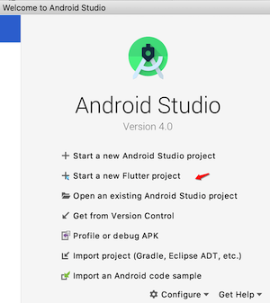 

  一般来说, 我很少使用工具来创建flutter项目, 因为使用工具会生成一些额外和工具相关的莫名其妙的文件等, 导致项目不是很纯洁, 所以我在开发flutter时, 一般选择使用命令行来创建项目. 

  

- 通过终端命令创建

  通过命令创建flutter项目非常的简单, 在终端输入命令即可.

  ```
  // 错误命令 flutter create helloWorld
  flutter create hello_flutter			// 正确命令
  ```
  
  > **注意**:
  >
  > 1、flutter 项目的名称不要包含特殊符号, 另外不支持驼峰命名, 也可以理解为flutter项目名称不支持特殊符号和大写字母.
  >
  > 2、使用终端命令创建好flutter命令后, 使用对应的工具直接打开即可(vscode 或者 android studio)
  >
  > 3、顺便提示一下, 在创建flutter项目时好像要下载一些文件, 因此要保证电脑能上网.


## 2、打开flutter项目

打开flutter项目, 主要有两种方式:

- 使用命令终端运行flutter项目
- 使用开发工具打开flutter项目

### 1、使用终端命令打开flutter项目

其实, 当我们在使用终端命令创建flutter项目完成后, 在终端上已经提示了, 使用终端命令运行我们的项目, 这个完全没问题

```
// 使用终端命令 运行 flutter 项目
cd flutter项目目录
flutter run 
```

> 补充:
>
> 如果在使用终端命令 运行 flutter项目时提示: `No supported devices connected.` 说明当前没有设备, 打开电脑模拟器后再执行 `flutter run` 命令即可正常运行flutter项目

- 打开iOS模拟器

  打开Xcode -> 选择Xcode -> Open Developer Tool -> Simulator

  - 如果想要切换模拟器

    选择模拟器 -> HardWare -> Device -> 选择对应版本的模拟器即可


### 2、使用开发工具打开flutter项目

一般来说, 我们可以使用 `vscode` 和 `android studio` 开发工具来打开flutter项目. 

我一般使用`android studio` 打开flutter项目多一点, 所以下面我们说一下使用`android studio` 打开flutter的流程

- 启动 `android studio`

- 选择`Open an existsinng Android Studio project` 

  然后跟着指示选择对应的flutter的工程目录即可打开flutter项目

  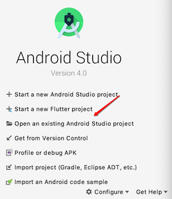 
  
  > 补充:
  >
  > 只要是使用工具打开`flutter` 项目, 不论是`vscode` 还是`android studio` . 在使用之前必须要安装`flutter 和 dart` 插件, 这个是前提条件, 如何安装, 百度一下即可.
  >
  > 如果不装这两个插件是没有办法打开和开发flutter的. 


## 3、flutter 工程目录介绍

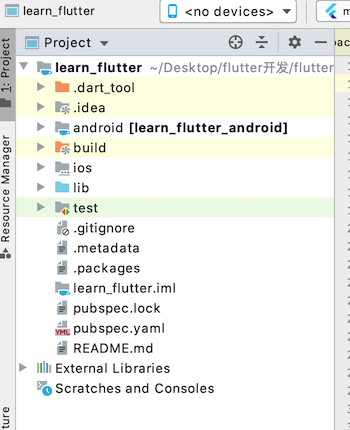 

- `.dart_tool` 目录主要存储的是我们Flutter项目中Dart 依赖的一些第三方库信息. 不需要手动配置和修改
- `.idea` 目录, 因为Android Studio 是google 基于`IDEA` 开发的,因此项目中默认有这个`.idea` 目录, 我们不用管它.
- `android` 目录就是我们的android项目的代码
- `ios`目录就是我们的ios项目的代码

- `lib` 目录就是我们非常重要的flutter源代码的目录, 以后我们开发flutter所有的代码都写在这个`lib` 目录里面. 
- `test` 目录就是我们做测试的目录
- `.gitignore` 是做git项目管理的忽略文件, 如果我们在做git提交时如果不想提交, 就在这个文件里配置就可以了
- `.metadata` 文件, 是对我们的flutter 项目版本做记录的, 不需要手动修改. 
- `pubspec.yaml` 是用来管理第三库依赖的描述文件, 用来说明我们的项目需要安装怎样的第三方依赖库. 后续开发过程中会用到
- `.packages` 和 `pubspec.lock` 文件是我们安装第三方依赖后自动生成的第三方描述文件, 其中`pubspec.lock` 主要记录的是已经安装的第三方依赖的具体版本信息, 保证项目多次安装时, 安装同样版本的依赖.
- `README.md` 是用来写一些项目的描述信息. 

> 整个flutter项目的目录结构, 其实还以包含很多其它的内容, 目前先介绍这些常用的目录和文件, 其余的后续再补充. 


## 4、使用android studio 运行flutter项目

我们在使用 android studio 运行flutter项目时, 主要分为三步:

1、选择并打开指定的模拟器(ios  或 android 模拟器)

2、选择一个已经打开的模拟器(iOS 或 android)作为启动模拟器

3、选择run图标运行flutter程序

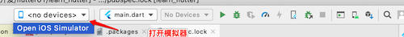  


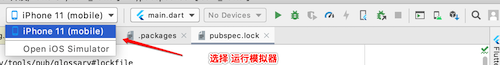 


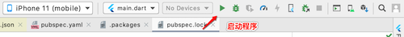 


## 5、flutter 项目的启动

在flutter开发中项目的启动主要分为两种: **冷启动和热启动** .

 具体呢又可以划分为三种操作: 

**冷启动、热重启、热重载** 


### 1、flutter冷启动和热启动

- **冷启动** 

  所谓冷启动, 就是这个flutter项目完全没有启动,从0开始启动, 这个过程我们就称为冷启动. 	冷启动意味着, 我们整个flutter的框架包括我们自己写的flutter代码全部都是从0开始启动的. 这个过程非常的慢.根据你电脑的配置不同启动花销的时间也不同, 可能1~5分钟不等. 

- **热启动**

  当我们的flutter项目已经启动了, 我们修改了一些代码, 想要立马看到修改的效果, 一种方式是结束当前的程序运行后再冷启动, 另一种就是直接热启动


### 2、flutter 冷启动 热重启 热重载

在我们使用`vscode` 或者 `android studio` 开发flutter项目时, 经常会用到 **hot restart 和 hot reload** 这两个功能. 

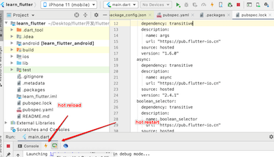 

- hot reload 功能, 快捷键  `command + \`
- hot restart功能, 快捷键 `shift + command + \` 

**下面我们来简单的介绍一下, 热重载(hot reload)  和 热重启(hot restart) 他们之间的关系和区别** 

其实我们在运行一个flutter项目的时候有三种方式:

1、冷启动

- 当前的项目完全没有启动, 从0开始启动. 所有的flutter框架的代码和我们自己写的代码都是从0开始启动加载的. 耗时长.

2、热重启 (快捷键 shift + command + `\`)

- 当我们执行热重启后, flutter会重新运行我们整个 flutter app 的. 换句话说执行热重启后我们的flutter app 是从0开始运行的. 热重启比冷启动执行时间要短的多.

  > **注意:** 
  >
  > 虽然, 冷启动和热重启, 整个flutter app 都是从0开始运行的, 但是不要把他们搞混了, 冷启动是完完全全的从0开始启动app, 而 热重启是对已经启动的app 进行从0运行, 没有运行过得app 是不能直接热重启的. 

3、热重载 (快捷键 command + `\`)

- hot  reload 热重载, 最主要是执行build 方法.  如果修改的内容不是在 `build` 方法里面, 这时热重载是不生效的.  换句话说, 当我们按下 command + `\` 时, flutter 会重新制定build 方法, 如果我们修改的内容在build 方法里面, 那么被修改的内容就会被呈现, 否则没反应.

### 3、冷启动、热重启、热重载总结

- flutter app完全没有启动过, 需要启动就使用冷启动. 
- flutter app 已经启动了, 想要让app 再次从0开始启动一遍,可以选则再次冷启动, 也可以选择热重启, 如果希望快一点看到效果就选择热重启否则就冷启动.
- 如果flutter app 已经运行, 我们修改了 build 方法内的内容, 想要快速看到效果就可以选择热重载. 


## 6、第一个flutter 项目

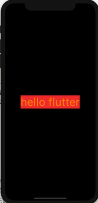 

```
import 'package:flutter/material.dart';

main(List<String> args){
  runApp(
      Center(
        child: Text(
          'hello flutter',
          textDirection:TextDirection.ltr,
          style: TextStyle(
              fontSize: 50,
              // 注意: 此处是Colors 不是Color. 
              // 比如: orange 就是Colors 中的一个静态属性
              color: Colors.orange,
              backgroundColor:Colors.red
          ),
        ),
      )
  );
}
```

> ```v
> 1. dart 代码的入口 是main函数, main函数是整个Dart 应用程序的入口
> 2. main 函数可以没有参数, 也可以有参数, 参数是一个 List 类型, eg: List<String> args
> 3. flutter 在启动后, 我们应当首先调用 runApp() 这个全局函数
> 	3.1. 我们在 main 函数中运行 runApp() 全局函数时, 一般我们选择的是 'package:flutter/material.dart' 模块中的 runApp,不要选择错了
> 4. 在flutter 中万物皆 widget, 所有的东西都是widget
> 5. 在flutter 中, Widget不能直接使用, 因为Widget是一个抽象类.
> ```

到这里的话, 我们最简单的flutter 项目就开发完了.


# 九、material设计风格


## 1、什么是material 风格

- material 是google公司推行的一套`设计风格` , 或者叫做` 设计语言` `设计规范` 等. 
- 在material 里面有非常多的设计规范, 比如: `颜色` 、`文字的排版`、`填充` 等. 
- 在flutter中, 高度集成了`material风格的 widget`
- 在我们的应用中, 我们可以直接使用这些widget来创建我们的应用. (后面我们会用到很多, 里面有些关键的widget我们是必须掌握才能开发flutter的)

**补充:**

widget 到底是什么东西?

- 我们学习flutter, 从一开始就可以有一个基本的认识: **flutter中万物皆是widget**
- 在我们iOS或者Android开发中, 我们界面有很多种类的划分: 应用(Application)、视图控制器(viewController)、活动(Activity)、视图(View)、按钮(button)等等
- 但是在Flutter开发中, 这些都是不同类型的 widget而已.
- 也就是说, 我们整个应用内程序中, **所看到的内容** 几乎都是widget, 甚至**内边距设置** 我们也要使用一个叫`PaddingWidget` 来设置.


## 2、第一个material App

```
import 'package:flutter/material.dart';

main(List<String> args){
  print('----程序启动了');

  runApp(
    MaterialApp(
      home: Center(
        child: Text(
          'hello material app',
          style: TextStyle(
            color: Colors.white,
            fontSize: 20,
            backgroundColor: Colors.red
          ),
        ),
      ),
    )
  );
}
```

> ```
> /**
>  * 通常我们开发 flutter项目时, 整个流程是这样
>  * 1. 先在 main 方法中运行 runApp 方法.
>  * 2. 在runApp 方法中, 我们直接传入一个 MaterialApp , 就是告诉程序我们要运行一个 material风格的 app
>  * 3. 在 MaterialApp 中有个home参数, 直接传入我们要显示的widget 即可
>  * 4. 这样我们的 material 风格的app 就运行了
>  * 5. 在material App 中因为已近设置了 方向, 因此后续我们 就不用再单独在 子widget 中在设置排版方向了
>  *
>  * 总结:
>  * 我们使用MaterialApp 包裹我们所有的子widget, 或则说我们在 runApp 中运行MaterialApp 其实就是告诉
>  * 系统, 我们整个app 都采用material 风格开发, 后面我们很多东西就沿用material 风格了, 就不需要再单独设置.
>  */
> ```

  

## 3、第二个Material 风格的 app

```
import 'package:flutter/material.dart';

main(List<String> args){

  runApp(
      MaterialApp(
        debugShowCheckedModeBanner: false ,     // 不显示右上角的debug 图标
        home: Scaffold(
          appBar:AppBar(
            title: Text(
              '我是标题',
              style: TextStyle(
                  color: Colors.white,
                  fontSize: 20
              ),
            ),
            backgroundColor: Colors.lightBlue,
          ) ,
          body: Center(
            child: Text(
              'material scaffold app',
              style: TextStyle(
                  color: Colors.white,
                  backgroundColor: Colors.cyan,
                  fontSize: 30
              ),
            ),
          ),
        ),
      )
  );

}
```

> ```
> /**
>  * Scaffold  翻译过来的话就是脚手架
>  *
>  * 1. 脚手架一个主要的功能就是帮助我们快速的搭建页面
>  * 2. 在Scaffold 中, 我们最主要的就是传入2个参数,  appBar 和 body
>  * 其中appBar 就是类似于我们iOS中的导航 nav, 而 body 就有点类似于我们controller 中
>  * 要显示的控制器的view
>  * 3. 其中 appBar 是一个需要继承自PreferredSizeWidget 的widget, 但是PreferredSizeWidget 是一个
>  * 抽象类, 不能实例化, 一般我们使用它的子类 AppBar 或者  TabBar
>  *
>  *
>  */
> ```

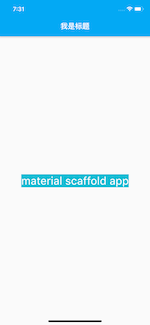 


## 4、Material app 重构

这个章节, 我们主要是要对我们之前写的Material App 进行结构上的重构, 让我们写的代码更结构化, 这样便于我们后续的维护和开发, 以及各个版本迭代

-  app 抽取

  ```
  import 'package:flutter/material.dart';
  main(List<String> args){
    runApp(YRApp());
  }
  ```

  从上面来看, 我们把整个app 都抽到一个叫 YRApp 的类里面, 这样 main 方法就清晰了, 里面只需要 runApp 就行了, 具体 run 的是那个app , 我们只需要按照规范把YRApp 在其他地方写好就行了, main 不需要再关心其它逻辑, 这样职责就清晰了, main 方法只需要 runApp 就好

- YRHomePage 抽取

  ```
  class YRHomepage extends StatelessWidget{
    @override
    Widget build(BuildContext context) {
      return Scaffold(
        appBar: homePageAppBar() ,
        body: YRHomePageBody()
      );
  
    }
  
    AppBar homePageAppBar(){
      return AppBar(
        title: Text(
          '我是标题',
          style: TextStyle(
              color: Colors.white,
              fontSize: 20
          ),
        ),
        backgroundColor: Colors.green,
      );
    }
  }
  ```

- YRHomePageBody 抽取

  ```
  class YRHomePageBody extends StatelessWidget{
    @override
    Widget build(BuildContext context) {
      return Center(
        child: Text(
          'YRHomeage',
          style: TextStyle(
              color: Colors.white,
              backgroundColor: Colors.cyan,
              fontSize: 30
          ),
        ),
      );
    }
  }
  ```

  


​	


# 十、StatelessWidget & StatefulWidget


## 1、StatelessWidget 介绍

StatelessWidget 通常被称作一种没有状态state(也可以理解为data) 需要维护的Widget

- 它们的数据通常是直接写死的(放在widget中的数据, 必须被定义为final), 为什么定义在StatelessWidget 中的数据必须定义为final, 我们在后面的章节中会介绍.
- StatelessWidget中的数据通常是从父widget(parent widget) 中传入的, 而且一旦传入就不能被改变了. 
- StatelessWidget 中的数据也可以从InheritedWidget 中获取, 这个在后面也会将

## 2、创建继承自StatelessWidget 的widget

很简单, 一般来说只需两步:

- 定义一个类, 继承自StatelessWidget

- 重写StatelessWidget 的 build 方法, 返回自己想要显示的widget 即可. 

  ```
  class YRHomePage extends StatelessWidget{
  
    @override
    Widget build(BuildContext context) {
      
      return Center(
        child: Text(
          '自定义widget, 继承自StatelessWidget',
          style: TextStyle(
              color: Colors.white,
              backgroundColor: Colors.red
          ),
        ),
      );
    }
  }
  ```

## 3、build 方法的解释


- 当flutter 在拿到我们自己创建的继承自StatelessWidget的类创建实例时就会调用它里面重写的 build 方法, 渲染里面返回的widget

- 我们需要在 build 方法中告诉flutter, 我们自己定义的widget 希望渲染什么元素, 比如一个Text Widget 等等. 

- StatelessWidget 是没有办法主动执行 build方法的, 当我们的数据发生变化的时候, build方法会被重新调用

  > 在我们的flutter开发中, 一般来说, 我们是不会且也不会主动的调用widget 中的build 方法的, 一般都是用来让系统自己调用的. 


## 4、build 方法在什么情况下被执行


- 当我们的StatelessWidget是第一次插入到Widget 树中时, 也就是第一次被创建时
- 当我们的父Widget (parent widget) 发生改变的时候, 子Widget 会被重新构建
- 如果我们的Widget依赖InheritedWidget 的数据, InheritedWidget 中的数据发生变化的时候会被调用. 

> 其实,当我们在 执行 热重载的时候, build 方法就会被再次调用, 重新绘制页面, 这也就是为甚么说, hot reload 时, 只有build 中的修改会被改变. 


## 5、StatelessWidget 中的@immutable 注解

前面我们将我StatelessWidget 是没有状态的, 现在我们来说一下StatelessWidget 中的@immutable 注解. 

- 首先, 注解这个东西是flutter中才有的, 在Dart 中是没有这一说法, `注解`这个东西涉及到Dart的元编程, 我们这里不讲

- 在flutter官方中是这样定义 Widget类的, 如下图:

  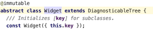 

  注意到没有, 在前面有个 `@immutable` 注解

- 当我们在被`@immutable` 注解 注解的类或是继承自被`@immutable` 注解的类中定义非`final` 修饰的属性(成员变量)时, 代码就会报错, 提示如下错误:

  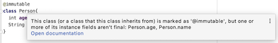 

  这个就是官方给我们的错误提示, 意思就是说被@immutable注解或者是继承自被@immutable 注解的类, 所有的成员变量必须是 final 的, 即成员变量必须是常量,  因为是常量, 所以成员属性的值一旦确定就不能变, 这也就是为什么, 我们说StatelessWidget 是没有状态的不能修改状态的原因, 因为属性压根不能变, 是常量
  
- 官方对于 `@immutable` 有做解释, 具体看这里: https://api.flutter.dev/flutter/meta/immutable-constant.html


## 6、flutter 中Widget 知识补充那个

- 在flutter开发中所有的Widget都是不能定义状态的, 因为 Widget 类是被`@immutable` 注解的.

- 因此不论是继承自StatelessWidget 还是继承自StatefullWidget 都是不能定义状态的, 这个结论很重要, 很重要.

- 以下的写法都是错误的

  ```
  class YRLessWidget extends StatelessWidget{
    String name; // 此处错误, 必须是final 修饰的变量
  }
  
  ```

  ```
  class YRFullWidget extends StatefulWidget{
    String name; // 错误写法, 此处必须是final 修饰
  }
  ```


## 7、同意协议demo

```
import 'package:flutter/material.dart';

main(List<String> args){
  runApp(YRApp());
}

class YRApp extends StatelessWidget{
  @override
  Widget build(BuildContext context) {
    return MaterialApp(
    	// 不显示右上角的debug 图标
      debugShowCheckedModeBanner: false ,     
      home: YRHomepage()
    );
  }
}

class YRHomepage extends StatelessWidget{
  @override
  Widget build(BuildContext context) {
    return Scaffold(
      appBar: homePageAppBar() ,
      body: YRHomePageBody()
    ); 
  }

  AppBar homePageAppBar(){
    return AppBar(
      title: Text(
        '我是标题',
        style: TextStyle(
            color: Colors.white,
            fontSize: 20
        ),
      ),
      backgroundColor: Colors.green,
    );
  }
}

class YRHomePageBody extends StatefulWidget{

  @override
  State<StatefulWidget> createState() {
    // 创建一个我们自己实现的 State, YRHomePageBodyState
    return YRHomePageBodyState();
  }
}

class YRHomePageBodyState extends State<YRHomePageBody>{

  var  flag = true;
  @override
  Widget build(BuildContext context) {

    return Center(
      child: Row(
        mainAxisAlignment: MainAxisAlignment.center,
        children: <Widget>[
          Checkbox(
              value: flag,
              onChanged: (value){
                setState(() {
                  flag = value;
                });
              }),
          Text(
            "同意协议",
            style: TextStyle(
              color: Colors.white,
              backgroundColor: Colors.cyan,
              fontSize: 40
            ),
          )

        ],
      ),
    );
  }
}
```

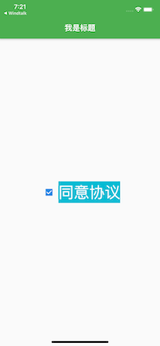 

> **说明**
>
> 在Material App 中, 一个Scaffold 就相当于是我们iOS中的一个UIViewController, 在Scaffold 中主要有 appBar 和 body, 其中 appBar 就相当于是我们的导航条 navBar, 而 body 就相当于是UIViewController 中的View 主要用来展示页面内容. 		 
>
> 也类似于Android 中的Activity 


## 8、StatefullWidget 回顾

我们在自定义继承自StatefullWidget 类的类的时候发现, 其实, 我们需要定义两个类, 一个类继承自StatefullWidget 一个类继自State

其中, 继承自State的类是用来管理记录状态的, 因为继承自Widget的类是没有状态的. 		

```
class HomePage extends StatefulWidget{
  @override
  State<StatefulWidget> createState() {
    // TODO: implement createState
    return HomePageState();
  }
}

class HomePageState extends State<HomePage>{
  @override
  Widget build(BuildContext context) {
    // TODO: implement build
    return Center(
      child: Text(
        """ 自定义继承自StatefulWidget 的类需要自己创建2个类
        一个是继承自 StatefulWidget 的类
        一个是继承自 State的类, 继承自State的类用来记录状态 """
      ) ,
    );
  }
}
```


## 9、StatelessWidget 简单案例


- 最终案例效果

     

  ```
  示例代码1:
  import 'package:flutter/material.dart';
  main(){
    runApp(YRStatelessApp());
  }
  
  class YRStatelessApp extends StatelessWidget{
    @override
    Widget build(BuildContext context) {
  
      return MaterialApp(
        debugShowCheckedModeBanner: true,
        home: YRStatelessAppHome(),
      );
    }
  }
  
  
  class YRStatelessAppHome extends StatelessWidget{
    @override
    Widget build(BuildContext context) {
      return Scaffold(
        appBar: AppBar(
          title: Text('我是标题'),
        ),
        body: ProductPage(),
      ) ;
    }
  }
  
  class ProductPage extends StatelessWidget{
    final String imageUrl1 = "https://tva1.sinaimg.cn/large/006y8mN6gy1g72j6nk1d4j30u00k0n0j.jpg";
    final String imageUrl2 = "https://tva1.sinaimg.cn/large/006y8mN6gy1g72imm9u5zj30u00k0adf.jpg";
    final String imageUrl3 = "https://tva1.sinaimg.cn/large/006y8mN6gy1g72imqlouhj30u00k00v0.jpg";
    @override
    Widget build(BuildContext context) {
      return Column(
        children: <Widget>[
          ProductPagetem('apple1',
              'apple1 描述apple1 描述apple1 描述apple1',
              imageUrl1
          ),
          ProductPagetem('apple2',
              'apple2 描述apple2 apple2 描述apple2',
              imageUrl2
          ),
          ProductPagetem('apple1dsf',
              'apple3 描述apple3 apple2 描述apple3',
              imageUrl3
          ),
  
        ],
      );
    }
  }
  
  
  class  ProductPagetem extends StatelessWidget{
  
    final String title;
    final String desc;
    final String imageUrl;
  
    final titleStyle = TextStyle(color: Colors.orange, fontSize: 30);
    final descStyle = TextStyle(color: Colors.green, fontSize: 20);
  
    ProductPagetem(
        this.title,
        this.desc,
        this.imageUrl
        );
  
    @override
    Widget build(BuildContext context) {
      return  Column(
        children: <Widget>[
          Text(
            this.title,
            style: titleStyle,
          ),
          SizedBox( // 使用SizeBox 可以做垂直和水平方向上的间距
              height: 8
          ),
          Text(
            this.desc,
            style: descStyle,
          ),
          Image.network(this.imageUrl)
        ],
      );
    }
  }
  ```

  

  ```
  // 示例代码2: 
  import 'package:flutter/material.dart';
  main(){
    runApp(YRStatelessApp());
  }
  
  class YRStatelessApp extends StatelessWidget{
    @override
    Widget build(BuildContext context) {
  
      return MaterialApp(
        debugShowCheckedModeBanner: true,
        home: YRStatelessAppHome(),
      );
    }
  }
  
  
  class YRStatelessAppHome extends StatelessWidget{
    @override
    Widget build(BuildContext context) {
      return Scaffold(
        appBar: AppBar(
          title: Text('我是标题'),
        ),
        body: ProductPage(),
      ) ;
    }
  }
  
  class ProductPage extends StatelessWidget{
    final String imageUrl1 = "https://tva1.sinaimg.cn/large/006y8mN6gy1g72j6nk1d4j30u00k0n0j.jpg";
    final String imageUrl2 = "https://tva1.sinaimg.cn/large/006y8mN6gy1g72imm9u5zj30u00k0adf.jpg";
    final String imageUrl3 = "https://tva1.sinaimg.cn/large/006y8mN6gy1g72imqlouhj30u00k00v0.jpg";
    @override
    Widget build(BuildContext context) {
      return ListView(
        children: <Widget>[
          ProductPagetem('apple1',
              'apple1 描述apple1 描述apple1 描述apple1',
              imageUrl1
          ),
          ProductPagetem('apple2',
              'apple2 描述apple2 apple2 描述apple2',
              imageUrl2
          ),
          ProductPagetem('apple1dsf',
              'apple3 描述apple3 apple2 描述apple3',
              imageUrl3
          ),
  
        ],
      );
    }
  }
  
  
  class  ProductPagetem extends StatelessWidget{
  
    final String title;
    final String desc;
    final String imageUrl;
  
    final titleStyle = TextStyle(color: Colors.orange, fontSize: 30);
    final descStyle = TextStyle(color: Colors.green, fontSize: 20);
  
    ProductPagetem(
        this.title,
        this.desc,
        this.imageUrl
        );
  
    @override
    Widget build(BuildContext context) {
      return  Column(
        children: <Widget>[
          Text(
            this.title,
            style: titleStyle,
          ),
          SizedBox( // 使用SizeBox 可以做垂直和水平方向上的间距
              height: 8
          ),
          Text(
            this.desc,
            style: descStyle,
          ),
          Image.network(this.imageUrl)
        ],
      );
    }
  }
  ```


### 示例分析:

**为什么示例一的代码 会出现黄条的页面呢?**

- 在flutter的布局中 子widget只知道自己的大小, 然后父widget对子widget显示的位置进行调整. 而父widget 发现子widget 超出了自己的安全区域, 到时就会报黄条的错误, 说子widget 越界了.` relayoutboundary 错误`
- 在flutter开发中, 只要是你的内容, 超出了父widget可以显示的区域, 且你没有将超出元素的父元素设置为可滚动的元素, 那么就会报比较经典的,, 也就是说flutter中的内容只能在安全区域显示.
- Column 这个Widget是不可以滚动的, 我们可以使用ListView 这个Widget 代替,ListView 也是一个Widget, 当ListView 这个Widget内的内容超出了自己的范围, 那么ListView 的内容就是可以滚动的了


## 10、StatelessWidget 案例二

设置Widget之间的间距

设置Widget的内边距

设置Widget的垂直对齐方式, 以及水平对齐方式

### 1、设置Widget 之间的间距

> 使用SizeBox 这个Widget 可以设置上下Widget之间的间距, 也可以设置左右Widget 之间的间距

- 在iOS 开发中, 我们设置上下两个View之间的间距, 调整View的Y值即可, 在安卓或者前端开发中设置上下两个元素之间的间距, 我们设置Margin即可, 但是在我们的flutter开发中, 设置上下两个Widget 之间的间距时与iOS 、安卓、前端中的方式都不一样 , 在flutter中设置两个Widget之间的间距有很多种方法, 大概有4~5中, 但是这里我们可以使用在两个Widget之间插入一个Widget来实现. 
- 这里我们介绍,使用SizeBox这个widget 来实现连个Widget之间的间距

```
class ProductItem extends StatelessWidget{
  final String title;
  final String desc;
  final String imageUrl;
  
  ProductItem(this.title, this.desc, this.imageUrl);
  
  @override
  Widget build(BuildContext context) {
    // TODO: implement build
    return Column(
      children: <Widget>[
        Text(this.title),
        SizedBox(height: 10),  // 设置一个上下为10 的间距
        Text(this.desc),
        SizedBox(height: 10),  // 设置一个上下为10 的间距
        Image.network(this.imageUrl)
      ],
    );
  }
}
```


### 2、设置Widget的边框和内边距

> 在flutter 中, 我们可以通过Container 这个Widget来给其它的Widget设置边框和内边距. 
>
> 在flutter开发中, 我们可以通过给Container这个Widget来给其它的Widget设置内边距

- 在flutter开发中, 我们不直接像在iOS 或者安卓 或者前端中直接给设置边框和内边距. 
- 在flutter开发中我们可以给其它的Widget增加一个Container容器Widget, 将其它Widget包裹在理面, 然后通过Container 的decoration 属性给Widget设置边框和内边距
- 在flutter开发中, 如果我们想要给一个Widget增加内边距, 这时我们就可以考虑使用一个Container将对应的Widget包裹, 然后设置Container 的Padding 属性即可.

> 说明:
>
> 1、Container 这个Widget中的Decoration 属性是装饰的意思, 是一个`Decoration` 类型(抽象类), 不能直接使用, 一般我们使用它的子类`BoxDecoration` 来设置边框以及背景色等, 
>
> 2、需要注意的是, 其实在Container中除了可以通过 `decoration ` 属性来装饰我们的Container, 也可以直接使用哪个Container中的color属性来直接设置Container的背景色, 但是 `color` 属性和 `decoration` 属性只能选择一个不能同时用
>
> 3、Container 中的`padding` 属性虽然可以用来设置内边距, 但是因为`padding` 属性是`EdgeInsetsGeometry` 类型(抽象类) , 不能直接使用呢, 一般我们使用哪个`EdgeInsets` 子类


```
class  ProductItem extends StatelessWidget{

  final String title;
  final String desc;
  final String imageUrl;
  
  final titleStyle = TextStyle(color: Colors.orange, fontSize: 30);
  final descStyle = TextStyle(color: Colors.green, fontSize: 20);

  ProductItem(this.title, this.desc, this.imageUrl);

  @override
  Widget build(BuildContext context) {
    return  Container(

      decoration: BoxDecoration(
        border: Border.all(
          color: Colors.green,
          width: 10
        ),
        color: Colors.white
      ),
      padding: EdgeInsets.all(10),
      child: Column(
        children: <Widget>[
          Text(
            this.title,
            style: titleStyle,
          ),
          SizedBox( // 使用SizeBox 可以做垂直和水平方向上的间距
              height: 8
          ),
          Text(
            this.desc,
            style: descStyle,
          ),
          Image.network(this.imageUrl)
        ],
      ),
    );
  }
}

```

 


### 3、设置水平和垂直对齐方式

在flutter中的布局和前端中Flex布局很像

在flex布局中没有严格的水平布局和垂直布局的概念, 也就是说在flex 布局中是没有严格意义的水平轴和垂直轴的概念.

在flex布局中只有**主轴 和 交叉轴** , 有的地方也叫做 **主轴 和 侧轴** , 的概念, 我习惯上将这两个轴叫做**主轴 和 侧轴** .

主轴和侧轴始终代表两个垂直的方向, 主轴代表的方向可以是水平的也可以竖直的, 当然侧轴代表的方向也可以是水平的或者是竖直的, 具体的方向需要根据特定的环境来定. 


- 主轴的排列方式主要有以下几种:

  ```
  enum MainAxisAlignment {
    start,
    end,
    center, 
    spaceBetween,
    spaceAround,
    spaceEvenly,
  }
  ```

- 侧轴的排列方式主要有以下几种:

  ```
  enum CrossAxisAlignment {
    start,
  	end,
  	center,
    stretch,
    baseline,
  }
  ```


# 十一、生命周期

## 1、StatefulWidget 的生命周期


### 1、生命周期的理解

什么是生命周期?

- 客户端开发: 在iOS开发中我们需要知道UIViewController 从创建到销毁的整个过程,

  android开发中, 我们要知道Activity从创建到销毁的整个过程, 以便在不同的生命周期方法中完成不同的操作.

- 前端开发中, Vue、React开发中, 组件也都有自己的生命周期, 在不同的生命周期中我们可以做不同的操作/

flutter中Widget 的生命周期:

- StatelessWidget 可以由父Widget直接传入值, 并调用构造方法来构造, 整个过程非常的简单
- 而, StatefulWidget需要通过State来管理其数据, 并且还要监控状态的改变决定是否重新build整个Widget
- 所以, 在flutter开发中, 我们主要讨论StatefulWidget的生命周期, 也就是它从创建到销毁的整个过程.

> 对于我们开发者来说, 生命周期有什么样的意义:
>
> 1、初始化一些变量、 数据、状态
>
> 2、发送网络请求
>
> 3、监听组件的监听事件
>
> 4、管理内存

```
// 因为在StatelessWidget 中, 只有一个构造函数和 build 方法
// StatelessWidget一旦创建出来就定了, 所以我们一般很少说StatelessWidget的生命周期
class YRHomeContent extends StatelessWidget{
  final String content;

  YRHomeContent(this.content);

  @override
  Widget build(BuildContext context) {
    return  Text(content);
  }
}
```


### 2、生命周期的---简单版

> 在这个版本中, 我们讲解那些常用的方法和回调, 下个版本中我们解释一些比较复杂的方法和回调


那么StatefulWidget有那些生命周期的回调呢? 他们分别在什么情况下执行呢? 

- 在下图中, 灰色的部分是flutter内部操作的, 我们并不需要去手动设置它
- 白色的部分, 表示我们可以去监听 或者 可以 手动调用

我们知道一个StatefulWidget本身包含两个类组成: `StatefulWidget` 和 `State` , 我们对他们分开进行总结, 如下: 

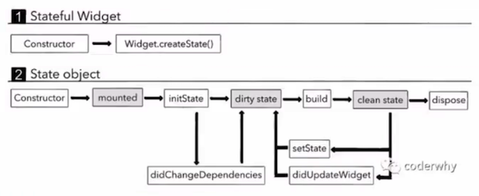 

```
import 'package:flutter/material.dart';

main(){
  runApp(YRCounterApp());
}

class YRCounterApp extends StatelessWidget{

  @override
  Widget build(BuildContext context) {

    return MaterialApp(
      debugShowCheckedModeBanner: false,
      home: Scaffold(
        appBar: AppBar(
          title: Text('我是标题'),
        ), 
      body: ChangeFlag(),
      )

    );
  }
}

class ChangeFlag extends StatefulWidget {
  @override
  _ChangeFlagState createState() => _ChangeFlagState();
}

class _ChangeFlagState extends State<ChangeFlag> {
  int flag = 1;
  @override
  Widget build(BuildContext context) {
    return Container(
      child: Column(
        children: <Widget>[
          RaisedButton(
            child: Text('change flag: $flag'),
            onPressed: (){
              setState(() {
                flag = (flag == 1 ? 0 : 1);
              });
            },
          ),
          HomeContent()
        ],
      ),
    );
  }
}


class HomeContent extends StatefulWidget {

  HomeContent(){
    print('1. 调用 statefulWidget 的构造方法');
  }
  @override
  _HomeContentState createState(){
    print('2. 调用 StatefulWidget 的 createState 方法');
    return _HomeContentState();
  }
}

class _HomeContentState extends State<HomeContent> {

  int _count = 0;

  _HomeContentState(){
    print('3. 调用 State 的构造方法');
  }

  // 注意, 自定义initState 方法时, 必须调父类的 initState方法
  @override
  void initState() {
    print('4. 调用 state 的initState 方法');
    super.initState();
  }

  @override
  Widget build(BuildContext context) {

    print('5. 调用 state 的 build 方法');
    return Container(
      width: 500,
      height: 100,
      color: Colors.cyan,
      child: RaisedButton(
        child: Text('点解+, 当前计数: $_count'),
        onPressed: (){
          print('点击了+');
          setState(() {
            _count++;
          });
        },
      ),
    );
  }

  // 自定义dispose 方法, 必须调父类的 dispose 方法
  @override
  void dispose() {
    print('6. 调用 state 类的  dispose 方法');
    super.dispose();
  }

  // 自定义 didChangeDependencies 方法, 必须调用父类的didChangeDependencies
  @override
  void didChangeDependencies() {
    print(' 调用 state 类的  didChangeDependencies 方法');
    super.didChangeDependencies();
  }

  // 自定义 didUpdateWidget 方法, 必须调父类的 didUpdateWidget
  @override
  void didUpdateWidget(HomeContent oldWidget) {
    print(' 调用 state 类的 didUpdateWidget 方法');
    super.didUpdateWidget(oldWidget);
  }

  // 自定义 setState 方法, 必须调用父类的 setState 方法
  @override
  void setState(fn) {
    print('调用 State 类的 setState 方法');
    super.setState(fn);
  }
}
```

从上面的代码及流程图, 我们可以发现 `StatefulWidget` 主要有9个生命周期方法

- 1、`StatefulWidget` 中的构造方法

  > 构造方法主要用来创建和初始化StatefulWidget 对象

- 2、`StatefulWidget` 中的createState方法

  > createState 方法主要用来创建一个State实例对象, 来维护StatefulWidget对象
  >
  > 其次, 在调用对应的createState 方法的同时, 执行State类中的相关方法

- 3、`State` 中的 构造方法

  > 构造State实例对象

- 4、`State` 中的 `initState` 方法, 重写时必须调父类的 initState 方法

  > 在执行 initState 方法时, 我们通常会做一些数据初始化操作, 或者肯能也会发送一些网络请求等等

- 5、`State`中的 didChangeDependencies 方法

  > didChangeDependencies 这个生命周期的方法, 在两种情况下会调用
  >
  > 情况1: 当`State` 类中的 `initState` 方法被调用后, 会调用 didChangeDependencies 方法
  >
  > 情况2: 当从其它对象中中依赖的一些数据发生变化的时候会再次调用 didChangeDependencies方法,  比如: 我们前面有提到的 `inheritedWidget` , 一旦 didChangeDependencies 方法被调用后, 就后重新调用 State 中的 build 方法
  >
  > 这里我们可以大致介绍下, 什么是inheritedWidget, 首先inherited 是继承的意思, 我们前面有提到过其实Widget可以理解为是一个配置, inheritedWidget 可以理解为是可以及成果的Widget, 一般我们在做数据共享的时候会用到. 比如: 我们几个不同的Widget在显示同一个数据状态时就可以使用

- 6、`State` 中的 build 方法

  > 这个方法主要是为StatefulWidget 构建widget

- 7、`State` 中的   `setState` 方法

  > 一旦调用 State 中的setState 方法, 就会调用 Element的 markNeedsBuild 方法, 标记需要 build,然后就会重新调用State 中的build 方法, 对widget中的内容进行重新绘制, 最终达到更新页面的目的
  >
  > 换句话说, State中的setState 的本质就是给对应的Element 做 needbuild 的标记, 等到下一帧的时候调用build方法重新构建widget, 刷新页面的目的

- 8、`State` 中的 `didUpdateWidget` 方法

  > 当父Widget发生改变的时候, 就会调用子Widget 的didUpdateWidget 方法, 当子widget 的didUpdateWidget  方法, 然后子Widget 接着就会调用build 方法重build自己的Widget, 达到页面变化的效果
  >
  > 其实从`didUpdateWidget` 的名称中, 我们可以知道, 这个方法是Widget被更新的意思, 其实原理是这样的:
  >
  > -  一句话, StatefulWidget 被创建后会被对应的一个State持有(管理), 这个State只会创建和销毁一次, 但是State持有的Widget可能会变化. 当父widget 重新调用build 后, 就会调用持有子Widget的State的 didUpdateWidget方法, 接着State中就会重新在调用build 方法重新构建子Widget, didUpdateWidget的目的是让子Widget对应的State重新指向一个新的Widget

- 9、`State` 中的 dispose 方法, 重写时必须调用父类的 dispose 方法. 


> 以上, 就是我们StatefulWidget 的一个比较完整的生命周期的流程
>
> 大家需要对这个流程很熟悉, 才能真正的掌握flutter开发的正确姿势. 
>
> 如果你对flutter的生命周期都不清楚, 那你就不会掌握代码的运行逻辑, 会出问题的


### 3、生命周期的---复杂版

 

我们在前面学习生命周期简单版的时候, 上图中灰色的几个生命周期函数是没有学习的, 下面我们来学习一下其它的几个生命周期函数:

`mounted` `dirty State` `clean state` 


- `mounted` 是State中内置的一个属性`(get 属性)`, 事实上我们不了解它开发也是没有问题的, 但是如果你想要深入的学习, 会对State的机制有更加深刻的理解. 

  - 很多资料中是没有提到这个属性的, 但是我这里把它列出来, 是内部设置的, 不需要我们手动进行修改

    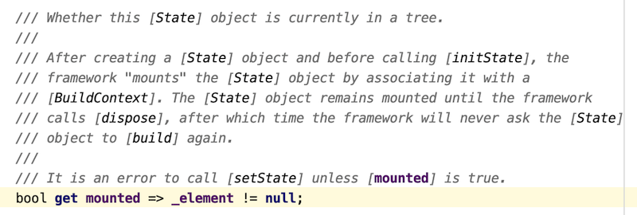

    > 从上面的截图, 我们可以知道, 
    >
    > 在我们创建了一个 State, 在State执行 initState 方法之前, frameWork(即我们的flutter框架)会通过一个`BuildContext` 挂在这个属性, 这个mouted 属性最主要的功能就是记录一个`_Element` 这个属性是否为空, 如果`_Element` 不为空就表示你当前是处于`mounted` 挂在状态, 否则就处于非挂载状态(销毁状态)

- `dirty state` 的含义是脏的 state 的意思

  - 它实际上是通过一个Element的东西(我们后面会学习Element的绘制原理) 的属性来标记的

  - 将它标记为dirty, 会等待下一次的重绘检查, 强制调用 build 方法来构建我们的Widget

    > 后面我们会写一篇关于StatelessWidget 和 StatefulWidget的区别的文章, 讲解一下在开发中我们如何选择StatelessWidget和StatefulWidget

- `clean state` 的含义是干净的 state

  - 它表示当前build 出来的widget, 下一次重绘检查时不需要重新build	


# 十二、基础Widget


基础Widget: `文本` 、`按钮` 、`图片`、`输入框` 


## 1、 编程范式

### 1、编程范式的理解

**编程范式** 对于初学编程的人来说是一个虚无缥缈的东西, 但是确实我们日常开发中都在默认的遵循的一些**模式 和 方法**

- 比如: 我们常用的`面向对象编程` 就是一种编程范式, 与之对应的或者结合开发的包括:`面向过程编程`、`函数式编程` 、`面向协议编程` 
- 另外还有两个对应的编程范式: `命令式编程`  和 `声明式编程`
  - **命令式编程**: 命令式编程非常好理解, 就是一步步给计算机命令(指令), 告诉它我们要做的事情
  - **生命式编程**: 声明式编绳与命令式编程不同, 声明式编程通常是描述目标的性质,比如: 
    - 你应该是什么样式的
    - 你依赖那些状态(数据), 并且当依赖的状态(数据) 发生变化的时候, 我们通过某些方式通知目标作出相应的变化(改变)

> 因为我们flutter的 编程范式 与 iOS 和 android 的编程范式是不一样的, iOS 和 android 一般任然采用的命令式更多, 而flutter中一般采用的是声明式的, 只有在 编程方式上有了大概的理解后, 这样我们在flutter开发中才会有正确的思维方式以及思考方向


想我们平时用到的 `Vue` `React` 就是属于声明式的框架, 我们要实现功能时, 找到对应的组件, 配置对应的参数(描述)即可, 我们不需要知道里面的实现细节. 像我们在iOS 和android 开发中我们就需要了解更多的细节一步步实现

### 2、flutter的编程范式

从2009年(数据来自维基百科), 声明式编程就开始流行起来, 并且在`Vue` 、`React` 、包括iOS中的`SwiftUI` 以及`flutter` 项目中都采用了声明式编程.


现在我们开开发一个需求:

实现一个 hello world, 之后又修改成 hello flutter

- 如果我们采用命令式编程, 伪代码应该是这样的

  ```
  final text = new Text();
  var title = "Hello world";
  text.setContent(title);
  
  // 修改数据
  title = "hello flutter";
  text.setContent(title);
  ```

- 声明式编程 , 我们通常维护一套数据集

  - 这个数据可以来自自己的父类、来自自身State管理、来自inheritedWidget、来自同一的状态管理的地方

  - 总之, 我们知道有这么一个数据集, 并且告诉flutter这些数据集在哪里使用

    ```
    var title = "hello world";
    Text(title); // 告诉Text widget 内部显示的就是 title中的内容
    
    // 修改数据
    title = "hello flutter";
    // 通知重新 build widget 即可, 他在build 的时候自动的就取到了新数据
    setState((){
    	
    })
    ```


> 一定要对声明式编程有个理解, 这样在 后续flutter 开发中才会更得心应手. 


## 2、文本Widget (待完善)

在 Android 中, 我们使用的是 TextView, 在iOS  中我们使用UILabel来显示文本

在flutter中, 我们使用`Text` 组件来控制文本如何展示.

### 1、Text 的使用 (普通文本)

在flutter中, 我们可以将文本的控制显示分成两类:

- **控制文本 布局的参数**: 

  - 如文本对齐的方式 `textAlign` 、文本排版方向`textDirection` 、文本显示最大行数`maxLines`、文本的截断规则`overflow` 等等, 这些都是构造函数中的参数. 

- **控制文本 样式的参数**: 

  - 如字体的名称`fontFamily` 、字体大小`fontSize` 、文本颜色`color` 、文本阴影`shadows` 等等, 这些参数被统一封装到了构造函数中的参数`style` 中. 

```
 const Text(
    this.data, {
    Key key,
    this.style,					// 显示额样式, 比如字体大小, 颜色, 背景
    this.strutStyle,
    this.textAlign,
    this.textDirection,
    this.locale,
    this.softWrap,
    this.overflow,
    this.textScaleFactor,
    this.maxLines,
    this.semanticsLabel,
    this.textWidthBasis,
    this.textHeightBehavior,
  })
```

Text widget就是用于显示最基础的文本, 相当于我们iOS 中的UILabel 或者 android 中的TextView, 使用很简单. 只有一个必选参数用于接收要显示的字符串, 这里就不再敖述了

#### 1、Text Demo1

```
class TextContentDemo extends StatelessWidget {
  @override
  Widget build(BuildContext context) {
    // Container 有个特点是, 设置了宽高信息就按具体的宽高信息来显示, 否则按照父组件的大小展示
    // 给Container组件提供宽高信息的方式有很多: 比如: 设置宽高属性width,height 或者约束Constraints, 或者设置
    // child 属性, 这些都算是给Container提供宽高信息
    return Container(
      color: Colors.pink,
      child: Text(
        "《定风波》 苏轼 \n莫听穿林打叶声，何妨吟啸且徐行。\n竹杖芒鞋轻胜马，谁怕？一蓑烟雨任平生。",
        style: TextStyle(
            fontSize: 15,
            color: Colors.white,
            backgroundColor: Colors.orange    // Text 的背景色, 这个最好别用, 容易出现字体大小背景色不好看的样式
        ),
      ),
    );
  }
}
```

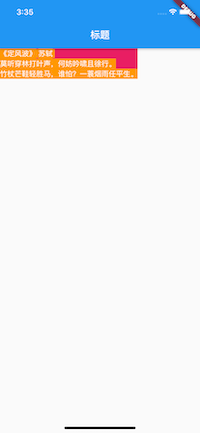 


#### 2、TextDemo e2

```
class TextContentDemo2 extends StatelessWidget {
  @override
  Widget build(BuildContext context) {
    // Container 有个特点是, 设置了宽高信息就按具体的宽高信息来显示, 否则按照父组件的大小展示
    // 给Container组件提供宽高信息的方式有很多: 比如: 设置宽高属性width,height 或者约束Constraints, 或者设置
    // child 属性, 这些都算是给Container提供宽高信息
    return Container(
      color: Colors.pink,
      width: double.infinity,
      height: 100,
      child: Text(
          "《定风波》 苏轼 \n莫听穿林打叶声，何妨吟啸且徐行。\n竹杖芒鞋轻胜马，谁怕？一蓑烟雨任平生。",
        style: TextStyle(
          fontSize: 30,
          color: Colors.white,
          backgroundColor: Colors.orange    // Text 的背景色, 这个最好别用, 容易出现字体大小背景色不好看的样式
        ),
        maxLines: 3,    // 最大显示行数, 如果要显示的行数不确定就不设置, 没有像iOS中的0就是显示任意行数
        textAlign: TextAlign.right,   // 只有当Text的父组件的宽度超过自己时才会有效果
        overflow: TextOverflow.fade,

      ),
    );
  }
}
```

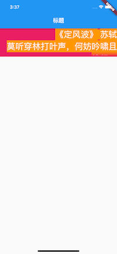 


### 2、Text.rich 富文本展示

前面展示的文本，我们都应用了相同的样式，如果我们希望给他们不同的样式呢？

- 比如《定风波》我希望字体更大一点，并且是黑色字体，并且有加粗效果；
- 比如 苏轼 我希望是红色字体；

如果希望展示这种混合样式，那么我们可以利用分片来进行操作（在Android中，我们可以使用SpannableString，在iOS中，我们可以使用NSAttributedString完成，了解即可）


#### 1、Text.rich 的简单使用

```
class TextRichDemo extends StatelessWidget {
  @override
  Widget build(BuildContext context) {
    return Container(
      child: Text.rich(
        TextSpan(
          children: [
            TextSpan(text: "《定风波》", style: TextStyle(fontSize: 25, fontWeight: FontWeight.bold, color: Colors.black)),
            TextSpan(text: "苏轼", style: TextStyle(fontSize: 18, color: Colors.redAccent)),
            TextSpan(text: "\n莫听穿林打叶声，何妨吟啸且徐行。\n竹杖芒鞋轻胜马，谁怕？一蓑烟雨任平生。")
        ],
      )
      ),

    );
  }
}
```

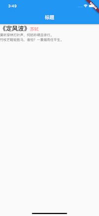  


#### 3、Text.Rich 图文示例

先来一个示例效果:

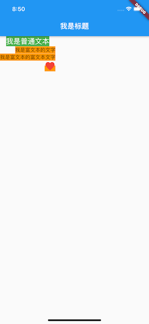 

在来一段示例代码:

```
mport 'package:flutter/material.dart';
main(List<String> args){
  runApp(YRApp());
}


class YRApp extends StatelessWidget {
  @override
  Widget build(BuildContext context) {
    return MaterialApp(
      debugShowCheckedModeBanner: true,
      home: HomePage()
    );
  }
}


class HomePage extends StatelessWidget {
  @override
  Widget build(BuildContext context) {
    return Scaffold(
      appBar: AppBar(
        title: Text('我是标题'),
      ) ,
      body: TextContent(),
    ) ;
  }
}


class TextContent extends StatelessWidget {
  @override
  Widget build(BuildContext context) {
    return Column(
      children: <Widget>[
        // 普通文本使用 Text 这个Widget即可
        Text(
          '我是普通文本',
          style: TextStyle(
            fontSize: 20,
            color: Colors.white,
            backgroundColor: Colors.green
          ),
        ),

        // 富文本需要使用 Text.rich
        Text.rich(
          TextSpan(
            text: '我是富文本的文字\n',
            children:[
              TextSpan(
                  text:'我是富文本的富文本文字\n'
              ),
              WidgetSpan(
                child: Icon(Icons.favorite, color: Colors.red, size: 30,)
              )

            ]
          ),
          textAlign: TextAlign.right,
          style: TextStyle(
            backgroundColor: Colors.orange
          ),

        ),

      ],
    );
  }
}

```

最后来个总结:

> ```
> 简单说:
> - 如果我们想要显示一段纯文本, 使用Text 这个Widget即可
> - 如果我们想要显示一段富文本, 就使用 Text.rich()
> 
> 在Text.rich()  中有个 InlineSpan 类型的必选参数, 也就是说如果我们要显示富文本, 就必须把富文本的文字图片等包装成InlineSpan 类型的Widget
> 
> 然而 InlineSpan 是抽象类我们不能直接使用, 通过快捷键 `option+command+b` 我们发现抽象类
> InlineSpan 有两个实现类 TextSpan 和 WidgetSpan, 也就是说我们要显示的富文本内容(图文)最终需要包装成 TextSpan或者WidgetSpan
> 
> 其中TextSpan 中有个text的可选属性用于接收字符串的文本, 有个 List 类型的可选属性 children 用来接收其它要显示的 InlineSpan Widget. 
> 
> 而在WidgetSpan中只有一个 Widget类型的child 属性用来接收其它要显示的 widget
> ```


### 3、Text 计算文字宽高

首先要说明, 我们在使用呢Text 组件时, 没有直接找到计算文字的宽高的方法, 但是我们在使用Text 组件时, 其实它内部是有通过某种方法计算Text组件需要显示的宽高的

具体思路, 我们参照网友的一片文章, 如下:

**场景**

在某些业务上，可能我们需要计算多段文字的高度，达到动态适配ListView高度的目的，满足我们产品的优（bian）秀（tai）需求。在android原生层大家都知道有各种手段可以计算文字的宽、高等，例如paint.layout等等手段。但在flutter中，虽然并没有直接提供API供开发者使用，但和android原生一样，只有看下RichText的源码就可以发现其中奥妙。

**源码分析**

**RichText分析(Text等文本实现都一致)**

1. 文本实现最重要的是RenderParagraph类，官网备注 A render object that displays a paragraph of text，大概意思就是这个类用作文案展示的。再继续看构造函数发现了我们非常熟悉的老朋友TextPainter（和Android老朋友是不是也差不多），那么我们的TextPainter是否也有layout函数呢？let me see。

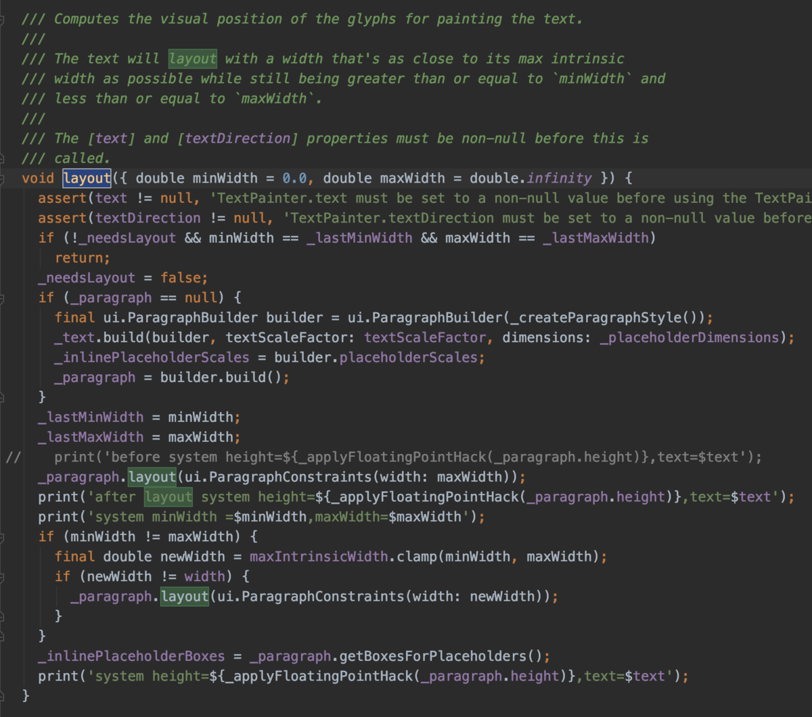 

2. 上面我们可以看到，layout函数里面主要做的事情：一、构建好开发者定义的Text。二、根据开发者传入的maxWidth做限宽操作。三、把所有参数与计算交给ui.Paragraph（ParagraphXXX开头都是native C++代码）C++来做跨平台处理了。

3. 看下TextPainter的height是怎么来的？由下图可以看出还是离不开ui.Paragraph变量。所以上面第一、第二步只是把参数告知Paragraph的native层，然后委托flutter engine进行计算。最后我们flutter通过painter直接访问Paragraph的各种属性变量。

 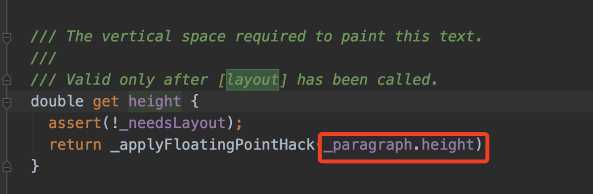 

**如何计算文字高度（本文重点）**

```
/**
 * 根据文本内容, 字体大小, 字体粗细, 最大宽度计算文本的显示尺寸
 */
Size calculateSize(String txt,            // 文本文字
                  double fontSize,        // 文本字体大小
                  FontWeight fontWeight,  // 文本的粗细
                  int maxLines,           // 文本的行数
                  double maxWidth){       // 文本最大宽度

  // fontFamily:
  TextStyle txtStyle = TextStyle( fontSize: fontSize,  fontWeight:fontWeight);

  TextSpan txtSpan = TextSpan(
    text: txt,
    style: txtStyle
  );

  ///AUTO：华为手机如果不指定locale的时候，该方法算出来的文字高度是比系统计算偏小的。
  //locale: Localizations.localeOf(GlobalStatic.context, nullOk: true),
  Locale locale = Locale('zh','CH');
  TextPainter txtPainter = TextPainter(
    text: txtSpan,
    
    locale: locale,
    maxLines: maxLines,
    textDirection: TextDirection.ltr
  );

  txtPainter.layout(minWidth: 0, maxWidth: maxWidth);
   print("text size: ${txtPainter.size}");
  return txtPainter.size;
}
```


## 3、按钮的使用


### 1、按钮的简单使用呢

Material widget库中提供了多种按钮Widget如: `FloatingActionButton`、`RaisedButton`、`FlatButton`、`OutlineButton`等

```
class ButtonDemoContent extends StatelessWidget {
  @override
  Widget build(BuildContext context) {
    return Column(
      children: <Widget>[
        FloatingActionButton(
          child: Text('float action button title'),
          onPressed: () {
            print(' float action button 被点击了');
          },
        ),

        RaisedButton(
          child: Text('raise buttonn'),
          onPressed: () {
            print('raise button click');
          },
        ),
        FlatButton(
          child: Text('flat buttonn'),
          onPressed: () {
            print('flat button click');
          },
        ),
        OutlineButton(
          child: Text('OutlineButton buttonn'),
          onPressed: () {
            print('OutlineButton button click');
          },
        ),
        // 自定义button
        FlatButton(
          color: Colors.orange,
          highlightColor: Colors.red,
          textColor: Colors.white,
          shape:RoundedRectangleBorder(
                  borderRadius: BorderRadius.circular(10)
              ),
          child: Text('自定义 buttonn'),
          onPressed: () {
            print('自定义 button click2');
          },
        ),
        FlatButton(
          color: Colors.red,
          disabledColor: Colors.grey,
          highlightColor: Colors.blue,
          // 设置圆角
          shape:RoundedRectangleBorder(
              borderRadius:BorderRadius.circular(10)
          ) ,

          child: Row(
            // 控制主轴上占用的宽度
            mainAxisSize: MainAxisSize.min,
            children: <Widget>[
              Text('自定义button'),
              SizedBox(width: 25,),
              Icon(Icons.people)
            ],
          ),
          // onPress 这个属性很重要, 直接控制了 button 的disable
          onPressed: (){
            print('自定义 图文 button 点击了');
          },
        ),
        IconButton(
          color: Colors.cyan,
          icon: Icon(Icons.people),
          onPressed: (){},
        )
      ],
    );
  }
}
```

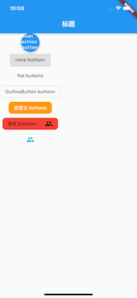  


### 2、小button 的使用

我们在flutter开发中,默认情况下Button的大小是由内容决定的, 但是默认情况下即便button的内容很少, button 也是有一个默认的宽度和高度的, 这就导致了一个问题, 当我们想设置一个很小的button 时很困难.

当我们在查看源码时发现, 在button 的build 方法中使用了 `ButtonThemeData` , 在ButtonThemeData 中有设置默认的宽和高

- RaiseButton 的build 方法定义如下: 

  ```
  @override
    Widget build(BuildContext context) {
      final ThemeData theme = Theme.of(context);
      // 就是这个ButtonnThemeData 中有设置button 默认的宽高
      final ButtonThemeData buttonTheme = ButtonTheme.of(context);
      return RawMaterialButton(
        onPressed: onPressed,
        onLongPress: onLongPress,
        onHighlightChanged: onHighlightChanged,
        clipBehavior: clipBehavior,
        fillColor: buttonTheme.getFillColor(this),
        textStyle: theme.textTheme.button.copyWith(color: buttonTheme.getTextColor(this)),
        focusColor: buttonTheme.getFocusColor(this),
        hoverColor: buttonTheme.getHoverColor(this),
        highlightColor: buttonTheme.getHighlightColor(this),
        splashColor: buttonTheme.getSplashColor(this),
        elevation: buttonTheme.getElevation(this),
        focusElevation: buttonTheme.getFocusElevation(this),
        hoverElevation: buttonTheme.getHoverElevation(this),
        highlightElevation: buttonTheme.getHighlightElevation(this),
        disabledElevation: buttonTheme.getDisabledElevation(this),
        padding: buttonTheme.getPadding(this),
        visualDensity: visualDensity ?? theme.visualDensity,
        constraints: buttonTheme.getConstraints(this),
        shape: buttonTheme.getShape(this),
        focusNode: focusNode,
        autofocus: autofocus,
        animationDuration: buttonTheme.getAnimationDuration(this),
        materialTapTargetSize: buttonTheme.getMaterialTapTargetSize(this),
        child: child,
      );
    }
  ```

- ButtonThemeData 的构造方法如下:

  ```
  const ButtonThemeData({
      this.textTheme = ButtonTextTheme.normal,
      
      // 在设立设置的button 的默认宽高
      this.minWidth = 88.0,
      this.height = 36.0,
      EdgeInsetsGeometry padding,
      ShapeBorder shape,
      this.layoutBehavior = ButtonBarLayoutBehavior.padded,
      this.alignedDropdown = false,
      Color buttonColor,
      Color disabledColor,
      Color focusColor,
      Color hoverColor,
      Color highlightColor,
      Color splashColor,
      this.colorScheme,
      MaterialTapTargetSize materialTapTargetSize,
    }) : assert(textTheme != null),
         assert(minWidth != null && minWidth >= 0.0),
         assert(height != null && height >= 0.0),
         assert(alignedDropdown != null),
         assert(layoutBehavior != null),
         _buttonColor = buttonColor,
         _disabledColor = disabledColor,
         _focusColor = focusColor,
         _hoverColor = hoverColor,
         _highlightColor = highlightColor,
         _splashColor = splashColor,
         _padding = padding,
         _shape = shape,
         _materialTapTargetSize = materialTapTargetSize;
  ```

如果我们要想设置 小button只需在项目中修改默认的 ButtonThemeData 即可

- 设置小button代码如下:

  ```
  main(List<String> args) {
    runApp(MaterialApp(
        title: '安卓最近使用app title', // 这个属性只在android 上有效, 在iOS 上无效
        theme: ThemeData(
            // 2. 设置 默认的button 大小
            buttonTheme: ButtonThemeData(
              minWidth: 10,
              height: 10,
              buttonColor: Colors.orange // 设置默认button背景色
            )
        ),
        home: MyApp()));
  }
  ```

  


## 4、图片的使用

图片可以让我们的应用更加丰富多彩，Flutter中使用Image组件

Image组件有很多的构造函数，我们这里主要学习两个：

- Image.assets：加载本地资源图片；
- Image.network：加载网络中的图片；


### 1、本地图片的使用

在我们的flutter开发中, 使用本地图片主要有三个步骤:

- 在flutter项目中创建一个文件, 用于存储图片

- 在`pubspec.yaml` 文件中配置图片的信息

  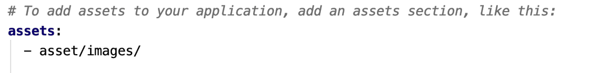 


```
class ImageDemo extends StatelessWidget {
  @override
  Widget build(BuildContext context) {
    return Image(
    	// Image Widget有个续传属性 image 是一个ImageProvider, 加载本地图片时, 我们可以使用
    	// AssetImage, 提供一个图片路劲即可
      image: AssetImage('asset/images/card@1x.png'),
    );
  }
}
```

> 一般我们使用本地图片, 为了简化代码 一般法会尽量使用  `Image.asset()` 代替

```
Image.asset('asset/images/card@1x.png');
```

### 2、网络图片的使用

相对来讲，Flutter中加载网络图片会更加简单，直接传入URL并不需要什么配置，所以我们先来看一下Flutter中如何加载网络图片。

我们先来看看Image有哪些属性可以设置：

> const Image({
>   ...
>   this.width, *//图片的宽*
>   this.height, *//图片高度*
>   this.color, *//图片的混合色值*
>   this.colorBlendMode, *//混合模式*
>   this.fit,*//缩放模式*
>   this.alignment = Alignment.center, *//对齐方式*
>   this.repeat = ImageRepeat.noRepeat, *//重复方式*
>   ...
> })

```
class ImageDemo extends StatelessWidget {
  @override
  Widget build(BuildContext context) {
    return Image(
      image:NetworkImage(url)
    );

  }
}
```

> 般我们使用网络图片, 为了简化代码 一般法会尽量使用  `Image.network()` 代替

```
Image.network(url);
```


### 3、图片常用的属性介绍

- `width`、`height`：用于设置图片的宽、高. 

  - 当不指定宽高时，图片会根据当前父容器的约束限制，尽可能的显示其原始大小
  - 如果只设置`width`、`height`的其中一个，那么另一个属性(宽、高)默认会按比例缩放，但可以通过下面介绍的`fit`属性来指定适应规则。

- `fit`：该属性用于在图片的显示空间和图片本身大小不同时指定图片的适应模式。具体取值如下:

  ```
  enum BoxFit {
    fill,
    contain,
    cover,
    fitWidth,
    fitHeight,
    none,
    scaleDown,
  }
  ```

- **示例代码如下:**

  ```
  
  class ImageDemoContent extends StatelessWidget {
    final String url =
        'https://pics2.baidu.com/feed/fc1f4134970a304e410cd2820c348981c8175c9b.jpeg?token=f9c9fd8d67c2cf3c1c152eca34009a3c';
  
    @override
    Widget build(BuildContext context) {
      return Column(
        children: <Widget>[
          Row(
            children: <Widget>[
              Container(
                  color: Colors.cyan,
                  child: Image(
                    image: NetworkImage(url),
                    width: 120,
                  )),
              Text('只设置宽,不设置fit属性')
            ],
          ),
          
          
          SizedBox(height: 10,),
          Row(
            children: <Widget>[
              Container(
                  color: Colors.orange,
                  child: Image(
                    image: NetworkImage(url),
                    width: 120,
                    height: 120,
                  )),
              Text('同时设置宽高, 不设置fit属性')
            ],
          ),
          
          
          SizedBox(height: 10,),
          Row(
            children: <Widget>[
              Container(
                  color: Colors.pink,
                  child: Image(
                    image: NetworkImage(url),
                    width: 120,
                    height: 120,
                    fit: BoxFit.fill, //会拉伸填充满显示空间，图片本身长宽比会发生变化，图片会变形
                  )),
              Text('同时设置宽高, 和fit=fill')
            ],
          ),
          
          
          SizedBox(height: 10,),
          Row(
            children: <Widget>[
              Container(
                  color: Colors.pink,
                  child: Image(
                    image: NetworkImage(url),
                    width: 120,
                    height: 120,
                    fit: BoxFit.cover, //会按图片的长宽比放大后居中填满显示空间，图片不会变形，超出显示空间部分会被剪裁。
                  )),
              Text('同时设置宽高和 fit= cover')
            ],
          ),
          
          
          SizedBox(height: 10,),
          Row(
            children: <Widget>[
              Container(
                  color: Colors.pink,
                  child: Image(
                    image: NetworkImage(url),
                    width: 120,
                    height: 120,
                    // 这是图片的默认适应规则，图片会在保证图片本身长宽比不变的情况下缩放以适应当前显示空间，图片不会变形。
                    fit: BoxFit.contain,
                  )),
              Text('同时设置宽高, 设置fit=contain')
            ],
          ),
          
          
          SizedBox(height: 10,),
          Row(
            children: <Widget>[
              Container(
                  color: Colors.pink,
                  child: Image(
                    image: NetworkImage(url),
                    width: 120,
                    height: 120,
                    // fitHeight 图片等比缩放, 高度拉伸到指定高度, 宽度超出会裁剪掉
                    // fitWidth 图片等比缩放, 宽度拉伸到指定高度, 高度超出会裁剪掉
                    // 可以把 cover 理解成为fitWidth 或者 fitHeight
                    fit: BoxFit.fitHeight,
                  )),
              Text('同时设置宽高, 设置fit=fitHeight')
            ],
          ),
        ],
      );
    }
  }
  
  ```

  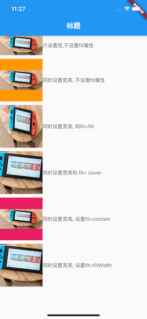  


### 4、圆角图片

> 在Flutter中实现圆角效果也是使用一些Widget来实现的。


#### 1、CircleAvatar 实现圆角

CircleAvatar可以实现圆角头像，也可以添加一个子Widget：

换句话说, CircleAvatar 就是一个实现圆角功能的Widget,  将要显示圆角的Widget使用CircleAvatar包裹配上参数即可

```
const CircleAvatar({
  Key key,
  this.child, *// 子Widget*
  this.backgroundColor, *// 背景颜色*
  this.backgroundImage, *// 背景图像*
  this.foregroundColor, *// 前景颜色*
  this.radius, *// 半径*
  this.minRadius, *// 最小半径*
  this.maxRadius, *// 最大半径*
})
```

> 注意:
>
> 此处, backgroundImage 是一个ImageProvider类型的参数, 不能直接使用图片

- 示例代码: 

  ```
  class CircleImageDemo1 extends StatelessWidget {
    @override
    Widget build(BuildContext context) {
      return CircleAvatar(  
        backgroundImage: NetworkImage(url),
        radius: 100 / 2,
        child: Text('我是 文字', style: TextStyle(fontSize: 20, color: Colors.green),),
      );
    }
  }
  ```

  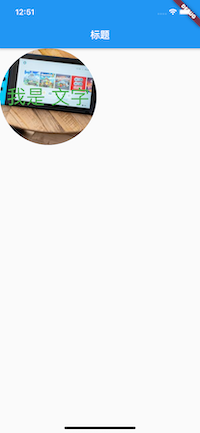 


#### 2、ClipOval 实现圆角

```
const ClipOval({
    Key key, 
    this.clipper, 
    this.clipBehavior = Clip.antiAlias, 
    Widget child
})
```

通常我们使用ClipOval 来实现圆角头像,默认情况下 ClipOval 会根据子组件的宽高自动实现圆角, 如果子组件宽高相等就是一个圆, 否则就是一个椭圆

 示例代码如下:

```
class ClipOvalDemo extends StatelessWidget {
  @override
  Widget build(BuildContext context) {
    return Column(
      children: <Widget>[
        ClipOval(
          child: Container(
            color: Colors.green,
            child: Image(
              image: NetworkImage(url),
              width: 100,
              height: 200,
            ),
          )
        ),
        
        SizedBox(height: 10,),
        
        ClipOval(
          child: Container(
            color: Colors.green,
            child: Image(
              image: NetworkImage(url),
              width: 200,
              height: 200,
            ),
          )
        ),
      ],
    );
  }


}
```

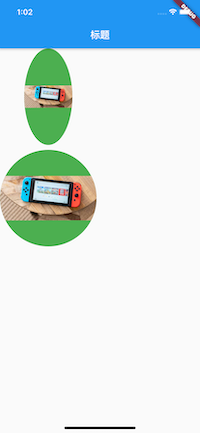 


#### 3、Container + BoxDecoration 实现圆角

## 5、字体图标 icon


## 6、表单Widget

> 和用户交互的其中一种就是输入框，比如注册、登录、搜索，我们收集用户输入的内容将其提交到服务器。


### 1、**TextField** 的简单介绍

TextField用于接收用户的文本输入，它提供了非常多的属性，我们来看一下源码：

但是我们没必要一个个去学习，很多时候用到某个功能时去查看是否包含某个属性即可

```
const TextField({
  Key key,
  this.controller,
  this.focusNode,
	//  用于设置输入框相关的样式, 如下:
  //	icon：设置左边显示的图标
  //  labelText：在输入框上面显示一个提示的文本
  //  hintText：显示提示的占位文字
  //  border：输入框的边框，默认底部有一个边框，可以通过InputBorder.none删除掉
  //  filled：是否填充输入框，默认为false
  //  fillColor：输入框填充的颜色
  this.decoration = const InputDecoration(),
  
  TextInputType keyboardType,		// 键盘的类型(数字键盘, 文字键盘)
  this.textInputAction,					// return 键显示的样式
  this.textCapitalization = TextCapitalization.none,
  this.style,										// 设置输入框文字样式
  this.strutStyle,
  this.textAlign = TextAlign.start,	// 文本对齐方式
  this.textAlignVertical,
  this.textDirection,
  this.readOnly = false,
  ToolbarOptions toolbarOptions,
  this.showCursor,
  this.autofocus = false,
  this.obscureText = false,
  this.autocorrect = true,
  this.maxLines = 1,
  this.minLines,
  this.expands = false,
  this.maxLength,
  this.maxLengthEnforced = true,
  this.onChanged,				// 监听输入框内容的改变，传入一个回调函数
  this.onEditingComplete,
  this.onSubmitted,			// 点击键盘中右下角的down时，会回调的一个函数
  this.inputFormatters,
  this.enabled,
  this.cursorWidth = 2.0,
  this.cursorRadius,
  this.cursorColor,
  this.keyboardAppearance,
  this.scrollPadding = const EdgeInsets.all(20.0),
  this.dragStartBehavior = DragStartBehavior.start,
  this.enableInteractiveSelection = true,
  this.onTap,
  this.buildCounter,
  this.scrollController,
  this.scrollPhysics,
})
```


​			

### 2、TextField 的简单使用

示例代码如下:

```
class TextFieldContent extends StatelessWidget {
  @override
  Widget build(BuildContext context) {
    return Container(
      child: TextField(
        keyboardType:TextInputType.text,                  // 键盘的样式(数字键盘, 文字键盘...)
        textInputAction: TextInputAction.join,            // return 键显示的样式
        style: TextStyle(color:Colors.red, fontSize: 30), // 输入框的文字样式
        decoration: InputDecoration (
          icon: Icon(Icons.people),  // 输入框左边的按钮
          hintText: '我是占位文字',   // 输入框的占位文字
          hintStyle: TextStyle(color: Colors.green),
          filled: true,         // 只有filled为true 时, 才能使用fillColor
          fillColor: Color.fromARGB(50, 255, 0, 0) // 输入框填充色
        ),
        onChanged: (String value ){ // 当输入框的文字发生变化就会回调这个方法, 在这里监听输入框的变化
          print('textfield change: $value');
        },
        onSubmitted: (String value){ // 当用户点击 done 按钮时回调这个方法
          print('key board down: $value');
        },
      ),
    );
  }
}
```

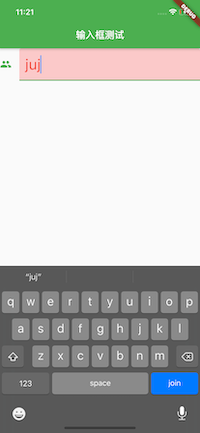 


### 3、TextField 的controller

我们可以给TextField添加一个控制器（Controller），可以使用它设置文本的初始值，也可以使用它来监听文本的改变；

> 事实上，
>
> 如果我们没有为TextField提供一个Controller，那么会Flutter会默认创建一个TextEditingController的，这个结论可以通过阅读源码得到, 如下:
>
> ```
> @override
>   void initState() {
>     super.initState();
>     // ...其他代码
>     if (widget.controller == null)
>       _controller = TextEditingController();
>   }
> ```

我们也可以自己来创建一个Controller控制一些内容：

```
class TextFieldContent2 extends StatefulWidget {
  @override
  _TextFieldContent2State createState() => _TextFieldContent2State();
}

class _TextFieldContent2State extends State<TextFieldContent2> {
  // 因为我们要个TextField 设置controller, 且只设置一次, 所以我们在 initState 方法中设置最好
  final textEditingCtr = TextEditingController();

  @override
  void initState() {
    super.initState();

    // 1.通过controller 设置TextField的默认文字
    textEditingCtr.text = "默认昵称";

    // 2. 监听文本框
    textEditingCtr.addListener(() {
      print('text edit ctr listener: ${textEditingCtr.text}');
    });
  }

  @override
  Widget build(BuildContext context) {
    return Container(
      child: TextField(
        controller: textEditingCtr, 
        decoration: InputDecoration(
            contentPadding: EdgeInsets.all(10), hintText: "请输入昵称"),
      ),

    );
  }
}
```


## 7、Form表单


### 1、Form的基本使用

Form表单也是一个Widget，可以在里面放入我们的输入框。

但是Form表单中输入框必须是FormField类型的

- 我们查看刚刚学过的TextField是继承自StatefulWidget，并不是一个FormField类型；
- 我们可以使用TextFormField，它的使用类似于TextField，并且是继承自FormField的；

我们通过Form的包裹，来实现一个注册的页面：

```

class FormContent extends StatefulWidget {
  @override
  _FormContentState createState() => _FormContentState();
}

class _FormContentState extends State<FormContent> {
  @override
  Widget build(BuildContext context) {
    return Form(

      child: Container(
        padding: EdgeInsets.fromLTRB(10, 0, 10, 0),
        margin: EdgeInsets.fromLTRB(0, 50, 0, 0),
        color: Colors.lightGreen,

        child: Column(
          mainAxisSize: MainAxisSize.min,
          children: <Widget>[
            TextFormField(
              decoration: InputDecoration(
                icon: Icon(Icons.people, color: Colors.orange,),
                hintText: '用户名',
              ),
            ),

            SizedBox(height: 10,),
            TextFormField(
              obscureText: true,  // 是否显示密码
              decoration: InputDecoration(
                icon: Icon(Icons.lock, color: Colors.orange,),
                hintText: "密码",
              ),
            ),

            SizedBox(height: 10,),
            Container(
              width: double.infinity,
              child: RaisedButton(
                color: Colors.orange,
                child: Text('点击 注册'),
                onPressed: (){

                },
              ),
            )
          ],
        ),
      ),
    );
  }
}


```

  


### 2、保存和获取表单数据

**有了表单后，我们需要在点击注册时，可以同时获取和保存表单中的数据，怎么可以做到呢？**

1. 需要监听注册按钮的点击，在之前我们已经监听的onPressed传入的回调中来做即可。（当然，如果嵌套太多，我们待会儿可以将它抽取到一个单独的方法中）

2. 监听到按钮点击时，同时获取`用户名`和`密码`的表单信息。

   

**如何同时获取`用户名`和`密码`的表单信息？** 

如果我们调用`Form的State对象`的save方法，就会调用Form中放入的TextFormField的onSave回调

```
TextFormField(
  obscureText: true,  // 是否显示密码
  decoration: InputDecoration(
    icon: Icon(Icons.lock, color: Colors.orange,),
    hintText: "密码",
  ),
  onSaved: (value){
    print('获取到用户密码: ${value}');
  },
)
```

但是，我们有没有办法可以在点击按钮时，拿到 `Form对象` 来调用它的save方法呢？

> 知识点：
>
> 在Flutter如何可以获取一个通过一个引用获取一个StatefulWidget的State对象呢？

```
class FormContent extends StatefulWidget {
  @override
  _FormContentState createState() => _FormContentState();
}

class _FormContentState extends State<FormContent> {

  // 注册一个formkey
  final registFormKey = GlobalKey<FormState>();
  String userName, password;


  @override
  Widget build(BuildContext context) {
    return Form(
      // 通过formKey.currentState 可以获取到它的State对象
      key: registFormKey,
      child: Container(
        padding: EdgeInsets.fromLTRB(10, 0, 10, 0),
        margin: EdgeInsets.fromLTRB(0, 50, 0, 0),
        color: Colors.lightGreen,
        child: Column(
          mainAxisSize: MainAxisSize.min,
          children: <Widget>[
            TextFormField(
              decoration: InputDecoration(
                icon: Icon(Icons.people, color: Colors.orange,),
                hintText: '用户名',
              ),
              onSaved: (value){
                print('获取到用户名: ${value}');
                this.userName = value;
              },
            ),

            SizedBox(height: 10,),
            TextFormField(
              obscureText: true,  // 是否显示密码
              decoration: InputDecoration(
                icon: Icon(Icons.lock, color: Colors.orange,),
                hintText: "密码",
              ),
              onSaved: (value){
                print('获取到用户密码: ${value}');
                this.password = value;
              },

            ),

            SizedBox(height: 10,),
            Container(
              width: double.infinity,
              child: RaisedButton(
                color: Colors.orange,
                child: Text('点击 注册'),
                onPressed: (){

                  this.registerForm();
                },
              ),
            )
          ],
        ),
      ),

    );
  }

  void registerForm(){
    registFormKey.currentState.save();
    print(registFormKey.currentState);
    print('username: ${userName}, password: ${password}');
  }

}
```


### 3、验证填写的表单数据


在表单中，我们可以添加`验证器`，如果不符合某些特定的规则，那么给用户一定的提示信息

比如我们需要账号和密码有这样的规则：账号和密码都不能为空。

按照如下步骤就可以完成整个验证过程：

- 1、为TextFormField添加validator的回调函数；
- 2、调用Form的State对象的validate方法，就会回调validator传入的函数；

```
class FormContent extends StatefulWidget {
  @override
  _FormContentState createState() => _FormContentState();
}

class _FormContentState extends State<FormContent> {

  // 注册一个formkey
  final registFormKey = GlobalKey<FormState>();
  String userName, password;


  @override
  Widget build(BuildContext context) {
    return Form(
      // 通过formKey.currentState 可以获取到它的State对象
      key: registFormKey,
      child: Container(
        padding: EdgeInsets.fromLTRB(10, 0, 10, 0),
        margin: EdgeInsets.fromLTRB(0, 50, 0, 0),
        color: Colors.lightGreen,
        child: Column(
          mainAxisSize: MainAxisSize.min,
          children: <Widget>[
            TextFormField(
              decoration: InputDecoration(
                icon: Icon(Icons.people, color: Colors.orange,),
                hintText: '用户名',
              ),
              onSaved: (value){ // 当调用 form 的save 方法时, 会自动调用 TextFormField 的onSaved 方法, 获取内容
                print('获取到用户名: ${value}');
                this.userName = value;
              },
              // 我们通过给 TextFormField 添加 验证器来验证数据格式
              validator: (value){
                if(value.isEmpty){
                  return "用户名不能为空";
                }
                return null;
              },
            ),

            SizedBox(height: 10,),
            TextFormField(
              obscureText: true,  // 是否显示密码
              decoration: InputDecoration(
                icon: Icon(Icons.lock, color: Colors.orange,),
                hintText: "密码",
              ),
              onSaved: (value){
                print('获取到用户密码: ${value}');
                this.password = value;
              },
              // 我们通过给 TextFormField 添加 验证器来验证数据格式
              validator: (value){
                if(value.isEmpty){
                  return "密码不能为空";
                }
                return null;
              },

            ),

            SizedBox(height: 10,),
            Container(
              width: double.infinity,
              child: RaisedButton(
                color: Colors.orange,
                child: Text('点击 注册'),
                onPressed: (){

                  this.registerForm();
                },
              ),
            )
          ],
        ),
      ),

    );
  }

  void registerForm(){
    // 获取form 中每个 TextFormField 的文字内容
    registFormKey.currentState.save();
    // 通过调用 validate 方法验证 TextFormField的数据
    registFormKey.currentState.validate();

    print(registFormKey.currentState);
    print('username: ${userName}, password: ${password}');
  }

}
```

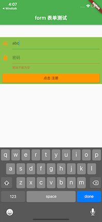 


也可以为TextFormField添加一个属性：autovalidate

- 不需要调用validate方法，会自动验证是否符合要求；

```
TextFormField(
  obscureText: true,  // 是否显示密码
  decoration: InputDecoration(
    icon: Icon(Icons.lock, color: Colors.orange,),
    hintText: "密码",
  ),
  onSaved: (value){
    print('获取到用户密码: ${value}');
    this.password = value;
  },
  // 通过自动验证数据格式, 不需要调用 form 的validate() 方法
  autovalidate: true,
  // 我们通过给 TextFormField 添加 验证器来验证数据格式
  validator: (value){
    if(value.isEmpty){
      return "密码不能为空";
    }
    return null;
  },

)
```


## 8、透明度widget

在iOS 开发中, 我们是通过给view设置透明度的属性`alpha` 来改变view的透明度的, 但是在flutter 开发中我们不是通过设置属性来让widget组件改变透明度的, 我们是通过给组件包裹一个`Opacity` 的widget来改变组件的透明度的

```
Opacity(
	opacity: 0.5,
	child: Text('透明度50%')
);
```


# 十三、flutter 布局

在我们前面有用到的 `Button` 、`Image` 、`TextField` 、`Text` 、`Icon`  这些我们在flutter中一般称为叶子组件. 


为了实现界面内组件的各种排布方式，我们需要进行布局，和其他端不同的是，Flutter中因为万物皆Widget，所以布局也是使用Widget来完成的。

Flutter中的布局组件非常多，有31个用于布局的组件，**Flutter布局组件**

在学习的过程中，我们没必要一个个全部掌握，掌握最常用的，一些特殊的组件用到时去查文档即可；


> Flutter将布局组件分成了 `单子布局组件`（Single-child layout widgets） 和 `多子布局组件`（Multi-child layout widgets）

## 1、单子布局组件

> 单子布局组件的含义是其只有一个子组件, 可以通过设置一些属性设置改子组件所在的位置信息.
>
> 比如: 常用的单子布局组件有:
>
> `Align` 、`Center` 、`Padding`、`Container`


### 1、Align 布局组件

> 看到`Align`这个词，我们就知道它有我们的对齐方式有关。
>
> 在其他端的开发中（iOS、Android、前端）Align通常只是一个属性而已，但是Flutter中Align也是一个组件。

我们可以通过源码来看一下Align有哪些属性：

```
const Align({
  Key key,
  this.alignment: Alignment.center, // 对齐方式，默认居中对齐
  this.widthFactor, // 宽度因子，不设置的情况，会尽可能大
  this.heightFactor, // 高度因子，不设置的情况，会尽可能大
  Widget child // 要布局的子Widget
})
```


这里我们特别解释一下`widthFactor`和`heightFactor`作用：

- 因为子组件在父组件中的对齐方式必须有一个前提，就是父组件得知道自己的范围（宽度和高度）；

- 如果`widthFactor`和`heightFactor`不设置，那么默认Align会尽可能的大

  换句话说, 如果没有设置 widthFactor 和 heightFactor 那么Align占据的大小同父组件的宽高一样

  如果设置了WidthFactor 和 heightFactor 那么Align 的宽度和高度就是子组件的 对应倍数.

  

  ```
  class SingleChildContent extends StatelessWidget {
    @override
    Widget build(BuildContext context) {
      return Align(
        child: Icon(Icons.people, size: 40,),
        alignment: Alignment.bottomRight,
        widthFactor: 2,  // 宽度因子, Align的宽度为Icon的2倍
        heightFactor: 2, // 高度因子, Align的高度为Icon的2倍
      );
    }
  }
  ```

   


### 2、Center 布局组件

Center组件我们在前面已经用过很多次了。

事实上Center组件继承自Align，只是将alignment设置为Alignment.center。

源码分析：

```
class Center extends Align {
  const Center({
    Key key,
    double widthFactor,
    double heightFactor,
    Widget child
  }) : super(key: key, widthFactor: widthFactor, heightFactor: heightFactor, child: child);
}
```

示例:

```
class CenterContent extends StatelessWidget {
  @override
  Widget build(BuildContext context) {
    return Center(
      child: Icon(Icons.people, size: 40,),
      widthFactor: 2,
      heightFactor: 2,
    );
  }
}
```

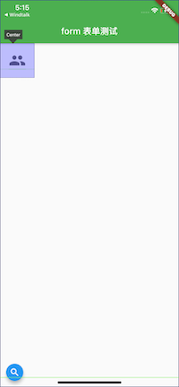 


### 3、Padding 布局组件

> Padding组件在其他端也是一个属性而已，但是在Flutter中是一个Widget，但是Flutter中没有Margin这样一个Widget，这是因为外边距也可以通过Padding来完成。
>
> Padding通常用于设置子Widget到父Widget的边距（你可以称之为是父组件的内边距或子Widget的外边距）。

源码分析：

```
const Padding({
  Key key,
  @required this.padding, // EdgeInsetsGeometry类型（抽象类），使用EdgeInsets
  Widget child,
})
```

示例:

```
class PaddingContent extends StatelessWidget {
  @override
  Widget build(BuildContext context) {
    return Padding(
        padding: EdgeInsets.all(20),
        child: Text(
          "莫听穿林打叶声，何妨吟啸且徐行。竹杖芒鞋轻胜马，谁怕？一蓑烟雨任平生。",
          style: TextStyle(
              color: Colors.redAccent,
              fontSize: 18
          ),
        )
    );
  }
}
```

 


## 2、Container 布局组件(重要!!! )

> Container在开发中被使用的频率是非常高的，特别是我们经常会将其作为容器组件。

下面我们来看一下Container有哪些属性：

```
Container({
  this.alignment,
  this.padding, //容器内补白，属于decoration的装饰范围
  Color color, // 背景色
  Decoration decoration, // 背景装饰
  Decoration foregroundDecoration, //前景装饰
  double width,//容器的宽度
  double height, //容器的高度
  BoxConstraints constraints, //容器大小的限制条件
  this.margin,//容器外补白，不属于decoration的装饰范围
  this.transform, //变换
  this.child,
})
```


- 在flutter的开发中, Container 是一个比较特殊的布局组件, 一个Container 容器布局组件具体显示占据多大的空间情况是比较多的, 后面我们会详细的讲解.

- 在讲解Container 布局组件前我们需要先来了解一下在flutter中关于组件的布局流程:

  

### 1 、flutter布局流程及原理介绍

- 大家知道, 我们在flutter开发中, 各种widget 最后都是形成一棵树结构, 最后渲染出来的是一棵RenderObjectTree.

- Flutter 的布局流程其实是这样的, 首先父节点会告诉子节点自己的盒约束Constraits`(一般是BoxConstraints)`,  在BoxConstraits中主要有`minWidth`、`maxWidth`、`minHeight`、`maxHeight` 信息用于描述自己的宽高范围, 当子节点(Renderobject) 拿到父节点约束信息后就知道父节点的宽高范围了, 然后子节点就在父节点的宽高范围内对自己做一个布局调整(比如: 对自己的大小做一个调整, 自己的显示方式调整(比如ListView可以滚动) ). 调整完后父节点就知道子节点的尺寸了且子节点会再将自己的盒约束Constraints 传给自己的子节点, 一层层的布局.

  > 比如说:  父节点是一个Row且盒约束的 maxWidth是 100, 但是 有3个子节点分别的宽度是`50`、`40`、`30`  , 显然 50+40+30 的宽度是超过了父节点的盒约束宽度的, 此时就会报 黄条的越界警告, 说布局错误. 其实父节点在布局子节点的时候会计算一下所有子节点的size 判断是否会越界, 发现越界了就会抛出越界的错误并绘制黄条的警告,如下图

   

  换句话说, 在我们的flutter布局中, 子节点会根据父节点的盒约束BoxConstraits来调整自己的大小, 不同的子节点有各自调整大小的方式, 子节点调整完自己的大小后会将自己的尺寸再汇报给父节点.

  也就是说, 父节点先将自己的盒约束Constraints传递给子节点, 子节点拿到父节点的盒约束Constraints后再根据父节点的盒约束Constraints调整自己的尺寸, 尺寸调整完成后再将自己的尺寸汇报给父节点, 父节点拿到子节点的尺寸后就知道具体的子节点如何排布, 布局了.

  > 比如说, 父节点知道了子节点的尺寸后, 父节点结合 主轴的对齐方式MainAxisAlignment 以及侧轴的对齐方式CrossAxisAlignment 对子节点进行布局了, 等等...

	

	### 2、flutter 布局总结 

- 父节点会将自己的盒约束传递给子节点, 告诉子节点自己的宽高范围.

- 子节点拿到父节点的盒约束后, 就知道了父节点的宽高范围, 然后子节点就根据父节点的宽高范围调整自己的尺寸以及显示方式

  >  比如:Column 和ListView 作为子节点时调整方式和显示就不一样.

- 子节点根据父节点的盒约束调整完成尺寸和显示方式后, 父节点就知道了子节点的大小, 父节点再根据主轴和侧轴的对齐方式等等,来调整子节点的显示位置 position, 这样整个布局就完成了.

- 当然, 如果子节点还有自己的子节点的话, 就这样一层层的调整, 最后就完成了所有的显示布局了.


### 3、Container 中常见的几种布局介绍

在我们的官方文档中, 对于Container 的描述, 有这么一句总结, 如下:

> Summary:
>
> Container tries, in honor to alignment, to size itself to the child,  to honor the width、 height, and constraints, to expand to fit parent, to be as small as posible.
>
> 翻译: 容器Container尝试，为了对齐，根据子对象调整自身大小，遵循宽度、高度和约束，扩展以适合父对象，尽可能小。

这句话怎么理解呢? 

是这样, Container这个容器为了对齐Alignment , 它会根据子节点的尺寸, 或者设置的宽高, 或者设置的constraints来调整自己的大小, 又或者如果Contianer这个组件内没有设置子节点 或者 宽高 或则 constraints时container 就和父节点一样大.

```
import 'package:flutter/material.dart';
main(List<String> args){
  runApp(YRApp());
}

class YRApp extends StatelessWidget {
  @override
  Widget build(BuildContext context) {
    return MaterialApp(
      debugShowCheckedModeBanner: true,
      home: HomePage()
    );
  }
}

class HomePage extends StatelessWidget {
  @override
  Widget build(BuildContext context) {
    return Scaffold(
      appBar: AppBar(
        title: Text('我是标题'),
      ) ,
      body: ContainerContent(),
    ) ;

  }
}

```

**示例如下:**

- **表现1:**

  根据子节点调整自己的大小, 子节点有多大自己就多大, 即Container包裹子节点.

  > 即,默认情况下, Container 是包裹子节点的, 子节点多大,Container就占多大

  ```
  // Container占据的大小就是 子节点的大小
  class ContainerContent extends StatelessWidget {
    @override
    Widget build(BuildContext context) {
      return Container(
        color: Colors.green,
        child: Text('我 是container 的文本'),
      );
    } 
  }
  ```

  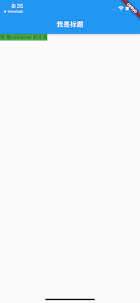 

- **表现2:**

   根据Container 中设置的width 和 height 来调整自己的大小, 

  > 即,如果Container 中设置了 width 或 height 那么Container就按照具体的宽高显示

  ```
  // Container 占据的大小就是 width 和 height 描述的大小
  class ContainerContent extends StatelessWidget {
    @override
    Widget build(BuildContext context) {
      return Container( // 按照宽200, 高100 显示
        width: 200,
        height: 100,
        color: Colors.green,
        child: Text('我 是container 的文本'),
      );
    } 
  }
  ```

  ```
  // Container 占据的高度是 height指定的, 宽度为子节点的宽度
  class ContainerContent extends StatelessWidget {
    @override
    Widget build(BuildContext context) {
      return Container( // 按照高100, 宽度为子节点的宽 显示
        height: 100,
        color: Colors.green,
        child: Text('我 是container 的文本'),
      );
    } 
  }
  ```

  ```
  // Container 占据的高度是子节点的高度, 宽度是指定的width
  class ContainerContent extends StatelessWidget {
    @override
    Widget build(BuildContext context) {
      return Container( // 按照宽200, 高度为子节点的高 显示
        width: 200,
        color: Colors.green,
        child: Text('我 是container 的文本'),
      );
    } 
  }
  ```

  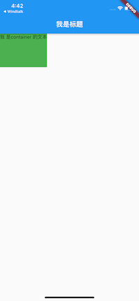  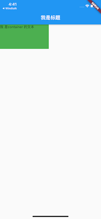   

- **表现3: ** 

- 当Container中没有设置 width 和 height 且没有子节点时, Container 会扩展到和父节点一样大

  > 即, 如果仅仅是一个Container, 则container 会和父节点一样大

  ```
  // Container中没有子节点, 也没有设置任何宽高信息, Contianer 占据的大小就是 父节点的大小
  class ContainerContent extends StatelessWidget {
  
    @override
    Widget build(BuildContext context) {
      return Container( // 父节点有多大, container 就多大
        color: Colors.green,
      );
    } 
  } 
  
  // Container中没有子节点
  // 只设置了高度信息,高度为 height所指定, 宽度就位父节点宽度
  class ContainerContent extends StatelessWidget {		
    @override
    Widget build(BuildContext context) {
        return Container( // 高度200, 宽和父节点一样高
          height: 200,
          color: Colors.green,
        );
      } 
  }
  
  // Container中没有子节点
  // 只设置了宽度信息,宽度为 width所指定, 高度就位父节点高度
  class ContainerContent extends StatelessWidget {
    @override Widget build(BuildContext context) {
      return Container( // 高度200, 宽和父节点一样高
        width: 200,
        color: Colors.green,
      );
  	}
  }
  ```
  
      


### 4、Container 布局总结

上面我们对flutter的布局流程原理以及Container 布局的几种常见情况都做了一些简单的介绍和示例, 其实还有一些其它情况这里就不介绍了, 后面用到再说. 

其实, 从前面几个Container 的布局情况我们可以发现一个特点, 就是 只要在Container内部能获取到 宽高相关的信息, 那么Container 在展示的时候就会按照已知的宽高信息来展示, 如果Container 没有获取到具体的宽高信息, 那么他就和父节点一样宽或这一样高


> 其实, 
>
> - 当我们在给Container 这个Widget 指定 `child` 元素时, 或者 设置 `width 、height`  或者设置 `constraints` 时, 都算是给Container 提供宽高信息. 
> - 只要Container 能拿到宽高信息, 它就会按照指定的宽高信息来展示, 否则就按照父元素的宽高来展示
>
> 这就是我在使用Container 是总结到的一些特点. 

**其实, Container的布局还远不止我们上面介绍的几种情况, 它还有 padding 属性, margin属性, alignment属性, 这些都会影响整个Container 的显示的, 后续我们再细讲**


### 5、Container 中的 padding、margin、 alignment属性


在Container中, 除了我们前面提到的 `width` 、`height` 、`constraints`、`child` 属性外, 还有 `padding` 、`margin` 和 `alignment` 属性. 这些都会影响我们的container 的显示以及所占据的位置的. 


### 6、Container 中BoxDecoration

圆角、阴影

Container 有一个非常重要的属性`decoration` , 它对应的是`Decoration` 类型, 不过他是抽象类我们不能直接用, 一般我们在开发中使用它的子类`BoxDecoration`

- BoxDecoration 常见属性

  ```
  const BoxDecoration({
      this.color, // 颜色，会和Container中的color属性冲突
      this.image, // 背景图片
      this.border, // 边框，对应类型是Border类型，里面每一个边框使用BorderSide
      this.borderRadius, // 圆角效果
      this.boxShadow, // 阴影效果
      this.gradient, // 渐变效果
      this.backgroundBlendMode, // 背景混合
      this.shape = BoxShape.rectangle, // 形变
    })
  ```

- 示例:

  ```
  class BoxDecotationContent extends StatelessWidget {
    @override
    Widget build(BuildContext context) {
      return Center(
        child: Container(
          width: 150,
          height: 150,
          child: Icon(
            Icons.pets,
            size: 50,
          ),
          alignment: Alignment.center,
          decoration: BoxDecoration(
              color: Colors.amber,
  //          border: Border( // 单独设置边框
  //              top: BorderSide(  width: 2, style: BorderStyle.solid, color: Colors.red),
  //              left: BorderSide(  width: 2, style: BorderStyle.solid, color: Colors.green),
  //              bottom: BorderSide(  width: 2, style: BorderStyle.solid, color: Colors.blue),
  //              right: BorderSide(  width: 2, style: BorderStyle.solid, color: Colors.cyan)
  //          ),
              border: Border.all(
                  // 同时设置边框
                  width: 3,
                  color: Colors.redAccent,
                  style: BorderStyle.solid),
              borderRadius: BorderRadius.circular(
                  20) ,// 注意: 如果要同时设置边框和圆角时, 边框只能使用Border.all的方式设置
  //            shape: BoxShape.circle,  // shape 不能同时和borderRadius 同时用, 要冲突
              boxShadow: <BoxShadow>[ // 可以同时设置多个阴影
                BoxShadow(
                  offset: Offset(15,15),  // 阴影的偏移量
                  color: Colors.purple,
                  blurRadius: 5           // 阴影的模糊度
                ),
                BoxShadow(
                  offset: Offset(5,5),
                  color: Colors.green,
                  blurRadius: 3           // 阴影的模糊度
                )
  
              ],
            //渐变你色
            gradient: LinearGradient(
              colors: [
                Colors.red, Colors.orange,Colors.blue, Colors.yellow
              ]
            )
              ),
  
        ),
      );
    }
  }
  
  ```

   


### 7、实现圆角图片

前面我们提到可以通过 `Container+BoxDecoration`来实现圆角图像。

示例代码:

```
class CircleContainerContent extends StatelessWidget {
  String url =
      "https://ss1.bdstatic.com/70cFuXSh_Q1YnxGkpoWK1HF6hhy/it/u=206669978,1648196901&fm=26&gp=0.jpg";

  @override
  Widget build(BuildContext context) {
    return Column(
      mainAxisAlignment: MainAxisAlignment.center,
      children: <Widget>[
        Center(
          child: Container(
            width: 120,
            height: 120,
            decoration: BoxDecoration(
                color: Colors.yellow,
                borderRadius: BorderRadius.circular(20),
                image: DecorationImage(
                    image: NetworkImage(url), fit: BoxFit.cover)),
          ),
        ),
        SizedBox(
          height: 30,
        ),
        Center(
          child: Container(
            width: 120,
            height: 120,
            decoration: BoxDecoration(
                image: DecorationImage(
                    image: NetworkImage(url), fit: BoxFit.cover),
                color: Colors.yellow,
                shape: BoxShape.circle),
          ),
        ),
      ],
    );
  }
}
```

 


## 3、多子布局

> 在开发中，我们经常需要将多个Widget放在一起进行布局，比如水平方向、垂直方向排列，甚至有时候需要他们进行层叠，比如图片上面放一段文字等；
>
> 这个时候我们需要使用多子布局组件（Multi-child layout widgets）。
>
> 比较常用的多子布局组件是Row、Column、Stack，我们来学习一下他们的使用。


### 1、Flex 组件

事实上, 我们即将学习的`Row` 组件和 `Column` 组件都继承自`Flex` 组件

- Flex 组件和 Row 、Column 组件的主要区别就是多了一个 direction属性
- 当direction属性的值为 Axis.horizontal的时候, 则为 Row
- 当direction属性的值为 Axis.vertical的时候, 则为column.

在学习Row和Column之前, 我们先学习一下`主轴` 和`交叉轴(侧轴)` 的概念

 

因为Row是一行排布的, Column是一列排布的, 那么他们都存在两个方向, 并且两个Widget排列的方向应该是对立的. 

不管是在`Row` 中, 还是在`Column` 中, 都存在主轴和交叉轴(侧轴) 的概念.

在Flex 布局中我们需要知道Row 和 Column 常用的几个属性: 

- `mainAxisAlignment` 主轴的排布方式
- `mainAxisSize` 主轴的大小
- `crossAxisAlignment` 侧轴的排布方式
- `textDirection` 文字的方向
- `verticalDirection` 主轴的方向
- `textBaseline` 基线的对齐方式

```
// 文字的方向
enum TextDirection {
 	rtl,
	ltr,
}

// 主轴的排布方式
enum MainAxisAlignment {
  start,
  end,
  spaceBetween,
  spaceAround,
  spaceEvenly,
}

// 交叉轴排布方式
enum CrossAxisAlignment {
  start,
  end,
  center,
  stretch,		// 每个子组件在交叉轴上 拉满父组件的 范围
  baseline,
}

// 主轴的排布方向
enum VerticalDirection {
  up,
	down,
}

// 基线对齐方式 (有文字时, 效果更明显)
enum TextBaseline {
  alphabetic,
	ideographic,
}

// 组件在主轴上占用的空间的大小
enum MainAxisSize {
  min,	// 主轴方向上占用尽量小的空间(包裹子组件内容)
  max,	// 主轴方向上占用尽量大的空间(一般是父组件有多大就占用多大)
}
```


### 2、Row 组件

> Row组件用于将所有的子Widget排成一行，实际上这种布局应该是借鉴于Web的Flex布局。
>
> 如果熟悉Flex布局，会发现非常简单。

Row 组件的特点:

- 水平方向尽可能占用比较大的空间
- 垂直方向尽量占用小比较小的空间(包裹内容)

```
Row(
  // Row默认情况下
  // 在水平会尽量占用较大的空间
  // 在垂直方向上会占用较小的空间(包裹子组件内容 )
  // 但是最终, 在主轴上占用较多的还是占用较少的空间, 我们可以通过 mainAxisSize 来控制
  children: <Widget>[
    Text('Row 的文字内容', style: (TextStyle(backgroundColor: Colors.green)),)
  ],
);

Row(
  // 我们可以通过 mainAxisSize 来控制, 主轴上占用的空间大小
  mainAxisSize: MainAxisSize.min,
  children: <Widget>[
    Text('Row 的文字内容', style: (TextStyle(backgroundColor: Colors.green)),)
  ],
);
```
  


**Row 组件属性详细介绍** 

```
Row({
  Key key,
  MainAxisAlignment mainAxisAlignment = MainAxisAlignment.start, // 主轴对齐方式
  MainAxisSize mainAxisSize = MainAxisSize.max, // 水平方向尽可能大
  CrossAxisAlignment crossAxisAlignment = CrossAxisAlignment.center, // 交叉处对齐方式
  TextDirection textDirection, // 水平方向子widget的布局顺序（默认为系统当前Locale环境的文本方向(如中文、英语都是从左往右，而阿拉伯语是从右往左））
  VerticalDirection verticalDirection = VerticalDirection.down, // 表示Row纵轴（垂直）的对齐方向
  TextBaseline textBaseline, // 如果上面是baseline对齐方式，那么选择什么模式（有两种可选）
  List<Widget> children = const <Widget>[],
})
```


- **mainAxisSize：**

  - 表示Row在主轴(水平)方向需要占用多大的空间
  - 默认是`MainAxisSize.max`，表示尽可能多的占用水平方向的空间，此时无论子widgets实际占用多少水平空间，Row的宽度始终等于水平方向的最大宽度(一般就是父组件占据的宽度)
  - 而`MainAxisSize.min`表示尽可能少的占用水平空间，宽度为所有子组件中最宽的一个宽度(即一般是包裹最宽的子组件宽度)

- **mainAxisAlignment** 

  表示子Widgets在Row所占用的水平空间内对齐方式

  - 如果mainAxisSize值为`MainAxisSize.min`，则此属性无意义，因为子widgets的宽度等于Row的宽度
  - 只有当mainAxisSize的值为`MainAxisSize.max`时，此属性才有意义
  - `MainAxisAlignment.start`表示沿textDirection的初始方向对齐，
  - 如textDirection取值为`TextDirection.ltr`时，则`MainAxisAlignment.start`表示左对齐，textDirection取值为`TextDirection.rtl`时表示从右对齐。
  - 而`MainAxisAlignment.end`和`MainAxisAlignment.start`正好相反；
  - `MainAxisAlignment.center`表示居中对齐。

- **crossAxisAlignment**：
  - 表示子Widgets在纵轴方向的对齐方式,Row的高度等于子Widgets中最高的子元素高度
  - 它的取值和MainAxisAlignment一样(包含`start`、`end`、 `center`三个值)
  - 不同的是crossAxisAlignment的参考系是verticalDirection，即verticalDirection值为`VerticalDirection.down`时`crossAxisAlignment.start`指顶部对齐，verticalDirection值为`VerticalDirection.up`时，`crossAxisAlignment.start`指底部对齐；而`crossAxisAlignment.end`和`crossAxisAlignment.start`正好相反；

 

### 3、Expanded 可伸缩组件

如果我们希望红色和黄色的Container Widget不要设置固定的宽度，而是占据剩余的部分，这个时候应该如何处理呢？

这个时候我们可以使用 `Expanded` 来包裹 Container Widget

```
const Expanded({
  Key key,
  int flex = 1,
  @required Widget child,
})
```

> 说明:
>
> Expanded 这个Widget组件内主要有2个属性需要注意, 一个是flex属性, 这个属性是用来说明被包裹的子组件内暂用主轴上剩余空间的分数.
>
> Expanded 继承自Flexible, 我们一般使用Expanded


```
class RowContent extends StatelessWidget {
  @override
  Widget build(BuildContext context) {

    return Column(
      children: <Widget>[
        Row(
          children: <Widget>[
            Container(color: Colors.red, width: 60, height: 60),
            Container(color: Colors.blue, width: 80, height: 80),
            Container(color: Colors.green, width: 70, height: 70),
            Container(color: Colors.orange, width: 100, height: 100),
          ],
        ),


        SizedBox(height: 10,),
        Row(
          children: <Widget>[
            Expanded(
              flex: 1,
              child: Container(color: Colors.red, width: 60, height: 60),
            ),
            Expanded(
              flex: 1,
              child: Container(color: Colors.blue, width: 80, height: 80),
            ),
            Container(color: Colors.green, width: 70, height: 70),
            Container(color: Colors.orange, width: 100, height: 100),
          ],
        ),

        SizedBox(height: 10,),
        Row(
          children: <Widget>[
            Expanded(
              flex: 1,
              child: Container(color: Colors.red, width: 60, height: 60),
            ),
            Expanded(
              flex: 2,
              child: Container(color: Colors.blue, width: 80, height: 80),
            ),
            Container(color: Colors.green, width: 70, height: 70),
            Container(color: Colors.orange, width: 100, height: 100),
          ],
        ),

        SizedBox(height: 10,),
        Row(
          children: <Widget>[
            Expanded(
              flex: 1,
              child: Container(color: Colors.red, width: 60, height: 60),
            ),
            Expanded(
              flex: 3,
              child: Container(color: Colors.blue, width: 80, height: 80),
            ),
            Container(color: Colors.green, width: 70, height: 70),
            Container(color: Colors.orange, width: 100, height: 100),
          ],
        ),
      ],
    );
  }
}
```

 


### 4、Column 

>  Column组件用于将所有的子Widget排成一列，学会了前面的Row后，Column只是和row的方向不同而已。


## 4、Stack 组件

在开发中 , 我们多个组件很有肯能需要重叠显示, 比如: 在一张图片上显示一个文字或者一个按钮

在Android 中可以使用 Frame来实现, 在web端可以使用绝对定位, 在flutter中我们需要使用层叠布局 Stack


### 1、Stack 介绍

```
import 'package:flutter/material.dart';
main(List<String> args){
  runApp(YRApp());
}


class YRApp extends StatelessWidget {
  @override
  Widget build(BuildContext context) {
    return MaterialApp(
      debugShowCheckedModeBanner: true,
      home: HomePage()
    );
  }
}


class HomePage extends StatelessWidget {
  @override
  Widget build(BuildContext context) {
    return Scaffold(
      appBar: AppBar(
        title: Text('我是标题'),
      ) ,
      body: StackContent(),
    ) ;

  }
}

class StackContent extends StatelessWidget {
  @override
  Widget build(BuildContext context) {
    /**
     * 1. 在我们开发中, Stack 默认的大小是包裹内容的, 也就是说在Stack 中最大的child 有多大, Stack就占据多大
     * 换句话说, 默认情况下Stack是包裹所有内容的
     * 2. 在Stack中所有的 child 是按照 数组children 中书写的顺序层第的, 后面的child盖在前面的child上面, 在Stack
     * 中是没有 网页中的Zindex 层叠顺序这一说法的, 如果要改变层叠顺序, 那么修改 数组children中的元素顺序即可
     * 3. 在Stack 中, 虽然我们能让所有的子组件之间出现层叠(一层盖一层)的效果, 我们也能控制子组件的显示位置, 但是我们
     * 只能通过alignment控制所有子组件的对齐方式, 不能单个的指定位置
     *4. 在Stack 中也有一个 fit 属性, 默认你情况下是 loose按照子组件默认的大小排布, 也可以是 expand 表示和父组件一样大表示的是拉伸
     * 如果Stack的fit 是StackFit.expand 的话, 所有的子元素都会被拉升到父组件的大小
     */
    return Stack(
      alignment: AlignmentDirectional.topCenter,
      fit: StackFit.expand,
      children: <Widget>[

        Container(
          width: 180,
          height: 100,
          color: Colors.cyan,
        ),
        Image.asset("asset/images/card@1x.png", width: 200,),
        Row(
          mainAxisSize: MainAxisSize.min,
          children: <Widget>[
          Text('wo shi wen ben ', style: TextStyle(backgroundColor: Colors.red),)
        ],)
      ],
    );
  }
}
```

- 在我们开发中, Stack 默认的大小是包裹内容的, 也就是说在Stack 中最大的child 有多大, Stack就占据多大,换句话说, 默认情况下Stack是包裹所有内容的
- 在Stack中所有的 child 是按照 数组children 中书写的顺序层第的, 后面的child盖在前面的child上面, 在Stack中是没有 网页中的Zindex 层叠顺序这一说法的, 如果要改变层叠顺序, 那么修改 数组children中的元素顺序即可
- 在Stack 中, 虽然我们能让所有的子组件之间出现层叠(一层盖一层)的效果, 我们也能控制子组件的显示位置, 但是我们只能通过alignment控制所有子组件的对齐方式, 不能单个的指定位置
- 在Stack 中也有一个 fit 属性, 默认你情况下是 loose按照子组件默认的大小排布, 也可以是 expand 表示和父组件一样大表示的是拉伸,如果Stack的fit 是StackFit.expand 的话, 所有的子元素都会被拉升到父组件的大小

```

import 'package:flutter/material.dart';
main(List<String> args){
  runApp(YRApp());
}


class YRApp extends StatelessWidget {
  @override
  Widget build(BuildContext context) {
    return MaterialApp(
      debugShowCheckedModeBanner: true,
      home: HomePage()
    );
  }
}


class HomePage extends StatelessWidget {
  @override
  Widget build(BuildContext context) {
    return Scaffold(
      appBar: AppBar(
        title: Text('我是标题'),
      ) ,
      body: StackContent(),
    ) ;

  }
}

class StackContent extends StatelessWidget {
  @override
  Widget build(BuildContext context) {
    /**
     * 1. 在我们开发中, Stack 默认的大小是包裹内容的, 也就是说在Stack 中最大的child 有多大, Stack就占据多大
     * 换句话说, 默认情况下Stack是包裹所有内容的
     * 2. 在Stack中所有的 child 是按照 数组children 中书写的顺序层第的, 后面的child盖在前面的child上面, 在Stack
     * 中是没有 网页中的Zindex 层叠顺序这一说法的, 如果要改变层叠顺序, 那么修改 数组children中的元素顺序即可
     * 3. 在Stack 中, 虽然我们能让所有的子组件之间出现层叠(一层盖一层)的效果, 我们也能控制子组件的显示位置, 但是我们
     * 只能通过alignment控制所有子组件的对齐方式, 不能单个的指定位置
     *4. 在Stack 中也有一个 fit 属性, 默认你情况下是 loose按照子组件默认的大小排布, 也可以是 expand 表示和父组件一样大表示的是拉伸
     * 如果Stack的fit 是StackFit.expand 的话, 所有的子元素都会被拉升到父组件的大小
     */
    return Stack(
      alignment: AlignmentDirectional.topCenter,
      fit: StackFit.expand,
      children: <Widget>[

        Container(
          width: 180,
          height: 100,
          color: Colors.cyan,
        ),
        Image.asset("asset/images/card@1x.png", width: 200,),
        Row(
          mainAxisSize: MainAxisSize.min,
          children: <Widget>[
          Text('wo shi wen ben ', style: TextStyle(backgroundColor: Colors.red),)
        ],)
      ],
    );
  }
}
```

 


#### 2、Stack 结合 Positon组件实现 层叠绝对定位

```

import 'package:flutter/material.dart';
main(List<String> args){
  runApp(YRApp());
}


class YRApp extends StatelessWidget {
  @override
  Widget build(BuildContext context) {
    return MaterialApp(
      debugShowCheckedModeBanner: true,
      home: HomePage()
    );
  }
}


class HomePage extends StatelessWidget {
  @override
  Widget build(BuildContext context) {
    return Scaffold(
      appBar: AppBar(
        title: Text('我是标题'),
      ) ,
      body: StackContent(),
    ) ;

  }
}

class StackContent extends StatelessWidget {
  @override
  Widget build(BuildContext context) {
    /**
     * 使用Stack 的正确姿势
     * 1. 使用一个设置的 宽高的Container 包裹Stack
     * 2. 设置Stack 的fit 属性为StackFit.expand 即将Stack 扩展为Container的大小
     * 3. Stack的children 属性中的所有子组件 均 使用 Position 组件包裹
     * 4. 在Position组件中 包裹上要显示的 具体组件即可, 比如: Text 或者 Image 等等
     */
    return Container(
      width: double.infinity,
      height: 200,
      color: Colors.green,
      child: Stack(
        fit: StackFit.expand,
        children: <Widget>[
          Positioned(
            left: 0,
            top: 0,
            child: Image.asset('asset/images/card@1x.png', width: 150,),
          ),
          Positioned(
            right: 0,
            bottom: 0,
            child: Text('我是 Stack 中的 position 中的text的文本',
              style: TextStyle(backgroundColor: Colors.orange),
            ),
          )
        ],
      ),
    );
  }
}
```

 

  


## 5、滚动的Widget

列表是移动端经常使用的一种视图展示方式, 在flutter中提供了 ListView 和 GridView


### 1、ListView  组件

> 移动端数据量比较大时，我们都是通过列表来进行展示的，比如商品数据、聊天列表、通信录、朋友圈等。
>
> 在Android中，我们可以使用ListView或RecyclerView来实现，在iOS中，我们可以通过UITableView来实现。
>
> 在Flutter中，我们也有对应的列表Widget，就是ListView。

创建ListView 通常有4种方式:

- 方式1: 默认构造方法:`ListView()` 

- 方式2: `ListView.builder()`

- 方式3: `ListView.separated()`

- 方式4: `ListView.custom()` 

#### 1、ListView 的基本使用

```
class ListViewContent extends StatelessWidget {
  @override
  Widget build(BuildContext context) {
    return ListView(
    	// List.generate 是一个数组构造函数, 可以构建一个指定数量的数组List
      children: List.generate(50, (index){
        return   Padding(
          padding: EdgeInsets.all(10),		// 为了让文字显示的更好看, 使用了padding 包裹
          child: Text('ListView 基本使用 $index'),
        );
      }),
    );
  }
}
```

 


#### 2、ListTile 的使用

在开发中, 我们经常见到一种列表, 有图标、有标题、副标题, 尾部还有图标, 这种样式, 我们可以使用flutter为我们提供的 `ListTile`

```
class ListTileContent extends StatelessWidget {
  @override
  Widget build(BuildContext context) {
    return ListView(
      children: List.generate(30, (index) {
        return ListTile(
        leading: Icon(Icons.people, size: 30,color: Colors.green,),
        title: Text('通讯录: $index') ,
        subtitle: Text('子标题'),
        trailing: Icon(Icons.delete, size: 15, color: Colors.red,),
        );
      }),
    );
  }
}
```

 


#### 3、ListView 实现水平滚动

我们在使用ListView时, 最多的应用场景是用来做垂直方向的列表, 但是我们也可以使用ListView 来实现水平的滚动

```
class ListViewHScrollContennt extends StatelessWidget {
  @override
  Widget build(BuildContext context) {
    return ListView(
      // 设置滚动方向
      scrollDirection: Axis.horizontal,
      // 设置行高(列宽)
      itemExtent: 200,
      
      children: List.generate(30, (index) {
        return ListTile(
          leading: Icon(
            Icons.people,
            size: 30,
            color: Colors.green,
          ),
          title: Text('通讯录: $index'),
          subtitle: Text('子标题'),
          trailing: Icon(
            Icons.delete,
            size: 15,
            color: Colors.red,
          ),
        );
      }),
    );
  }
}
```


#### 4、ListView.builder 的基本使用

我们在使用ListView时, 如果要显示的数量很少就可以直接使用ListView的默认构造方法`ListView()` 来实现, 但是如果数据量大了的话就不能直接使用默认的构造方法, 因为ListView在使用默认构造方法时时全量加载所有的子Widget, 不论显示与否, 当数据量很大的时候这是有很大的性能开销的. 

如果数据量大的话, 我们需要使用ListView另外的方法来实现, 一般我们使用 `ListView.builder()` , 在ListView.builder 中要求我们传递2个参数, 参数一是要显示的子组件的数量, 参数2是一个回调函数, 用来加载要显示的子组件.

```
class ListViewBuilderContent extends StatelessWidget {
  @override
  Widget build(BuildContext context) {
    return ListView.builder(
      itemCount: 30,
       
      // itemBuilder 是一个item的一个构造器, 将要显示某一行时才会加载某一行, 降低性能消耗
      itemBuilder:(BuildContext context, int index){
        return ListTile(
          leading: Icon(Icons.people, color: Colors.green,),
          title: Text('wo shi biaoti $index'),
          subtitle: Text('wo shi zi biaoti '),
          trailing: Icon(Icons.delete, color: Colors.red,),
        );
      }

    );
  }
}
```

 


#### 5、ListView.separated 的简单使用

`ListView.separated`可以生成列表项之间的分割器，它比`ListView.builder`多了一个`separatorBuilder`参数，该参数是一个分割器生成器。 你可以这样理解, 在ListView 中通过itemBuilder来构造一个个的要显示的item, 通过separatedBuilder 来构建一个个要显示的分割线

```
// 带分割线的 ListView
class ListViewSeparatedContent extends StatelessWidget {
  @override
  Widget build(BuildContext context) {
    return ListView.separated(
        itemCount: 50,
        
        // itemBuilder 是每一个item的构造函数, 用于显示每一行
        itemBuilder: (BuildContext context, int index) {
          return ListTile(
            leading: Icon(
              Icons.people,
              color: Colors.green,
            ),
            trailing: Icon(Icons.delete, color: Colors.red),
            title: Text('我是 ListViewSepatated 的 title'),
            subtitle: Text('我是 listViewSeparated 的 subtitle'),
          );
        },
        
        // separaterBuilder 是每一个分割线的构造函数, 用于显示分割线
        separatorBuilder: (BuildContext context, int index) {
          return Divider(  		// 我们可以使用 Divider 做分割线
            height: 1,
            thickness: 1,  		// 分割线的粗细
            color:  index % 2 == 0 ?  Colors.orange : Colors.green,
            indent: 30,     	// 前面缩进的距离
            endIndent: 30,  	// 尾部缩进的距离
          );
        });
  }
}
```

 


### 2、GridView

在我们flutter开发中, 我们除了可以使用ListView来实现表格的效果, 我们也可以使用GridView来实现类似的效果

GridView 主要有几个方法:

- `GridView()` 默认构造方法
- `GridView.count`
- `GridView.extent`
- `GridVeiw.builder` 


#### 1、GridView 默认构造函数的使用

一种使用GridView的方式就是使用构造函数来创建，和ListView对比有一个特殊的参数：`gridDelegate`

`gridDelegate`用于控制交叉轴的item数量或者宽度，需要传入的类型是SliverGridDelegate，但是它是一个抽象类，所以我们需要传入它的子类：**SliverGridDelegateWithFixedCrossAxisCount** 或 **SliverGridDelegateWithMaxCrossAxisExtent**


- 交叉轴上固定数量 的 item , 使用`SliverGridDelegateWithFixedCrossAxisCount` 

  > SliverGridDelegateWithFixedCrossAxisCount({
  >   @required double crossAxisCount, *// 交叉轴的item个数*
  >   double mainAxisSpacing = 0.0, *// 主轴的间距*
  >   double crossAxisSpacing = 0.0, *// 交叉轴的间距*
  >   double childAspectRatio = 1.0, *// 子Widget的宽高比*
  > })

  ```
  class GridViewContent extends StatelessWidget {
    @override
    Widget build(BuildContext context) {
      return GridView(
  
        // 在gridView 中我们通过 gridDelegate 来控制交叉轴上子widget显示的数量
        // 以及子widget之间的间距
        gridDelegate:SliverGridDelegateWithFixedCrossAxisCount(
            crossAxisCount: 3, // 交叉轴上item的数量
            crossAxisSpacing: 10, // 交叉轴间距(列间距)
            mainAxisSpacing: 20,  // 主轴间距(行间距)
            childAspectRatio:1.5 // 子元素item的宽高比
        ) ,
  
        children: List.generate(30, (index) {
          return Container(
            alignment: Alignment.center,
            color: Color.fromARGB(255, Random().nextInt(255), Random().nextInt(255), Random().nextInt(255)),
            child: Text('index: $index'),
          );
        }),
      );
    }
  }
  ```

   

- 交叉轴上使用非固定个数 item, 使用`SliverGridDelegateWithMaxCrossAxisExtent` 

  > SliverGridDelegateWithMaxCrossAxisExtent({
  >   double maxCrossAxisExtent, *// 交叉轴的item宽度*
  >   double mainAxisSpacing = 0.0, *// 主轴的间距*
  >   double crossAxisSpacing = 0.0, *// 交叉轴的间距*
  >   double childAspectRatio = 1.0, *// 子Widget的宽高比*
  > })

  ```
  class GridViewContent2 extends StatelessWidget {
    @override
    Widget build(BuildContext context) {
      return GridView(
        gridDelegate: SliverGridDelegateWithMaxCrossAxisExtent(
            maxCrossAxisExtent: 200, // 交叉轴上最大的item宽度, 很多时候实际达不到这个宽度
            mainAxisSpacing: 20,
            crossAxisSpacing: 30,
            childAspectRatio: 3
        ),
        children: List.generate(30, (index) {
          return Container(
            alignment: Alignment.center,
            color: Color.fromARGB(255, Random().nextInt(255),
                Random().nextInt(255), Random().nextInt(255)),
            child: Text('index: $index'),
          );
        }),
      );
    }
  }
  ```

   


**前面两种方式也可以不设置delegate**

可以分别使用：`GridView.count构造函数`和`GridView.extent`构造函数实现相同的效果，这里不再赘述。


#### 2、GridView.build

和ListView一样，使用默认构造函数会一次性创建所有的子Widget，会带来性能问题，所以我们可以使用`GridView.build`来交给GridView自己管理需要创建的子Widget。

```
class GridViewBuildContent extends StatelessWidget {
  @override
  Widget build(BuildContext context) {
    return GridView.builder(
        gridDelegate:
        SliverGridDelegateWithFixedCrossAxisCount(
            crossAxisCount: 3,
            crossAxisSpacing: 3,
            mainAxisSpacing: 5
        ),
        itemBuilder: (BuildContext ctx, index) {
          return Container(
            alignment: Alignment.center,
            color: Colors.orange,
            child: ListTile(
              leading: Icon(Icons.people),
              title: Text(
                  'index: $index'
              ),
            ),
          );
        }
    );
  }
}
```


### 3、Slivers的基本使用

因为我们需要把很多的Slivers 放在一个CustomScrollView中, 所以CustomScrollView有一个slivers属性,里面让我们放对应的一些sliver

- `SliverList` 类似于我们之前使用过的ListView
- `SliverFixedExtentList` 类似于SliverList, 只是可以设置滚动的高度
- `SliverGrid` 类似于我们之前使用过的GridView
- `SliverPadding` 设置Sliver的内边距, 因为可能要单独给sliver设置内边距
- `SliverAppBar` 添加一个AppBar, 通常用来作为CustomScrollView和headerView
- `SliverSafeArea` 设置内容显示在安全区域 ( 比如: 不让齐刘海挡住我们的内容)

下面我们简单演示一下, Sliver + SliverPadding+SliverSafeArea 的组合

`Scaffold` 类似于控制器

`SafeArea` 安全区域

`SliverSafeArea`  sliver的安全区域

`SliverPadding` 给sliver的滑动内容增加内边距


## 6、监听滚动


# 十四、异步&网络请求(重要!!!) 


## 1、Dart 是单线程的


### 1、程序中的耗时操作

- **开发中的耗时操作**:

  网络请求、文件的读取都是属于耗时操作, 如果所有的耗时操作都放到主线程执行的话, 主线程是会被阻塞的, 带给用户的体验就是卡顿和没有反应, 这是不行的. 

  

- **如何处理耗时操作**:

  针对如果处理耗时操作, 不同的语言有不同的处理方式.

  - **方式一: ** 多线程

    比如: java、C++、C语言、OC 等, 我们普遍的做法是开启一个新的线程(`thread`), 在新开启的线程中做耗时操作, 耗时操作完毕后再通过线程之间的通信, 将结果给到对应的线程(`一般是主线程`)继续处理.

  - **方式二**:单线程 + 事件循环

    比如: javaScript 和 Dart 都是采用单线程+事件循环来处理耗时操作. 那么单线程+事件循环是如何处理耗时操作的, 我们下面会讲解. 

- flutter 中处理耗时操作

  > 所谓的耗时操作不仅仅指的是网络请求, 这里的耗时操作囊括的范围很广
  >
  > 我们平时 通过执行的文件读取操作、发出的网络请求、或者是有一大段代码需要执行耗时很长、又或者我们在执行某个方法时中间有个时间延时,这些我们都称之为耗时操作.
  >
  > 简单的讲, 从代码开始执行到结束如果需要耗时, 我们都称为耗时操作

  - 在以前, 比如在java或者C++ 语言中, 我们通常处理耗时操作的方法是, 将这段耗时的操作从当前线程扔到子线程中执行, 等执行完成后再将结果返回到当前线程(一般来说是结果返给主线程)

  - 在Dart或者flutter开发中, 因为是单线程的, 没有主线程子线程的概念, 因此我们在dart或者flutter开发中是没有办法将耗时的操作从当前扔到子线程中执行的, 因为没有子线程的概念都是主线程.虽然在Dart和flutter开发中没有子线程的概念, 但是有个异步任务的概念, 即在Dart和flutter开发中不在讨论线程的问题,只会有同步任务和异步任务的概念了. 我们平时书写的代码默认情况下都是同步的顺序执行、挨个执行、从上到下执行的(即前一句代码执行完成了才会执行后一句)

  - 通常我们在dart和flutter开发中, 为了保证我们在实行耗时操作时, 不会等耗时任务执行完毕后再执行后面的代码, 这样会卡主耗时操作的代码后面的代码需要一直等到前面的耗时操作执行完成了才有机会执行, 为了让耗时操作不卡主后面的代码, 我们就在异步中执行这个耗时操作, 执行完成后再将这个结果抛回来.

  - 在Dart 和 flutter开发中, 我们只要将耗时操作包装到 **Future** 中, 系统自动的就会以异步的形式来执行我们的耗时操作, 我们外部只要持有这个 包装好的 `future` 对象, 系统异步执行完耗时操作后会再通过`future` 对象来告诉我们的.

    > 简单的说, 在java、C++ 开发中我们会将耗时操作放到子线程中去执行, 在Dart或者flutter开发中我们将耗时操作包装成 `Future` 对象在异步中执行.

  

### 2、Future的简单操作 

> 说明:
>
> 1. 因为Dart是单线程的, 因此在Dart开发中或者在flutter开发中不会存在像其他语言(比如: java/C++/C)中说的主线程与子线程的说法.即在Dart中只有主线程, 所有的方法都是在主线程中执行的
> 2. 因为在Dart中只有主线程没有子线程的说法, 为了保证在Dart开发中程序不会因为耗时操作(比如: 文件的读取, 网络请求)而阻塞, 在Dart开发中引入了异步的概念. 换句话说在Dart开发中凡是涉及到耗时的操作我们都需要放到异步中来执行, 执行完后再通过回调返回结果.
> 3. 为了更好的在Dart中使用异步, 引入了Future的概念. 所有的耗时操作都需要使用 Future来进行包装处理.

**Dart 中Future 的使用步骤大致是这样的:** 

- 使用`Future` 进行耗时操作封装(`future`成功的耗时封装, 异常的耗时封装)

- 使用 `future.then()` 对耗时操作的结果进行处理

- 使用`future.then().catchError()`  对耗时操作中产生的 异常或者错误结果进行处理

- 使用`future.then().catchError().whenComplete()` 完成异步的收尾工作  **(推荐)**

  或者 使用 `future.catchError().whenComplete()` 完成异步的收尾工作**(推荐)** 

  或者使用`future.then().whenComplete()` 完成异步的收尾工作 **(不推荐, 有异常风险)**

  也可以使用 `future.whenComplete() 完成异步的收尾工作  **(不推荐, 有异常风险)** 

```
// 异步操作的封装
int i = 0;
Future<String> getNetworkData3(){

  return Future<String>((){
    sleep(Duration(seconds: 5));
    if(i < 2){
      i ++;
      //  reture 返回的结果需要通过 future.then 来获取
      //  可以给future 使用泛型约束 return 返回的数据类型, 这样外面在.then 中可以直接使用对应的数据类型
      return '异步操作 成功完成 $i';
    }
  // 当程序出错时, 需要通过 throw Exceptionn 的方式将 异常抛出, 外面需要使用 future.catchError 来接收
  throw Exception('future 抛出异常');
  });
}
```


```
// 异步操作的调用哪个
FlatButton(
  color: Colors.orange,
  child: Text('future 最完整写法'),
  onPressed: (){
	  print('\n\n');
    print('future 最完整写法 发出异步任务开始');
    
    Future<String> future = getNetworkData3();
    future.then((String rst){
      print('成功结果: $rst');
    }).catchError((error){
      // future 抛出异常 来到这里
      print('异常错误: $error');
    }).whenComplete((){
      // 不论前面的 future 是正常执行还是异常执行, 只要future 完成就会来到这里
      print('future 最完整写法 future 结束了');
    });
    
    print('future 最完整写法 发出异步任务完成');
  },
 );
```

 


### 3、Future的链式调用

> 其实在Dart 中future的使用, 是推荐使用链式调用结构的, 有些情况下如果不使用链式调用反而会出现异常
>
> 比如下面的案例:


**在讲解Future的链式调用之前, 我们把Future 在使用过程中容易出的坑先将一下, 如下:** 

```
// 执行这个异步操作会抛出异常
Future<String> getNetworkData4(){
  return Future<String>((){
    sleep(Duration(seconds: 5));
    // return '异步操作 成功完成 $i';
     throw Exception('future 抛出异常');
  });
}
```

- 这样书写代码(链式调用) 程序正常执行   推荐

  ```
  // 这样书写代码(链式调用) 程序正常执行   推荐
  print('future 先异常在成功 发出异步任务开始');
  
  Future<String> future = getNetworkData4();
  
  future.then((String rst){
  	print('成功结果: $rst');
  }).catchError((error){
  	print('异常错误: $error');
  }).whenComplete((){
  	print('future 先异常在成功 future 结束了');
  });
  
  print('future 先异常在成功 发出异步任务完成');
  ```

- 这样书写(非链式调用), 程序无法正常执行, 会报错

  ```
  // 这样书写(非链式调用), 程序无法正常执行, 会报错
  print('future 先异常在成功 发出异步任务开始');
  
  Future<String> future = getNetworkData4();
  
  future.then((String rst){
  	print('成功结果: $rst');
  });
  
  future.catchError((error){
  	print('异常错误: $error');
  });
  
  future.whenComplete((){
  	print('future 先异常在成功 future 结束了');
  });
  
  print('future 先异常在成功 发出异步任务完成');
  ```


**Future的链式调用的正确姿势, 如下: **

```
void getNetworkData() {
  Future(() {
    sleep(Duration(seconds: 3));
    return '用户数据';
  }).then((value) {
    print('第一次请求获取到: ${value}');
    sleep(Duration(seconds: 3));
    throw Exception('获取用户头像出错');
    return "用户头像";
  }).then((value) {
    print('第二请求获取到: ${value}');
    sleep(Duration(seconds: 3));
    return "用户昵称";
  }).then((value) {
    print('第三请求获取到: ${value}');
  }).catchError((err) {
    print('捕获到网络请求异常: ${err}');
  }).whenComplete(() {
    print('所有的网络请求结束');
  });
}
```


### 4、Future的其它API

- **Future.value()** ApI 

  > 比如, 有时我们在`Future` 中没有执行耗时操作, 那么我们就就可以使用`Future.value()` 这个Api替代

  ```
  // 原始写法
  void getNetworkData2(){
    Future((){
      // 这里没有耗时操作
      return 'future 直接返回数据';
    }).then((value) {
      print(value);
    }).whenComplete((){
      print('结束了');
    });
  }
  
  // 可以简化成这样能
  void getNetworkData2(){
    Future.value('future 直接返回数据').then((value){
      print(value);
    }).whenComplete((){
      print('结束了');
    });
  }
  ```

- **Future.error()** API

  示例如下:

  ```
  // 比如, 我们在封装Future时, 仅仅是想 抛出一个异常, 正常情况下我们是这样写的, 如下:
  void getErrorData(){
    Future((){
      // 仅仅是想在 Future里面往外面抛出一个 异常
      throw Exception('future 异常出错');
    }).catchError((err){
      print('捕获到异常: ${err}');
    });
  }
  
  
  // 可以简化成这样
  void getErrorData(){
    Future.error('future 异常出错').catchError((err){
      print('捕获到异常: ${err}');
    });
  }
  ```

- **Future.delay()**  Api

  ```
  // 延时方式1
  void delayOpt(){
    print('----->');
    Future.delayed(Duration(seconds: 5)).then((value){
      print('delay: ${value}');
    });
  }
  
  // 延时方式2:
  void delayOpt(){
    print('----->');
    Future.delayed(Duration(seconds: 5),(){
      return '延时操作执行完毕';
    }).then((value){
      print('delay: ${value}');
    });
  }
  ```


## 2、await & async 详解


### 1、Future 的链式调用, 解决嵌套问题

- Future 嵌套的现象

  > 很多时候, 我们在开发中会出现这样的情况:
  >
  > 1. 先发送一个网络请求
  > 2. 根据拿到的第一个网络的结果, 再执行第二个网络请求
  > 3. 根据拿到的第二个网络请求, 再执行第三个网络请求
  >
  > ... ... 
  >
  > 这样的需求让我们的代码一层层的嵌套, 在执行的阅读时不方便, 如下代码

  ```
  // 耗时操作封装你
  Future getNetWorkData(count){
    return Future((){
      sleep(Duration(seconds: 3));
  //    if(count == 2){
  //      throw Exception('出错了: ${count}');
  //    }
      return count + 1;
    });
  }
  ```

  ```
  // 多个耗时操作嵌套使用, 原始写法
  void test(){
    int count = 1;
  
    print('发起第一次请求: ${count}');
    getNetWorkData(count).then((count1){
  
  
      print('\n收到第一次结果: ${count1}');
      print('发起第二次请求: ${count1}');
      tgetNetWorkData(count1).then((count2) {
  
  
        print('\n收到第二次结果: ${count2}');
        print('发起第三次请求: ${count2}');
        getNetWorkData(count2).then((count3) {
  
          print('\n收到第三次结果: ${count3}');
        }).catchError((err3){
          print('捕获到异常: ${err3}');
        });
        
  
      }).catchError((err2){
        print('捕获到异常: ${err2}');
      });
  
  
  
    }).catchError((err1){
      print('捕获到异常: ${err1}');
    });
  
  }
  
  ```

  

- 为了解决上面一层层的异步嵌套, 我们使用 `Future` 的链式调用就可以了,

  改造如下:

  > 下面的示例代码就是我们说的, future链式调用解决future的嵌套问题

  ```
  void test2(){
    int count = 1;
  
    print('发起第一次请求: ${count}');
    getNetWorkData(count).then((count1) {
    
      print('\n收到第一次结果: ${count1}');
      print('发起第二次请求: ${count1}');
      // 这里相当于是将第二次的异步结果返回出去, 在外部的.then .catchError 中在去取
      return getNetWorkData(count1);
    })
  
    .then((count2) {
    
      print('\n收到第二次结果: ${count2}');
      print('发起第三次请求: ${count2}');
      return getNetWorkData(count2);
    })
    
    .then((count3) {
      print('\n收到第三次结果: ${count3}');
    }).catchError((err){
      print('捕获到异常: ${err}');
    });
  }
  ```

   

### 2、await & async 的简单使用

虽然我们在前面通过future 的链式调用解决了嵌套的问题, 但是代码看起来还是比较多, 有没有方法能让我们的代码看起来更精简呢? 

答案是有的

在我的Dart开发中为我们提供了2个关键字**await**  和 **async** , 通过这两个关键字我们可以将原来书写的代码写的很精简, 具体使用如下:

- 原来的耗时`(比如: 文件读取、网络请求)`操作, 封装如下:

  ```
  // 一个耗时的异步操作方法, 返回的是 Future
  Future getNetWorkData(count){
    return Future((){
      sleep(Duration(seconds: 3));
      if(count == 1){
        throw Exception('出错了: ${count}');
      }
      return count + 1;
    });
  }
  ```

- 原来我们在没有借助`await` 和 `async` 关键字的时候, 我们是这样操作的

  ```
  // 比如: 我们要在 test 方法中使用 getNetWorkData 执行一个耗时操作, 我们是这样的,如下:
  
  void test{
    int count = 1;
    print('发起第一次请求: ${count}');
  
    getNetWorkData(count).then((count1) {  // 整个这坨代码不会卡主, 等有结果后会再回调回来
      print('\n第一次结果: ${count1}');
    });
    print('第一次请求发起 结束');
  }
  ```

   

  > 从上面的代码可以看出, 虽然我们使用Future执行了一个耗时操作, 满足了我们的需求, 但是我们在拿到异步执行结果时要在future后面再使用 `future.then()... ...`  巴拉巴拉的一大长串, 如果我们的操作很复杂, 异步操作后又有异步操作的话, 就要使用 **Future 的链式调用** 代码还是很长, 不是很容易阅读. 

- 在上面的 `test()` 方法中 直接调用耗时方法操作的, 我们可以借助 **async 和 await** 两个关键字来对代码进行改造, 改造后的的代码如下:

  ```
  void test() async{
    int count = 1;
    print('await 发起第一次请求: ${count}');
    var rst = await getNetWorkData(count);  // 注意: 这句代码会卡主, 直接有结果为止
    print('await 收到第一次结果: ${rst}');
  }
  ```

   

  > 改造前后对比说明:
  >
  > 改造前: 
  > 我们是在 Future 的后面使用`.then((value){})` 来获取异步完成的结果的
  >
  > 改造后:
  >
  > 1.  我们在方法名`test() ` 的后面添加了关键字 **async** , 说明了这是一个异步的方法
  > 2. 我们使用了关键字**await** 来修饰了返回结果(即, 我们使用了await 关键字修饰Future 对象),  将返回的future对象直接转换成了 原来在 `.then((value){})` 返回的value, 即如果我们在**async 方法** 中使用关键字**await** 修饰 **future** 对象的话, 系统会将我们的异步方法转换成同步方法并把结果返回给我们用


### 3、await & async 的总结

1. 获取`future` 对象成功会调的结果有两种方式:
   - 一种是通过 `future.then((value){})` 这种方式, 这种是异步的方式, 不会阻塞`future.then((value){})` 后面的其它带的执行
   - 另一种是直接在`future` 对象前面使用 `await` 关键字修饰`future` 对象, 将原来的`future.then` 这种异步获取结果的方式,转换为同步阻塞式获取结果的方式.
2. 使用 `await future` 这种方式获取结果的方式有以下的特点
   - 在获取到`future` 执行结果之前, `await future` 是处于阻塞状态的, 后面的代码是一直处于等待状态的, 换句话说,只要`await future` 没有拿到执行结果, 后面的代码是没有机会执行的
   - `await` 修饰的语句必须写在 `async` 方法内, 换句话说只有在`async` 方法内才能使用 `await` 
3. 外面在调用 `async` 修饰的方法时, 与调用普通的方法是一样的

> 其实, 使用 `async` 和 `await` 修饰的方法与未使用 `async` 和 `await` 修饰的方法的主要区别在于, `async ` 和 `await` 修饰的方法内部的future代码是顺序同步执行的, 只有前一句future代码执行完毕后才执行下一句代码, future代码的执行特点是顺序阻塞的, 而未使用`async` 和 `await` 修饰的future代码是非阻塞的, 这个阻塞特点一定要记住, 否则在开发中会发生意想不到的问题

**注意:**

1. 虽然, 通过关键字 `async` 和 `await` 可以将异步的`future` 代码简化为同步的代码, 让代码的可读性提高很多, 但是我们在程序中也是不能滥用的, 因为一旦将异步的`future` 代码转换为同步代码后, `await` 之后的代码是阻塞式的, 稍不注意就会造成卡死的现象, 这样不好.

2. 其实, `async` 和 `await` 是有它的独特使用情景的, 一般来说我们使用 `async` 和 `await` 来解决多个连续依赖的异步操作, 比如我们有这么一个应用场景: 一般就使用 `async` + `await` 来解决.

   > - 首先发起网络请求1.
   > - 当我们收到网络请求1的结果后, 再根据请求1的结果执行网络请求2.
   > - 当我们收到网络请求2的结果后, 再根据请求2的结果发起请求3.
   > - ... ... 
   > - 在最后 一个网络请求中拿到我们想要的结果, 做我们想要的事.

   上面的这个业务情景是典型的**异步依赖异步,层层依赖, 层层相关**  , 这种场景我们就可以使用**future 的链式调用  或是  async + await** 的方案来解决.  虽然我们的最正确的方式(最原始的方式)是使用`future链式调用`, 但是如果链式调用的代码太长了和async+await相比代码也是要复杂的多的, 没有async+await的代码优雅. 这种情景下我们就推荐使用async+await 的方案.

   

### 4、await & async 的返回值 future

**被async 关键字修饰的方法有以下几个特点**:

- 被 **async关键字**  修饰的方法, 返回值是一个Future类型,示例如下:

  ```
  // async 方法定义
  awaitAsync() async{
    return 'abc';
  }
  ```

  ```
  // 外部调用 async 方法
  void test(){
    print('---func_Async 调用前->');
    var rst = func_Async();
    print('返回值: ${rst}');
    rst.then((value){
    print('func_Async 真实结果: ${value}');
    });
    print('---func_Async 调用完毕->');
  }
  ```

     

- 既然,  被 **async关键** 字修饰的方法的返回值是Future类型的, 那么我们在调用 async 方法时, async 中的代码是异步执行的, async 方法的执行不会阻塞其它方法

  > 说明:
  >
  > 1. 虽然 async 方法的调用是异步的, 在调用async 方法时不会阻塞其它代码的正常运行, 但是需要说明的是, 如果在async 中使用了 await 将future 转换为了同步方法, 那么async 方法内的代码是同步顺序执行的, 是阻塞的.

  ```
  // 验证async 代码的执行是异步的, 非阻塞的
  
  Future getNetWorkData(count){
    return Future((){
      sleep(Duration(seconds: 3));
      return count + 1;
    });
  }
  
  test_func_Async() async{
    var rst1 = await getNetWorkData(11);
    print('rst1: ${rst1}'); // 3秒后打印
  
    var rst2 = await getNetWorkData(rst1);
    print('rst2: ${rst2}'); // 6秒后打印
  
    var rst3 = await getNetWorkData(rst2);
    print('rst3: ${rst3}'); // 9秒后打印
  
    print('async 中的 await 执行完毕');
    return rst3;
  }
  
  
  test(){
    print('---test_func_Async 调用前->');
    var rst = test_func_Async();
    print('test_func_Async方法返回值: ${rst}');
    rst.then((value){
      print('test_func_Async方法返回值.then结果: ${value}');
    });
    print('---test_func_Async 调用完毕->');
  }
  ```

  当我们调用 test() 方法后, 打印如下:

   


### 5、async & await 异常处理

1. 我们上面已经讲的很清楚了, 当我们使用 **async 关键字** 修饰方法后, 方法返回的是**future** 类型的结果, async 方法返回future类型结果的好处就是当我们外部在调用async 方法时, async 方法内部是异步执行的不会因为async 内部方法没有执行完毕而阻塞async方法外部其它代码的执行. 其实从async 名字也可以看出是异步的意思, 在Dart 和flutter开发中是要代码是异步执行的, 我们就应该想到这段代码被封装到future中了.

2. 前面我们已经讲过了, 我们可以直接使用 **await关键字** 将 `future.then()` 这段异步代码转换为同步代码, 转换后的同步代码会一直卡主直到拿到`future.then()` 中的结果, 只有await等到了结果await 后的其它代码才有机会执行. 

3. 我们知道, 当我们在执行一个方法, 而这个方法如果返回值是一个**Future** 类型的数据时, 一般我们有三种处理方式:

   - **方式1**: 通过 `future.then((value){})` 中的`.then((value){})`拿到异步成功执行完毕的结果
   - **方式2:** 通过`future.then((value){}).catchError((error){})` 中的`.catch((value){})` 拿到异步执行抛出的异常结果
   - **方式3:** 通过`future.then((value){}).catch((error){}).whenComplete((){})` 中的`.whenComplete((){})` 方法拿到异步执行完毕的结果

   但是, 我们在`async + await` 方法中只是通过 `await 修饰future` 拿到异步成功的回调结果, 并没有对future 异步执行中可能出现的异常以及异步的执行难完毕进行处理,那我我们使用 `async + await` 将原来的future 代码进行改造后, 我们应该如何来处理异常以及监听异步执行完毕呢? 

   

**是这样的, 我们前面已经讲过了, 使用`async` 修饰的方法返回的是`future` 类型的结果, 如果我们在调用async方法时, async 内部的代码如果抛出异常的话, 我们是可以直接通过 async 方法返回的future 对象来监听已经以及方法发的执行完毕的**


监听async 方法内部异常的示例代码如下: 

```
// 耗时操作
Future getNetWorkData(count){
  return Future((){
    sleep(Duration(seconds: 3));
    if(count == 2){
      throw Exception('出错了: ${count}');
    }
    return count + 1;
  });
}

// async 内部连续调用耗时操作
test_func_Async() async{
  var rst1 = await getNetWorkData(1);
  print('rst1: ${rst1}');

  var rst2 = await getNetWorkData(rst1);
  print('rst2: ${rst2}');

  var rst3 = await getNetWorkData(rst2);
  print('rst3: ${rst3}');

  print('async 中的 await 执行完毕');
  return rst3;
}


// test 方法内部调用 async 方法, async 方法通过 .then 拿成功结果, 通过 .catchError 捕获异常
// 通过whenComplete 监听async 方法执行完毕
test(){
  print('---test_func_Async 调用前->');

  var rst = test_func_Async();
  print('test_func_Async方法返回值: ${rst}');
  rst.then((value){
    print('test_func_Async方法返回值.then结果: ${value}');
  }).catchError((error){
    print('test_func_Async方法捕获到异常: ${error}');
  }).whenComplete((){
    print('test_func_Async方法complete');
  });

  print('---test_func_Async 调用完毕->');
}
```

打印截图如下:

 


### 6、Future & async & await 大总结

1. future 的链式调用, 解决了future多层嵌套的代码书写方式, 让代码逻辑层次更清晰了
2. async + await 的方式, 将future 的异步链式书写格式转化成了, 同步的顺序执行格式, 让代码比future的链式调用更简洁
3. 不论是通过 future的链式调用, 还是通过 async + await 的同步大改造, 最终我们的结果还是要通过**.then()  .catchError()   .whenComplete() ** 来获取.   


## 3、Dart 的异步补充

### 1、任务执行的顺序

#### 1、认识微任务队列 (面试)


### 2、多核CPU的利用

#### 1、Isolate 的理解

> 说明:
>
> 一般来说, 在前端不要处理复杂的数据, 复杂的数据一般交由服务端统一处理
>
> 其实让后端统一处理其实是有好处的, 最起码是在业务层上多了一层业务, 这样可以保证
>
> 复杂的数据处理多端的处理逻辑是一致的, 如果都交由前端来处理那么可能造成不同前端
>
> 有不同的处理逻辑, 数据结构乱七八糟, 这个其实也是我们在实际开发中后来总结发现的一个
>
> 项目开发不规范带来的问题. 


#### 2、创建Isolate


#### 3、Isolate 之间的通信


# 十五、Flutter 网络请求

>  项目中展示的大部分数据都是来自服务器，我们需要向服务器请求数据，并且对他们进行解析展示。向服务器发出请求就需要用到网络请求相关的知识。


## 1、网络请求的方式

> 在Flutter中常见的网络请求方式有三种：HttpClient、http库、dio库；


### 1、httpClient

HttpClient是dart自带的请求类，在io包中，实现了基本的网络请求相关的操作。


**网络调用通常遵循如下步骤：** 

1. 创建 client.
2. 构造 Uri.
3. 发起请求, 等待请求，同时您也可以配置请求headers、 body。
4. 关闭请求, 等待响应.
5. 解码响应的内容.

- 示例代码:

  


### 2、http


### 3、dio


#### 1、dio 的大致介绍

dio这个框架是中国人写的, 在github上可以找到, dio框架里面包含很多的内容,比如

- Dio APIs
- 请求配置
- 响应数据
- 拦截器
- Cookie 管理
- 使用application/x-www-form-urlencoded 编码
- FormData
- 转换器
- HttpClientAdapter
- 设置http代理
- https证书校验
- http2支持
- 请求取消
- 继承Dio class
- Feature and bugs


#### 2、android studio 项目导入 flutter第三方库

##### 1、项目中第三方库简单使用--示例

1. 在以前我们说过了, 只有用到第三库, 我们都来到**pub.dev** 这个网站搜索具体的第三方库即可

   > 比如我们要在flutter项目中使用使用`dio` 这个第三方网络请求库, 我们就可以在`pub.dev` 这个网站上搜索`dio`, 然后选择`install` 标签可以查看到安装相关的各种提示说明:

      

   在`pubspec.yaml` 文件中填写好需要导入的第三方框架信息`dio: ^3.0.10` 然后在android studio 的终端中执行命令 `flutter pub get` 即可将描述的第三方框架信息安装到项目中, 框架版本描述信息如下图:

    

   

   

   ##### 2、项目中使用第三方库, 描述的细节

   **pubspec.yalm 文件中的 `dependencies` 和 `dev_depandencies` 的区别**

   

   - `dev_dependencies` 是开发时依赖, 当我们在打包app时开发时依赖是不会打包的进去的.

     >  也就是说, 我们在开发app的测试环境可能会用到对应描述的第三方依赖库, 在实际生产的时候是不会使用的. 

   - `dependencies`  是生产依赖, 当我们打包app的时候是会将生产时依赖打包到app 中的. 

   

#### 3、dio 简单的使用 get/post请求

一般我们都是在`httpbin.org` 这个经典的网站上测试我们的`get` `post` 等请求. 

> 说明: 
>
> ```
> 当我们在使用 https://httpbin.org 这个网站来进行http请求测试时, 我们传递什么参数response 就会返回
> 什么样的数据, 如果没传会返回一个空对象
> ```

- dio 测试`get` 请求

  ```
  // 1. 使用dio 测试get请求
  testDioGet() async{
    final dio = Dio();
    // 说明:
    // 当我们通过 dio.get 发送get请求后, 默认情况下 dio.get 返回的是一个future对象
    // 如果要的到具体的请求内容, 这就使用前面介绍的future的常用操作 .then .catchError .whennComplete即可
    var rst = await dio.get('https://httpbin.org/get');
    print('dio get success: ${rst}');
  
    // 说明:
    // 如果async 里面没有返回值的会话, 默认情况下async方法也会返回一个 future 类型的对象
    // 但是, 我们通过这个future对象的 .then() 方法获取到的value 为null
  }
  ```

- dio 测试`post` 请求

  ```
  // 2. 使用dio 测试post请求
  testDioPost() async{
    final dio = Dio();
    var rst = await dio.post('https://httpbin.org/post');
    print('dio post success: ${rst}');
  }
  ```

  

#### 4、dio 第三方库的再次封装

1. 在我们的实际开发中, 我们肯定不会仅仅是像上面简单的使用 dio 来发送网络请求, 我们肯定还会有其它的需求, 比如: 我们在实际的网络请求时可能有`请求的参数` 、`拦截器` 、`我们还会对dio做一层我们自己简单的封装不会直接在代码里面使用dio发送网络请求` 等等.
2. 在我们开发的过程中, 其实只要用到了第三方的库, 建议大家都进行一层封装, 这样的话代码更解耦, 以后框架替换后, 只需要修改封装的文件即可, 而不用修改整个项目里的代码. 

> 补充:
>
> - 一般来说在我们dart 或者 flutter开发中, 文件的命名有自己的规范, 比如: 如果我们项目中文件的名称如果是由多个单词组成了, 一般我们不会使用驼峰命名, 而是使用 _ 链接各个单词, 这是我们dart或者flutter开发中的一个小注意点
>
>   换句话说, 如果你在dart 或者flutter开发中使用驼峰命名的方式来给文件命名, 那么会显得不专业.
>
> - 在dart 或者 flutter开发中, 因为文件的命名不推荐使用驼峰命名的规则, 因此很多时候你会发现dart或者flutter中某个文件的名字和文件内定义的类名字不同, 一个采用的是_分隔, 一个采用的是驼峰命名`虽然文件命名使用的是 _  分隔, 但是我们的类名还是推荐使用驼峰命名的规则` 
>
> - 在dart 或者 flutter开发中没有像C语言一样有专门用来做常量定义的宏定义文件, 但是我们在dart 或者flutter开发中有很多的公共常量也是要抽取出来的, 不会直接定义在类文件中, 这样对于我们项目的维护来说是更方便的.  一般来说在dart 或者 flutter 开发中我们会创建一个 `.dart` 文件,在这个文件中专门来定义一个类并在类中定义很多的静态属性, 在外部直接通过类名来获取指定的常量值
>
>   > 虽然可以直接在一个`.dart` 文件中定义常量供外部配置使用, 但是我们一般不会这样做, 原因主要有2点. 一是在使用时公共常量的使用场景及范围不好界定, 需要有前缀标识. 二是如果外部有其它变量的名字冲突了的话容易产生混淆. 我们直接使用类的静态属性比如: `NetWorkConfig.baseUrl` 这样很见名知意, 描述很清晰


**在对dio http网络请求第三方库进行二次封装时, 我们主要会做以下几件事:**

1. 定义一个常量配置文件, 用于全局配置 http请求的通用你配置, 比如: `baseUrl` 、`超时时间` , 具体如下:

   ```
   // http_tool_config.dart 文件
   
   // 全局常量公共配置数据
   class YRHttpToolConfig{
     static const String baseUrl = "https://httpbin.org";
     static const int timeOut = 5000;
   }
   ```

2. 网络请求工具封装, 在封装是会提供默认的 http全局配置, 以及拦截器 

   ```
   import 'package:dio/dio.dart';  // 导入第三方 dio 框架
   import 'http_tool_config.dart';  // 导入常量配置文件
   
   export 'http_tool_config.dart'; // 导出自定义的常量配置文件, 供外部用
   
   class YRHttpTool {
   
     // 1. 配置dio全局的 基本配置参数
     static BaseOptions baseOptions = BaseOptions(
       baseUrl: YRHttpToolConfig.baseUrl,
       connectTimeout: YRHttpToolConfig.timeOut,
   		// headers:  这里我们也可以根据实际情况配置一些 公共的headers
     );
   
     // 2. 使用默认的 基础配置创建 dio 对象
     static final dio = Dio(baseOptions);
     
     static Future<T> request<T>(String url,
         {String method = 'get',
           Map<String, dynamic> param,
           Map<String, dynamic> headers, // http请求的header
           Interceptor interceptor}) //  拦截器(可以对: 请求, 响应, 错误做自定义拦截
     async {
     
       // 3. 创建个性化配置
       final options = Options(method: method);
   
       {
         // 添加全局的拦截器
         // 创建一个默认的全局拦截器
         // 在创建拦截器的时候会让你传入三个回调函数: 请求的回调函数onRequest, 响应的回调函数onResponse, 失败的回调函数onError
         Interceptor defaultInterceptor = InterceptorsWrapper(
             onRequest: (options) { // 1. 请求拦截, 
               print('请求拦截');
               return options;
             },
             onResponse: (response) { // 2. 响应拦截
               print('响应拦截');
               return response;
             },
             onError: (err) { // 3. 异常的拦截
               print('异常拦截');
               return err;
             }
         );
   
         List<Interceptor> interceptorList = [defaultInterceptor];
   
         // 请求单独的拦截器
         if (interceptor != null) {
           interceptorList.add(interceptor);
         }
         // 统一添加到拦截器中
         dio.interceptors.addAll(interceptorList);
       }
   
       // 4. 发起网络请求, 获取response
       Response response = await dio.request(url, // url 就会和 baseUrl 合并
                                             queryParameters: param,
                                             options: options); // options 就会和 baseOptions 合并
   
       // 5. 取出response 中data
       return response.data;
     }
   
   }
   ```

   


# 十六、app 基本框架搭建


这一章节我们主要要达到三个目的:

- 第一, 对前面以往知识点的回顾

- 第二,对一些widget其它知识点进行补充

- 第三,代码的结构如何进行组织


**computed** 函数答疑:

待续补充


##  1、效果图如下:   

 


## 2、工程项目目录的基本划分

我们整个项目的问价大致划分为2大块:

- 一块是资源文件, 主要存储的是我们的图片等
- 第二块是我们编写的flutter代码

具体如下图:

 

> 说明:
>
> 我么flutter项目中直接把资源图片放到项目中后是不能直接在代码里面使用的
>
> 我们需要在`pubspec.yalm` 文件中配置资源图片的路径, 路径需要配置到目录一级, 如下:

```
 assets:
    - asset/images/
    - asset/images/home/
    - asset/images/tabbar/
```


## 3、具体实现代码

### main.dart 

```
import 'package:flutter/material.dart';
import 'pages/main/main_page.dart';

main(List<String> args){

  runApp(MaterialApp(
    theme: ThemeData(
      primarySwatch: Colors.green,  // 主题色(navBar 和 item选中色)
      splashColor: Colors.transparent,      // 飞溅色
      highlightColor: Colors.transparent    // 去掉flutter默认选中的水波纹圆圈效果

    ),
    home: YRMainPage(),
  ));
}
```


### main模块

#### main_page.dart文件

```
import 'package:flutter/material.dart';

import 'bottom_nav_bar/bottom_nav_bar.dart';
import '../group/group.dart';
import '../home/home.dart';
import '../mall/mall.dart';
import '../subject/subject.dart';
import '../profile/profile.dart';


class YRMainPage extends StatefulWidget {
  @override
  _YRMainPageState createState() => _YRMainPageState();
}

class _YRMainPageState extends State<YRMainPage> {
  int selectedIndex = 0;

  @override
  Widget build(BuildContext context) {
    return Scaffold(
        body: IndexedStack(
          index: selectedIndex,
          children: <Widget>[
            YRHomePage(),
            YRSubjectPage(),
            YRGroupPage(),
            YRMallPage(),
            YRProfilePage(),
          ],
        ),

        bottomNavigationBar: YRBottomNavBar(
          onTap: (index) {
            print(' 用户点击了索引: ${index}');
            setState(() {
              selectedIndex = index;
            });
          },
          currentIndex: selectedIndex,
        ));
  }
}
```


#### bottom_nav_bar 模块

##### bottom_nav_bar_item.dart文件

```
import 'package:flutter/cupertino.dart';
import 'package:flutter/material.dart';

// 自定义一个类继承自  BottomNavigationBarItem 实现 tabbarItem
class YRBottomNavBarItem extends BottomNavigationBarItem {

  YRBottomNavBarItem(String title, String icon)
      : super(
          title: Text(title),
          icon: Image.asset('asset/images/tabbar/${icon}.png', width: 30,),
          activeIcon: Image.asset('asset/images/tabbar/${icon}_active.png', width: 30,),
        );
}
```


##### bottom_nav_bar.dart文件

```
import 'package:flutter/material.dart';
import 'bottom_nav_bar_item.dart';

class YRBottomNavBar extends StatelessWidget {
  // 当点击item的时候就会调这个回调函数
  final ValueChanged<int> onTap;
  final int currentIndex;

  YRBottomNavBar({@required this.onTap, @required this.currentIndex});

  @override
  Widget build(BuildContext context) {
    return BottomNavigationBar(
      items: buildBottomNavBarItems(),
      // 当item的数量超过3个时, 必须将BottomNavigationBar的type 设置为 fixed, 否则item 不显示标题
      type: BottomNavigationBarType.fixed,
      onTap: onTap,
      currentIndex: currentIndex,
// 也可以通过app 主题来控制
//      selectedItemColor: Colors.red,        // 选中title颜色
//      unselectedItemColor: Colors.green,    // 未 选中title颜色
      selectedFontSize: 12,                 // 选中title 字体大小
      unselectedFontSize: 12,               // 未 选中title 字体大小   flutter默认选中字体要大点
    );
  }

  List<YRBottomNavBarItem> buildBottomNavBarItems() {
    return [
      YRBottomNavBarItem('首页', 'home'),
      YRBottomNavBarItem('书影音', 'subject'),
      YRBottomNavBarItem('小组', 'group'),
      YRBottomNavBarItem('市集', 'mall'),
      YRBottomNavBarItem('我的', 'profile'),
    ];
  }
}
```


### home模块


#### home.dart文件

```
import 'package:flutter/material.dart';
import 'home_content.dart';

class YRHomePage extends StatelessWidget {
  @override
  Widget build(BuildContext context) {
    return Scaffold(
      appBar: AppBar(
        title: Text('首页标题'),
      ),
      body: YRHomeContent(),
    );
  }
}
```


#### home_content.dart 文件

```
import 'package:flutter/material.dart';

class YRHomeContent extends StatelessWidget {
  @override
  Widget build(BuildContext context) {
    return Container(
      color: Color(0x10ffff00),
      child: Center(child: Text('首页内容')),
    );
  }
}
```


### group 模块


#### group.dart 文件

```
import 'package:flutter/material.dart';
import 'group_content.dart';
class YRGroupPage extends StatelessWidget {
  @override
  Widget build(BuildContext context) {
    return Scaffold(
      appBar: AppBar(
        title: Text('小组标题'),
      ),
      body: YRGroupContent(),
    );
  }
}
```


#### group_content.dart 文件

```
import 'package:flutter/material.dart';

class YRGroupContent extends StatelessWidget {

  @override
  Widget build(BuildContext context) {
    return Container(
      child: Center(child: Text('小组内容')),
    );
  }
}

```


### mall 模块

#### mall.dart 文件

```
import 'package:flutter/material.dart';
import 'mall_content.dart';

class YRMallPage extends StatelessWidget {
  @override
  Widget build(BuildContext context) {
    return Scaffold(
      appBar: AppBar(
        title: Text('市集 标题'),
      ),
      body:YRMallContent() ,

    );
  }
}
```


#### mall_content.dart 文件

```
import 'package:flutter/material.dart';

class YRMallContent extends StatelessWidget {
  @override
  Widget build(BuildContext context) {
    return Container(
      child: Center(child: Text('市集 内容')),
    );
  }
}

```


### profile 模块


#### profile.dart 文件

```

import 'package:flutter/material.dart';
import 'profile_content.dart';

class YRProfilePage extends StatelessWidget {
  @override
  Widget build(BuildContext context) {
    return Scaffold(
      appBar: AppBar(
        title: Text('我的标题'),
      ),
      body: YRProfileContent(),
    );
  }
}

```


#### profile_content.dart文件

```
import 'package:flutter/material.dart';

class YRProfileContent extends StatelessWidget {
  @override
  Widget build(BuildContext context) {
    return Container(
      child: Center(child: Text('我的 内容')),
    );
  }
}

```


### subject 模块


#### subject.dart 文件

```
import 'package:flutter/material.dart';
import 'subject_content.dart';


class YRSubjectPage extends StatelessWidget {
  @override
  Widget build(BuildContext context) {
    return Scaffold(
      appBar: AppBar(
        title: Text('书影音标题'),
      ),
      body: YRSubjectConntent(),


    );
  }
}
```


#### subject_content.dart 文件

```
import 'package:flutter/material.dart';

class YRSubjectConntent extends StatelessWidget {
  @override
  Widget build(BuildContext context) {
    return Container(
      child: Center(child: Text('书影音 内容那个')),
    );
  }
}
```


# 十七、豆瓣


## 1、网络请求获取豆瓣数据

数据转模型


# 十九、flutter 的渲染流程

## 1、Flutter 开发中的三棵树

在我们整个flutter开发中必须要掌握三棵树, 否则的话是没有办法深入学习的.

- Widget Tree, 是用来描述widget 与Widget之间的一个关系的
- Element Tree, Element是用来描述Element 之间的树状关系的
- RenderObject Tree, renderObject 是用来描述renderObject 之间的树状关系的

> 是这样的, 我们以前学过数据结构都是知道的, 在一个树结构中, 我们通过自己在整棵树中的位置就可以向上查到父节点获取父节点的相关信息, 也可以往下查有那些子节点, 并获取子节点的信息, 这是我们树的一个特点

 

> 这里, 我们可以顺便提一下:
>
> - 一个widget 节点会有一个与之对应的Element节点
> - 一个Element节点可能没有与之对应的RenderObject节点与之对应
> - Element 是一个承上启下的树, 上联系 widget tree , 下联系 renderObject tree, 它相当于是中间的纽带

### 1、什么是Widget

官方对Widget的解释大概是这样的.

- 首先,Flutter 中的Widget的灵感是来自React, 它的中心思想是构建你的UI使用Widget
- widget 根据你提供的配置数据configuration和状态state来描述你的视图View应该长成什么样子
- 当一个widget的状态State发生变化时, widget会重新build视图描述信息, 框架会和之前widget描述数据进行对比, 决定最小的开销代价, 从一个状态到另一个状态. 

> 我自己的理解:
>
> widget是相当于是一个描述信息的配置文件, 这个描述文件在第一次被创建出来和状态改变时都会build


### 2、什么是Element

官方对Element的描述：

- Element是一个Widget的实例，在树中详细的位置。
- Widget描述和配置子树的样子，而Element实际去配置在Element树中特定的位置。

> 一个widget 实例在被创建后有一个与之对应的Element对象也被创建了, widget 与 Element 是一一对应


## 2、Widget 的继承链


### 1、渲染Widget 继承链

- Padding 继承链

  ```
  class Padding extends SingleChildRenderObjectWidget 
  abstract class SingleChildRenderObjectWidget extends RenderObjectWidget 
  
  abstract class RenderObjectWidget extends Widget 
  ```

- Row 继承链

  ```
  class Row extends Flex 
  class Flex extends MultiChildRenderObjectWidget
  abstract class MultiChildRenderObjectWidget extends RenderObjectWidget
  
  abstract class RenderObjectWidget extends Widget
  ```


### 2、组件Widget 继承链

- Container 继承链

  ```
  class Container extends StatelessWidget 
  
  abstract class StatelessWidget extends Widget
  ```

- Text 继承链

  ```
  class Text extends StatelessWidget 
  
  abstract class StatelessWidget extends Widget
  ```

- StatefulWidget 继承链

  ```
  abstract class StatefulWidget extends Widget 
  ```


### 3、Widget 继承链的特点

Widget 根类定义的部分代码

```
abstract class Widget extends DiagnosticableTree 
	@protected
  Element createElement();
}
```

1. 不论是 `渲染widget` 还是 `组件widget` 都是继承自Widget

2. 所有的widget 都有一个createElement(); 方法

3. 所有的渲染widget都继承自RenderObjectWidget.

   > 结论:
   >
   >  继承自 RenderObjectWidget 的widget 是渲染widget

4. 所有的组件widget 都继承自 StatelessWidget 或者 StatefulWidget

   > 结论:
   >
   > 继承自 StatelessWidget 或者 StatefulWidget 的widget 都是 组件widget 


## 3、渲染widget createElement 的流程


### 1、渲染Widget ,Padding的CreateElement流程

- Padding 类的定义

  ```
  // Padding 类的定义如下: 
  class Padding extends SingleChildRenderObjectWidget {
  
  	@override
    RenderPadding createRenderObject(BuildContext context) {
      return RenderPadding(
        padding: padding,
        textDirection: Directionality.of(context),
      );
    }
  }
  ```

  > 我们发现Padding中没有实现 Element 中定义的 createElement() 抽象方法, 说明在Padding的父类中可定实现了, 我们看下它的父类, 如下: 

  

- SingleChildRenderObjectWidget 类定义如下:

  ```
  abstract class SingleChildRenderObjectWidget extends RenderObjectWidget {
     
    @override
    SingleChildRenderObjectElement createElement() => SingleChildRenderObjectElement(this);
  }
  ```

  > 我们发现 SingleChildRenderObjectWidget 实现了Element父类定义的抽象方法 createElement() , 直接返回的是一个SingleChildRenderObjectElement对象, 我们来看下SingleChildRenderObjectElement的具体实现, 如下: 

- SingleChildRenderObjectElement 的主要实现代码如下:

  ```
  class SingleChildRenderObjectElement extends RenderObjectElement {
    
    SingleChildRenderObjectElement(SingleChildRenderObjectWidget widget) : super(widget);
  
    @override
    void mount(Element parent, dynamic newSlot) {
      super.mount(parent, newSlot);
      _child = updateChild(_child, widget.child, null);
    }
  }
  ```

  > 通过查看源码, 我们发现没有什么重要的代码, 比较有特点的就是构造方法和mount() 方法, 我们再继续看父类

- RenderObjectElement 主要实现如下: 

  ```
  abstract class RenderObjectElement extends Element {
    // 构造方法
    RenderObjectElement(RenderObjectWidget widget) : super(widget);
    
    
    @override
    void mount(Element parent, dynamic newSlot) {
      super.mount(parent, newSlot);
      
      _renderObject = widget.createRenderObject(this);
      attachRenderObject(newSlot);
      _dirty = false;
    }
  }
  ```

  我们接着再往父类看

- Element 的实现如下:

  ```
  abstract class Element extends DiagnosticableTree implements BuildContext {
  
    Element(Widget widget)  : assert(widget != null),  _widget = widget;
  
    Element _parent;
    
    dynamic get slot => _slot;
    dynamic _slot;
    
    @override
    Widget get widget => _widget;
    Widget _widget;
    
   
  	// 其实Element 中的mount方法发的主要作用就是将Element挂载到Element 树上
    @mustCallSuper
    void mount(Element parent, dynamic newSlot) {
     
      _parent = parent;		// 父Element
      _slot = newSlot;		// 插槽
      _depth = _parent != null ? _parent.depth + 1 : 1;
      _active = true;
      if (parent != null) // Only assign ownership if the parent is non-null
        _owner = parent.owner;
      final Key key = widget.key;
      if (key is GlobalKey) {
        key._register(this);
      }
      _updateInheritance();
    }
    
  }
  ```

**总结:**

对源码的分析我们发现, 整个 渲染Widget 的实例化过程是这样的

1. 每个Widget在实例过程中都会调用一个 叫createElement的方法, 创建一个Element对象.
2. widget在执行createElement时会将Widget自己传入Element的构造方法, 这样Element对象 被创建后就持有了Widget
3. Element对象创建后会执行Element里的一个叫做mount的方法, 渲染Widget对应你的Element在执行mount() 方法时会做 2件事, 一件事就是将Element 挂载到Element Tree 上, 另外一件事就是创建一个RenderObject对象

### 2、渲染widget, Row的createElement流程

- Row类的定义如下:

  ```
  class Row extends Flex {
   //  Row() 的构造方法 
  }
  ```

- Flex 类的定义

  ```
  class Flex extends MultiChildRenderObjectWidget {
  
  	// 实现了 createRenderObject()
  	@override
    RenderFlex createRenderObject(BuildContext context) {
      return RenderFlex(
        direction: direction,
        mainAxisAlignment: mainAxisAlignment,
        mainAxisSize: mainAxisSize,
        crossAxisAlignment: crossAxisAlignment,
        textDirection: getEffectiveTextDirection(context),
        verticalDirection: verticalDirection,
        textBaseline: textBaseline,
      );
    }
  }
  ```

- MultiChildRenderObjectWidget

  ```
  abstract class MultiChildRenderObjectWidget extends RenderObjectWidget {
  
  	@override
    MultiChildRenderObjectElement createElement() => MultiChildRenderObjectElement(this);
  }
  ```

-  MultiChildRenderObjectElement

  ```
   class MultiChildRenderObjectElement extends RenderObjectElement {
   
     @override
      void mount(Element parent, dynamic newSlot) {
        super.mount(parent, newSlot);
        
        _children = List<Element>(widget.children.length);
        Element previousChild;
        for (int i = 0; i < _children.length; i += 1) {
          final Element newChild = inflateWidget(widget.children[i], IndexedSlot<Element>(i, previousChild));
          _children[i] = newChild;
          previousChild = newChild;
        }
      }
   }
  ```

- RenderObjectElement

  ```
  abstract class RenderObjectElement extends Element {
    // 构造方法
    RenderObjectElement(RenderObjectWidget widget) : super(widget);
    
    
    @override
    void mount(Element parent, dynamic newSlot) {
      super.mount(parent, newSlot);
      
      _renderObject = widget.createRenderObject(this);
      attachRenderObject(newSlot);
      _dirty = false;
    }
  }
  ```

- Element

  ```
  abstract class Element extends DiagnosticableTree implements BuildContext {
  
    Element(Widget widget)  : assert(widget != null),  _widget = widget;
  
    Element _parent;
    
    dynamic get slot => _slot;
    dynamic _slot;
    
    @override
    Widget get widget => _widget;
    Widget _widget;
    
   
  	// 其实Element 中的mount方法发的主要作用就是将Element挂载到Element 树上
    @mustCallSuper
    void mount(Element parent, dynamic newSlot) {
     
      _parent = parent;		// 父Element
      _slot = newSlot;		// 插槽
      _depth = _parent != null ? _parent.depth + 1 : 1;
      _active = true;
      if (parent != null) // Only assign ownership if the parent is non-null
        _owner = parent.owner;
      final Key key = widget.key;
      if (key is GlobalKey) {
        key._register(this);
      }
      _updateInheritance();
    }
    
  }
  ```

  

## 4、组键Widget createElement的流程

### 1、组键widget,Container 的createElement 流程

- Container 类的定义

  ```
  class Container extends StatelessWidget {
    // 没有定义与Element相关方法
  }
  ```

- StatelessWidget 类的定义

  ```
  abstract class StatelessWidget extends Widget {
    @override
    StatelessElement createElement() => StatelessElement(this);
  }
  ```

- StatelessElement 类的定义

  ```
  class StatelessElement extends ComponentElement {
    StatelessElement(StatelessWidget widget) : super(widget);
    
    @override
    StatelessWidget get widget => super.widget as StatelessWidget;
    
    @override
    Widget build() => widget.build(this); 
    // 这里的build() 相当于是调用子类的build方法, 参数就是 StatelessElement
  }
  ```

- ComponentElement 类的定义

  ```
  abstract class ComponentElement extends Element {
   ComponentElement(Widget widget) : super(widget);
  
    Element _child;
  
    @override
    void mount(Element parent, dynamic newSlot) {
    	super.mount(parent, newSlot);
       
      _firstBuild(); 
      // 这个方法太重要了, 这个方法最终会执行 widget.build()
      // 这步是 widget 中最关键的方法之一
    }
  }
  ```

- Element 类的定义

  ```
  abstract class Element extends DiagnosticableTree implements BuildContext {
  	
  	@mustCallSuper
    void mount(Element parent, dynamic newSlot) {
      _parent = parent;
      _slot = newSlot;
      _depth = _parent != null ? _parent.depth + 1 : 1;
      _active = true;
      if (parent != null) // Only assign ownership if the parent is non-null
        _owner = parent.owner;
      final Key key = widget.key;
      if (key is GlobalKey) {
        key._register(this);
      }
      _updateInheritance();
    }
    
  }
  ```

  >  当我们在阅读源码的时候, 我们发现在Element里面有个mount方法, 在执行mount方法的时候里面主要做了以下几件事情: 

  - 首先mount()方法内部会调用 _firstBuild()方法
  - 在_firstBuild() 方法内部会再调用performRebuild() 方法
  - 在performRebuild() 方法内部会调用 build() 方法
  - 在build() 方法内会调用 widget.build() 方法, 而这个widget就是在创建Element时传递进来的Widget

### 2、组件Widget, StatefulWidget的createElement流程

- StatefulWidget 类定义

  ```
  abstract class StatefulWidget extends Widget {
  
  	 StatefulElement createElement() => StatefulElement(this);
  	 
  	 // 抽象方法, 子类必须实现
  	 @protected
    	State createState();
  }
  ```

- StatefulElement 类定义

  ```
  class StatefulElement extends ComponentElement {
  
    // 这个方法也是相当的重要
    // 这里Element 就持有了 State
   	StatefulElement(StatefulWidget widget)   : _state = widget.createState(), super(widget{
   		// 这里 state 就持有了 widget
      _state._widget = widget;
   }
  	
  	// 这里就是执行了 state 中的 build 方法了
  	Widget build() => _state.build(this);  // 这个方法很重要
  }
  ```

- ComponentElement 类定义

  ```
  abstract class ComponentElement extends Element {
  	void mount(Element parent, dynamic newSlot) {
      super.mount(parent, newSlot);
      
      _firstBuild();
    }
  }
  
  ```

- Element 类的定义

  ```
  abstract class Element extends DiagnosticableTree implements BuildContext {
  	
  	@mustCallSuper
    void mount(Element parent, dynamic newSlot) {
      _parent = parent;
      _slot = newSlot;
      _depth = _parent != null ? _parent.depth + 1 : 1;
      _active = true;
      if (parent != null) // Only assign ownership if the parent is non-null
        _owner = parent.owner;
      final Key key = widget.key;
      if (key is GlobalKey) {
        key._register(this);
      }
      _updateInheritance();
    }
    
  }
  ```

  > 当我们在阅读源码的时候, 我们发现在Element里面有个mount方法, 在执行mount方法的时候里面主要做了以下几件事情: 
  >
  > - 首先mount()方法内部会调用 _firstBuild()方法
  > - 在_firstBuild() 方法内部会再调用performRebuild() 方法
  > - 在performRebuild() 方法内部会调用 build() 方法
  > - 在build() 方法内会调用 _state.build() 方法, 而这个widget就是在创建Element时传递进来的Widget

## 5、Element 的继承链 

- 渲染Widget对应的 Element 继承链关系

  ```
  abstract class RenderObjectElement extends Element 
  class MultiChildRenderObjectElement extends RenderObjectElement
  class SingleChildRenderObjectElement extends RenderObjectElement 
  ```

  

- 组件Widget对应的Element 继承链关系

  ```
  abstract class ComponentElement extends Element
  class StatelessElement extends ComponentElement
  class StatefulElement extends ComponentElement 
  ```

  - StatelessElement 的具体实现, 如下: 

    ```
    abstract class StatelessWidget extends Widget {
      @override
      StatelessElement createElement() => StatelessElement(this);
    }
    
    class StatelessElement extends ComponentElement {
      StatelessElement(StatelessWidget widget) : super(widget);
    }
    ```
  
  - StatefulElement 的具体实现, 如下: 
  
    ```
    abstract class StatefulWidget extends Widget {
      @override
      StatefulElement createElement() => StatefulElement(this);
    }
    
    class StatefulElement extends ComponentElement { 
    	// 在statefulWidget 中有个_state属性
      StatefulElement(StatefulWidget widget) : _state = widget.createState(),  super(widget){
        
      _state._element = this; 
      _state._widget = widget; 
    }
    ```
  
    > 从上面StatelessWidget 和 StatefulWidget 的实现我们可以发现,  还是有差异的
  
  


# 二十、Widget中的key


## 1、Key 的简单介绍

 在我们创建Widget的时候，总是会看到一个key的参数，它又是做什么的呢？我们查看源码会发现这个 key 是在Widget类中定义的, 也就是说每个Widget都可以设置一个可以, 具体定义如下:

```
abstract class Key {
  /// Construct a [ValueKey<String>] with the given [String].
  ///
  /// This is the simplest way to create keys.
  const factory Key(String value) = ValueKey<String>;

  /// Default constructor, used by subclasses.
  ///
  /// Useful so that subclasses can call us, because the [new Key] factory
  /// constructor shadows the implicit constructor.
  @protected
  const Key.empty();
}
```

Key本身是一个抽象，不过它也有一个工厂构造器，创建出来一个ValueKey

key直接子类主要有：LocalKey和GlobalKey

- LocalKey，它应用于具有相同父Element的Widget进行比较，也是diff算法的核心所在；
- GlobalKey，通常我们会使用GlobalKey某个Widget对应的Widget或State或Element

> 我们也可以通过快捷键 `option` + `command` + `b` 查看具体的实现的key


前面我们已经介绍过了

## 2、LocalKey

LocalKey 有三个子类:

- ValueKey:

  ValueKey是当我们以特定的值作为key时使用, 比如: 一个String, 数字等

- Objectkey:

  如果有2个学生, 他们的名字一样, 使用name作为他们的key就不合适了, 我们可以创建一个学生对象用这个对象作为key

- UniqueKey:

  如果我们要确保key的唯一性, 可以使用UniqueKey, 比如: 我们通常使用随机数来保证每次key的不同, 但是有时随机数也可能是一样的不安全, 这时我们就可以使用 UniqueKey 不用我们再费心了. 


## 3、GlobalKey

GlobalKey可以帮助我们访问某个Widget的信息，包括Widget或State或Element等对象

> 换句话说,
>
> 我们在开发flutter的过程中, 有时想在一个widget中去拿另外一个Widget, 使用普通的方法是很难办到的, 这时我们就可以使用GlobalKey了. 

代码如下: 我们在常见Widget时, 给Widget绑定一个key, 后面我们就可以通过这个 GlobalKey 获取到对应的widget 等等 了

```
class HomePage extends StatelessWidget {
  // 定义一个 GlobalKey
  final GlobalKey<_HomeContentState> homeKey = GlobalKey();

  @override
  Widget build(BuildContext context) {
    return Scaffold(
      appBar: AppBar(
        title: Text('测试 global key'),
      ),
      body: HomeContent(key: homeKey,),
      floatingActionButton: FloatingActionButton(
        child: Icon(Icons.pets),
        onPressed: (){

          // 我们定义了 GlobalKey 后可以通过这个 key 获取到以下
          print('1context: ${homeKey.currentContext}');
          print('2state: ${homeKey.currentState}');
          print('3widget: ${homeKey.currentState.widget}');
          homeKey.currentState.test();
          print('5widget name: ${homeKey.currentState.widget.name}');
          print('6state value: ${homeKey.currentState.value}');
          

        },
      ),
    );
  }
}

class HomeContent extends StatefulWidget {
  final name = 'home content name';
  
  HomeContent({Key key}):super(key: key);
  @override
  _HomeContentState createState() => _HomeContentState();
}

class _HomeContentState extends State<HomeContent> {
  final value = 'home content state value';

  test(){
    print('home content state test');
  }

  @override
  Widget build(BuildContext context) {
    return Container();
  }
}
```


# 二一、状态管理


## 1、Flutter 中状态State的介绍


### 1、认识状态管理

> 说明:

- 状态管理是声明式编程非常重要的一个概念.

  我们在前面介绍过flutter是声明式编程范式.

下面我们就来介绍一下声明式编程中一个重要的**状态管理**


很多从命令式编程框架`(Android 或者 iOS 原生开发)` 转成声明式编程`(Flutter、Vue、React等)` 刚开始并不适应, 因为需要一个新的角度来考虑App 的开发模式.

Flutter作为一个现代的框架, 是**声明式编程**

 

在编写一个应用的过程中, 我们有大量的`State` 需要进行管理, 而正是对这些`State` 的改变, 来更新界面的刷新. 

 


### 2、不同状态管理分类

- **短时状态** `Ephemeral state`

  - 这种状态只需要使用`StatefulWidget` 对应的 `State` 类自己管理即可, Widget 树中的其它部分并不需要访问这个状态.

    > 其实, 在前面的开发中, 我们就一直在强调我们flutter中的Widget主要有两种, 一种是`StatelessWidget` 另一种是`StatefulWidget` , 在那个时候就在介绍状态了.只是没有详细讲什么是状态, 状态拿来做什么, flutter中为什么要有状态,以及Widget为什么要分为`StatelessWidget 和 StatefulWidget`,
    >
    > 换句话说, StatefulWidget中的state就是一种状态的管理方式,短时状态

- **应用状态**  `App State` 

  - 前面我们提到的 **短时状态** `Ephemeral State` 指的是`StatefulWidget` 中的State, 这种状态State, 主要的应用场景是记录组件内部自己的状态.

    > 比如: 一个按钮是选中的还是未选中的, StatefulWidget内部自己维护就好, 外部不需要关心

  - 在整个项目的开发中我们会用到很多的`StatefulWidget`, 每个`StatefulWidget` 中都维护着自己的状态, 通常外部是不需要关心的. 但是在有些应用场景下各个不同的组件之间的状态`State`其实是密切关联的, 不可能各管各的.

    > 比如: 用户的个性化选项状态直接决定了其它页面(组件) 的显示样式, 用户的登录状态直接影响了其它页面的展示, 消息未读数的等等

    如果这些相互关联的状态在`Widget` 之间传来、传去, 那么是无穷无尽的, 并且代码的耦合度是非常的高, 牵一发而动全身, 这对程序员来说是灾难性的, 整个项目的交期和质量将是没有保证.

    在这时候, 我们要介绍的**全局状态管理** 就出场了,我们可以对多个组件之间共同的状态进行统一的管理和应用那个. 这种复杂的多组件之间相互依赖的状态我们一般称为**应用状态 App State**, 这种状态不能只在单个StatefulWidget中进行管理了. 

     

### 3、如何选择不同的管理方式

在前面我们介绍flutter开发中的状态有2种: `短时状态` 和 `应用状态` , 但是在实际的开发中我们并没有明确的规则去判断划分, 那些状态应当划分为短时状态, 那些状态需要被划分为应用状态.

因为随着我们开发的进行, 项目的维护, 短时状态可能升级为应用状态, 应用状态的数据也可能演化为短时状态的数据.

针对,状态的管理方式的问题, Redux 的作者 `Dan Abramov` 是这样回答的

> The rule of thumb is: Do whatever is less awkward
>
> 原则就是, 选择尽可能减少麻烦的方式


## 2、共享状态管理

flutter中常用的数据共享方式:

`StatefulWidget中的短时状态数据共享`、 `自定义继承自InheritedWidget下所有子节点数据共享` `provider Consumer数据共享` 


### 1、InheritedWidget 共享数据


#### 1、InheritedWidget 数据共享原理

在讲InheritedWidget 共享数据前我们先来介绍一些内容:

首先让我们再来回顾一下, flutter 中的三棵树: `widget tree` 、`Element tree` 、`RenderObject tree` , 示意图如下: 


- 我们知道 tree 是用来描述节点之间数据结构关系的,  当我们拿到一个节点后我们就可以向上获取到它的祖先节点, 向下获取到它的子节点. 

- 在flutter开发中我们知道每一个Widget 都有一个与之对应的Element对象, Element 中有个`_widget`属性, 这样我们通过Element 就可以拿到对应的Widget

- 如果Widget是渲染Widget类型的(即如果widget是继承自RenderObjectWidget 的话) 在Element( 此时的Element都是RenderObjectElement的子类) 会有一个`_renderObject`  属性, 用来持有需要渲染的renderObject对象

- 如果Widget是组件Widget, 且widget是继承自StatefulWidget的话, 在Element(此时的Element是StatefulElement的子类)中还会有一个`_state` 属性, 用来持有当前的state对象.

  > 再补充说一下:
  >
  > 不论是StatefulWidget 还是 StatelessWidget 中的build(BuildContext ctx) 方法, 其实这个 BuildContext 就是我们ElementTree 中的 Element节点
  >
  > 换句话说, 我们平时在实现build 方法时, build 方法内的 buildContext就是当前widget在Element tree 中对应的Element 节点, 这个知识点非常重要, 特别是在后面的数据共享中会用到


flutter 中的 `InheritedWidget`  和 React中的`context` 功能是类似的.可以实现跨组件数据的传递, InheritedWidget 的数据共享原理就是将多个子节点需要共享的数据放在(存储在)共有的祖先节点, 这样各个子节点都可以通过build方法中的 BuildContext 方法找到存储数据的父节点, 最后实现数据的共享, 

.定义一个共享数据的`InheritedWidget` , 需要继承自 `InheritedWidget`

> inherited 是继承的意思


 


#### 2、InheritedWidget 数据共享示例

使用InheritedWidget共享数据, 必须继承自InheritedWidget

- 共享数据, 继承自`InheritedWidget` 

  ```
  class HYCounterWidget extends InheritedWidget {
    // 1.共享的数据
    final int counter;
  
    // 2.定义构造方法
    HYCounterWidget({this.counter, Widget child}): super(child: child);
  
    // 3.获取组件最近的当前InheritedWidget
    static HYCounterWidget of(BuildContext context) {
      // 沿着Element树, 去找到最近的HYCounterElement, 从Element中取出Widget对象
      return context.dependOnInheritedWidgetOfExactType();
    }
  
    // 4.绝对要不要回调State中的didChangeDependencies
    // 如果返回true: 执行依赖当期的InheritedWidget的State中的didChangeDependencies
    @override
    bool updateShouldNotify(HYCounterWidget oldWidget) {
      return oldWidget.counter != counter;
    }
  }
  ```

  > InheriedWidget 的继承链
  >
  > ```
  > class HYCounterWidget extends InheritedWidget 
  > abstract class InheritedWidget extends ProxyWidget 
  > abstract class ProxyWidget extends Widget
  > ```
  >
  > 1. 从InheritedWidget的继承链, 我们可以发现InheritedWidget 其实也是继承自Widget, 这样我们可以推断出它和其他的Widget的使用方式是一样的
  > 2. 因为InheritedWidget也是widget, 所有它有个特点就是所有的成员属性都必须是 **final** 修饰的.
  >
  > 我们最开始在使用InheritedWidget来实现多个widget之间的数据共享时, 其实也是有点疑问的, InheritedWidget内的成员属性是 **final** 修饰的, 因为final是常量不能拿改变, 如何做到数据变化后再共享呢? 似乎有点矛盾, 但是的实际的开发中我们发现一点也不矛盾, 因为InheritedWidget 是作为Widget tree 中的一个节点, 我们知道Widget tree 有个最大的特点是极其不稳定, 一旦Widget tree 中某个节点的状态State 发生变化, 从这个变化的节点开始所有的子节点都会重新build.虽然InheritedWidget中的成员属性是final的, 只要我们在构建新的InheritedWidget时保证新创建出来的InheritedWidget的成员变量是新的值, 它下面说有的子节点就又能共享数据了

- 共享数据的使用

  ```
  class HYHomePage extends StatefulWidget {
    @override
    _HYHomePageState createState() => _HYHomePageState();
  }
  
  class _HYHomePageState extends State<HYHomePage> {
    int _counter = 100;
  
    @override
    Widget build(BuildContext context) {
      return Scaffold(
        appBar: AppBar(
          title: Text("InheritedWidget"),
        ),
  
        body: HYCounterWidget(
          counter: _counter,
          child: Center(
            child: Column(
              mainAxisAlignment: MainAxisAlignment.center,
              children: <Widget>[
                HYShowData01(),
                HYShowData02()
              ],
            ),
          ),
        ),
        floatingActionButton: FloatingActionButton(
          child: Icon(Icons.add),
          onPressed: () {
            setState(() {
              _counter++;
            });
          },
        ),
      );
    }
  }
  
  
  class HYShowData01 extends StatefulWidget {
    @override
    _HYShowData01State createState() => _HYShowData01State();
  }
  
  class _HYShowData01State extends State<HYShowData01> {
  
  	// 这个方法很重要
  	// 当继承自InheritedWidget的子类中的 updateShouldNotify 返回true 时, 会调用这个方法
  	// 我们可以在这个方法中做点其它的事情, 比如网络请求等
    @override
    void didChangeDependencies() {
      super.didChangeDependencies();
      print("执行了_HYShowData01State中的didChangeDependencies");
    }
  
    @override
    Widget build(BuildContext context) {
      int counter = HYCounterWidget.of(context).counter;
  
      return Card(
        color: Colors.red,
        child: Text("当前计数: $counter", style: TextStyle(fontSize: 30),),
      );
    }
  }
  
  class HYShowData02 extends StatelessWidget {
    @override
    Widget build(BuildContext context) {
      int counter = HYCounterWidget.of(context).counter;
  
      return Container(
        color: Colors.blue,
        child: Text("当前计数: $counter", style: TextStyle(fontSize: 30),),
      );
    }
  }
  ```

    

  

#### 3、InheritedWidget的使用步骤

其实, 使用InheritedWidget来实现多节点之间数据共享和简单, 其使用步骤如下:

1. 自定义继承自InheritedWidget 的数据共享widget
2. 定义好共享的成员属性
3. 定义好构造函数
4. 实现通过 BuildContext(其实就是Element) 来获取共享数据的Widget的方法
5. 实现updateShouldNotify 方法
6. 在widget tree 中创建 自定义继承自InheritedWidget的 widget, 并设置child 属性
7. 在需要共享数据的地方, 通过BuildContext 获取到自定义继承自InheritedWidget的子类, 拿到共享数据, 灌到需使用数据的widget中即可. 


## 3、Provider 实现数据共享

### 1、provide 简介

Provider 是目前官方推荐的全局状态管理工具, 由社区工作者`Remi Rousselet 和 Flutter Team` 共同编写. 

在项目中使用 Provider 之前, 我们需要先引入它的依赖,  目前我们以`4.0.4` 版本来说明:

```
Dependencies:
	provider: ^4.0.4   // ^表示的是依赖版本兼容 >= 4.0.4 的版本
```

其实, 最开是官方推荐使用的是 `provide` , 后来就没有推荐了. 他们的用法是非常的相似的.

其实, `Providr` 和 react 中的redux很像, 和 vue 中的vues 很像, 这个很重要, 在我们项目开发中来说是必须要掌握的. 


Provider数据共享是在InheriedWidget 上进行改造的, 主要有三种方式:

- 使用 Provider.of(ctx) 获取数据
- 使用Consumer 共享数据
- 使用selector 共享数据


### 2、Provider.of(context) 共享数据


### 3、Consumer 共享数据


### 4、Selector 共享数据


```
class HYMealContent extends StatelessWidget {
  @override
  Widget build(BuildContext context) {
    final category = ModalRoute.of(context).settings.arguments as HYCategoryModel;
    return Selector<HYMealViewModel, List<HYMealModel>>(
    	/// 此处 selector方法的作用就是将 HYMealViewModel 类型的数据 转换拿为 List<HYMealModel>类型的数据
      selector: (ctx, mealVM) {
        return mealVM.meals.where((meal) {
          return meal.categories.contains(category.id);
        }).toList();
      },
      /// shouldRebuild 的功能就是用来控制是否可以调用下面的builder方法
      /// 此处prev 和 next 是 List<HYMealModel> 类型
      shouldRebuild: (prev, next) => !ListEquality().equals(prev, next),
      builder: (ctx, meals, child) {
        return ListView.builder(
          itemCount: meals.length,
          itemBuilder: (ctx, index) {
            return HYMealItem(meals[index]);
          },
        );
      },
    );
  }
}
```

Consumer 使用共享数据是有弊端的, 数据会频繁刷新

```
class HYMealContent extends StatelessWidget {
  @override
  Widget build(BuildContext context) {
    final category = ModalRoute.of(context).settings.arguments as HYCategoryModel;
    return Consumer<HYMealViewModel>(
      builder: (ctx, mealVM, child) {
        final meals = mealVM.meals.where((meal) => meal.categories.contains(category.id)).toList();
        return ListView.builder(
          itemCount: meals.length,
          itemBuilder: (ctx, index) {
            return ListTile(title: Text(meals[index].title),);
          }
        );
      }
    );
  }
}
```


### 5、Provider.of  Consumer Selector 之间共享数据的优缺点


## 4、Provider 依赖provider (ChangeNotifierProxyProvider)

是这样的, 我们有时有这样的需求:

- 整个项目都会共用一个数据A, 我们使用providerA 来管理共享即可

- 但是, 项目的其它地方有会共用数据B, 我们使用providerB来管理数据共享,

  但是有的地方是会使用数据B中的一部分数据, 但是帅选部分B数据的条件是通过

  providerA中的数据来管理的.

- 这样就相当于是ProviderB在提供数据时, 是依赖providerA中数据的状态的, 我们前面是没有这种provider 依赖provider的情景, 用原来的方式不满足需求

现在为了解决这种ProviderB 依赖 providerA中的数据条件来共享数据, 我们就要用到**ChangeNotifierProxyProvider** 

示例代码如下: 

- 我的菜, 我的收藏 基类

  ```
  import 'package:favorcate/core/model/meal_model.dart';
  import 'package:flutter/material.dart';
  
  import 'filter_view_model.dart';
  
  class BaseMealViewModel extends ChangeNotifier {
    List<HYMealModel> _meals = [];
  
    HYFilterViewModel _filterVM;
  
  	/// 更新依赖过滤条件
    void updateFilters(HYFilterViewModel filterVM) {
      _filterVM = filterVM;
    }
  
    List<HYMealModel> get meals {
      return _meals.where((meal) {
        if (_filterVM.isGlutenFree && !meal.isGlutenFree) return false;
        if (_filterVM.isLactoseFree && !meal.isLactoseFree) return false;
        if (_filterVM.isVegetarian && !meal.isVegetarian) return false;
        if (_filterVM.isVegan && !meal.isVegan) return false;
        return true;
      }).toList();
    }
  
    List<HYMealModel> get originMeals {
      return _meals;
    }
  
    set meals(List<HYMealModel> value) {
      _meals = value;
      notifyListeners();
    }
  }
  ```

- 我的菜

  ```
  import 'package:favorcate/core/services/meal_request.dart';
  import 'package:favorcate/core/viewmodel/base_view_model.dart';
  
  class HYMealViewModel extends BaseMealViewModel {
    HYMealViewModel() {
      HYMealRequest.getMealData().then((res) {
        meals = res;
      });
    }
  }
  ```

- 我的收藏

  ```
  import 'package:favorcate/core/model/meal_model.dart';
  import 'package:favorcate/core/viewmodel/base_view_model.dart';
  import 'package:flutter/material.dart';
  
  import 'filter_view_model.dart';
  
  class HYFavorViewModel extends BaseMealViewModel {
    void addMeal(HYMealModel meal) {
      originMeals.add(meal);
      notifyListeners();
    }
  
    void removeMeal(HYMealModel meal) {
      originMeals.remove(meal);
      notifyListeners();
    }
  
    void handleMeal(HYMealModel meal) {
      if (isFavor(meal)) {
        removeMeal(meal);
      } else {
        addMeal(meal);
      }
    }
  
    bool isFavor(HYMealModel meal) {
      return originMeals.contains(meal);
    }
  }
  ```

- 过滤条件

  ```
  import 'package:flutter/material.dart';
  
  class HYFilterViewModel extends ChangeNotifier {
    // 无谷蛋白
    bool _isGlutenFree = false;
    // 有无乳糖
    bool _isLactoseFree = false;
    // 素食主义
    bool _isVegetarian = false;
    // 严格素食主义
    bool _isVegan = false;
  
    bool get isGlutenFree => _isGlutenFree;
  
    set isGlutenFree(bool value) {
      _isGlutenFree = value;
      notifyListeners();
    }
  
    bool get isVegan => _isVegan;
  
    set isVegan(bool value) {
      _isVegan = value;
      notifyListeners();
    }
  
    bool get isVegetarian => _isVegetarian;
  
    set isVegetarian(bool value) {
      _isVegetarian = value;
      notifyListeners();
    }
  
    bool get isLactoseFree => _isLactoseFree;
  
    set isLactoseFree(bool value) {
      _isLactoseFree = value;
      notifyListeners();
    }
  }
  ```

- 外部使用1

  ```
  void main() {
    // Provider -> ViewModel/Provider/Consumer(Selector)
    runApp(
      MultiProvider(
        providers: [
        	/// 共享数据1
          ChangeNotifierProvider(create: (ctx) => HYFilterViewModel()),
          
          /// 共享数据2
          ChangeNotifierProxyProvider<HYFilterViewModel, HYMealViewModel>(
            create: (ctx) => HYMealViewModel(),
            /// 此处, 相当于给 mealVM 提供一个过滤条件  filterVM
            update: (ctx, filterVM, mealVM) {
              mealVM.updateFilters(filterVM);
              return mealVM;
            },
          ),
          
          /// 共享数据3
          ChangeNotifierProxyProvider<HYFilterViewModel, HYFavorViewModel>(
            create: (ctx) => HYFavorViewModel(),
            /// ctx 是BuildContext上下文
            /// filterVM 是HYFilterViewModel类型的依赖数据
            /// favorVM 是HYFavorViewModel类型的数据, 是提供给外部共享的数据,但是favorVM共享给外部的数据需要filterVM提供数据进行过滤
            update: (ctx, filterVM, favorVM) {
              favorVM.updateFilters(filterVM);
              return favorVM;
            },
          ),
        ],
        child: MyApp(),
      )
    );
  }
  ```

  > 共享数据1 因为不依赖其他的共享数据, 直接使用`ChangeNotifierProvider` 方式共享
  >
  > 共享数据2, 因为要依赖共享数据1, 因此共享数据2需要使用`ChangeNotifierProxyProvider` 的方式提供
  >
  > update 的主要作用是提供更新的数据依赖条件
  >
  > 共享数据3, 因为依赖共享数据1, 因此也要使用`ChangeNotifierProxyProvider` 的方式来提供共享数据


# 二二、flutter 事件监听

## 1、事件监听介绍

> 在大前端开发中, 必然存在各种各样的用户交互的情况, 比如: 手指点击、手指滑动、双击、长按等

在flutter中, 手势有2个不同的层次:

- 第一层: 原始指针事件(Pointer Event),

  描述了屏幕上由触摸板、鼠标、指示笔等触发的指针的位置和移动

- 第二层: 手势识别(Gesture  Detector),

  这个是在原始事件上的一种封装,比如:

  - 我们要监听用户长按, 如果要自己封装原始事件我们需要监听从用户从按下到抬起的时间来判断是否是一次长按事件.
  - 比如: 我们需要监听用户的双击事件, 我们需要自己封装监听用户两次按下抬起时间的间隔

  > 幸运的是, 各个平台几乎都对他们进行了封装, 而flutter中的手势识别就是对原始指针事件的封装, 包括: 点击、双击、长按、拖动等


## 2、指针事件

Pointer 代表的是人机交互的原始数据, 一共有4种指针事件:

- `PointerDownEvent` 指针在特定位置与屏幕接触
- `PointerMoveEvent` 指针从屏幕的一个位置移动到另外一个位置
- `PointerUpEvent` 指针与屏幕停止接触
- `PointerCancelEvent` 指针因为一些特殊情况被取消

Pointer的原理是什么? 

- 在指针落下时, 框架做了一个`hit test` 的操作, 确定与屏幕接触的位置上有那些Widget以及分发给最内部的组件去响应
- 事件会沿着最内的组件向组件树的根冒泡分发
- 并且不存在用于取消或者停止指针事件进一步分发的机制

> 注意: 
>
> 在Flutter中是不能阻止事件冒泡的, 这也是官方说的


flutter中原始事件使用**Listener** 监听 ,示例代码如下:

```
class HomeContent extends StatelessWidget {
  @override
  Widget build(BuildContext context) {
    return Center(
      
      /// 在flutter中要 监听手势, 就使用Listener 将对应的widget 包装起来即可
      child: Listener(
        child: Container(
          alignment: Alignment.center,
          color: Colors.yellow,
          width: 150,
          height: 150,
          child: Text('事件监听'),
        ),
        onPointerDown: (PointerDownEvent event) {
          print('onPointerDown');
          
          /// 监听指针在屏幕中的位置
          print('pointer 在屏幕中的位置: ${event.position}');
          /// 监听指针在当前widget中的位置
          print('pointer 在点击的widget中的位置: ${event.localPosition}');
        },
        onPointerMove: (PointerMoveEvent event) {
          print('onPointerMove');
        },
        onPointerUp: (PointerUpEvent event) {
          print('onPointerUp');
        },
        onPointerCancel: (PointerCancelEvent event) {
          print('onPointerCancel');
        },
      ),
    );
  }
}
```

 


## 3、手势识别 Gesture

Gesture 是对一系列的Pointer 的封装, 官方建议开发中尽量使用Gesture, 而不使用Pointer


### 1、Gesture 分类

**点击的Gesture** 

- `onTapDown`: 用户发生手指按下的操作
- `onTapUp`: 用户发生手指抬起的操作
- `onTap`: 用户点击事件完成
- `onTapCancle` : 事件按下过程中被取消

**双击的Gesture** 

- `onDoubleTap`: 快速点击了两次

**长按Gesture**

- `onLongPress:` 在屏幕上保持了一段时间

**横向拖拽Gesture**

- `onHorizontalDragStart`: 指针和屏幕产生接触并可能开始横向移动 
- `onHorizontalDragUpdate`: 指针和屏幕产生接触, 在横向上发生移动并保持移动
- `onHorizontalDragEnd`: 指针和屏幕产生接触结束

**纵向拖拽** 

- `onVerticalDragStart`:  指针和屏幕产生接触并可能开始纵向移动
- `onVerticalDragUpdate`: 指针和屏幕产生接触, 在纵向上发生移动并保持移动
- `onVerticalDragEnd`: 指针和屏幕产生移动结束

**移动**

- `onPanStart` : 指针和屏幕产生接触并可能开始横向或者纵向移动.

  > 如果设置了`onHorizontalDragStart` 或者`onVerticalDragStart` 该回调方法会引发崩溃

- `onPanUpdate`: 指针和屏幕产生接触, 在横向或者纵向上发生了移动并保持.

  > 如果设置了`onHorizontalDragUpdate` 或者`onVerticalDragUpdate` 该回调方法会引发崩溃

- `onPanEnd` : 指针先前和屏幕产生了接触, 并且以特定速度移动, 此后不再在屏幕上发生移动. 

  > 如果设置了`onHorizontalDragEnd` 或者`onVerticalDragEnd` 该回调方法会引发崩溃


从Widget的层面来监听手势, 我们需要使用: **GestureDetector** 

> 当然, 我们也可以使用RaiseButton 、FlatButton、InkWell 等来监听手势
>
> globalPosition用于获取相对于屏幕的位置信息
>
> localPosition 用于获取相对于当前Widget的位置信息


### 2、点击手势监听

- 示例代码

  在flutter中监听点击手势很简单, 只需要在Widget中包装一层个GestureDetector Widget实现各种(onTap...)点击方法

  ```
  class GestureDetectorContent extends StatelessWidget {
    @override
    Widget build(BuildContext context) {
  
      return Center(
        child: GestureDetector(
  
          /// 监听手指按下
          onTapDown:(TapDownDetails details){
            print('onTapDown');
            print('onTapDown 当前屏幕中的位置 : ${details.globalPosition}');
            print('onTapDown 当前widget中的位置 : ${details.localPosition}');
          } ,
          onTapUp: (TapUpDetails details){
            print('onTapUp');
          },
          /// 手势 onTapDown 和 onTapUp 后正常情况会调用 onTap, 否则触发
          onTap: (){
            print('onTap手势点击结束');
          },
          /// 监听手指点击取消, 来电 或 手机移动 或取消 点击操作
          onTapCancel: (){
            /// 发现一个比较 奇怪的现象, 当我们在执行onTap 事件监听时, 用户拖拽的话会调用 onTapCancle 事件回调方法
            print('手势点击取消');
          },
          
          /// 手势双击点击
          onDoubleTap: (){
            print(' double tap');
          },
  
          /// 长按手势
          onLongPress: (){
            print('onLongPress');
          },
          
          child: Container(
            width: 150,
            height: 150,
            color: Colors.green,
          ),
        ),
      );
    }
  }
  ```

  > 需要说明的是 flutter中的点击手势有很多种, 且他们之间是有冲突的, 用的时候要注意
  >
  > 一般我们是这样使用的:
  >
  > onTapDown + onTapUp + onTap + onTapCancle  是一个连续的动作, 这几个手势可以组合使用呢
  >
  > onDoubleTap 手势单独一组
  >
  > onLongPress 单独一组
  >
  > 这三组手势一般不混凝和使用


### 3、点击手势高级


#### 1、在一个Container 中显示另一个Conntainer

我们想要在一个Container中显示另外一个Container, 其实并不简单, 如下图效果

 


首先我们先显示外面的 红色Container, 代码如下, 效果如下: 

```
class ContainerContent extends StatelessWidget {
  @override
  Widget build(BuildContext context) {
    return Center(
      child: Container(
        width: 200,
        height: 200,
        color: Colors.pink,
      ),
    );
  }
}
```

 

让后我们再在这个红色的200 * 200 的Container中添加一个 100*100 的container, 代码如下, 你会发现有问题, 结果不是你预期的, 示例代码和效果如下:

```
class ContainerContent extends StatelessWidget {
  @override
  Widget build(BuildContext context) {
    return Center(
      child: Container(
        width: 200,
        height: 200,
        color: Colors.pink,
        child: Container(
          width: 100,
          height: 100,
          color: Colors.green
        ),
      ),
    );
  }
}
```

 


当我们直接在一个container中直接包裹另外一个container时, 我们发现container里面的container没有按照我们预期的效果显示, 一脸懵逼~~~ , 我们要怎么处理呢?

先说我们要在一个Container中直接包裹另外一个Container的解决方案有很多

- 方案1, 在外层Container与内层Container 之间插入一个 `Row` 或者 `Column` 即可
- 方案2, 设置外层Container的`alignment` 属性
- 方案3, 在外层Container 与内层Container 之间插入一个Align Widget


**方案1代码:**

```
class ContainerContent extends StatelessWidget {
  @override
  Widget build(BuildContext context) {
    return Center(
      child: Container(
        width: 200,
        height: 200,
        color: Colors.pink,
        child: Column(
          mainAxisAlignment: MainAxisAlignment.center,
          children: <Widget>[
            Container(width: 100, height: 100, color: Colors.green),
          ],
        ),
      ),
    );
  }
}
```

**方案2代码**

```
class ContainerContent extends StatelessWidget {
  @override
  Widget build(BuildContext context) {
    return Center(
      child: Container(
        width: 200,
        height: 200,
        color: Colors.pink,
        alignment: Alignment.center,
        child: Container(width: 100, height: 100, color: Colors.green),
      ),
    );
  }
}
```

**方案3代码**

```
class ContainerContent extends StatelessWidget {
  @override
  Widget build(BuildContext context) {
    return Center(
      child: Container(
        width: 200,
        height: 200,
        color: Colors.pink, 
        child: Align(
          alignment: Alignment.center,
          child: Container(width: 100, height: 100, color: Colors.green),
        ),
      ),
    );
  }
}

```

方案1 2 3 都能实现下面的效果

 


>  其实, 经过查看Container的源码, 我们发现 方案2和方案3其实原理是一样的, 因为Container的原来是这样处理的, 当我们给Container 这个组件设置了`alignment` 属性后, Container组件会在自己内部插入一个对应的`Alignment`组件, 并把赋值给Container的child 属性, 赋值给`Alignment组件的child` , 所以说方案2和方案3是一个道理

```
@override
  Widget build(BuildContext context) {
    Widget current = child;

    if (child == null && (constraints == null || !constraints.isTight)) {
      current = LimitedBox(
        maxWidth: 0.0,
        maxHeight: 0.0,
        child: ConstrainedBox(constraints: const BoxConstraints.expand()),
      );
    }

		/// 这里, 如果设置了lignment 会创建一个 Align 对象, 将container的child装进去
    if (alignment != null)
      current = Align(alignment: alignment, child: current);

    final EdgeInsetsGeometry effectivePadding = _paddingIncludingDecoration;
    
    /// 这里如果设置了padding , 会创建一个Padding 将Container的child 装进去
    if (effectivePadding != null)
      current = Padding(padding: effectivePadding, child: current);

		/// 这里会创建一个ColorBox 包裹子组件
    if (color != null)
      current = ColoredBox(color: color, child: current);

		/// 这里会创建一个DecoratedBox 包裹子组件
    if (decoration != null)
      current = DecoratedBox(decoration: decoration, child: current);

    if (foregroundDecoration != null) {
      current = DecoratedBox(
        decoration: foregroundDecoration,
        position: DecorationPosition.foreground,
        child: current,
      );
    }

    if (constraints != null)
      current = ConstrainedBox(constraints: constraints, child: current);

    if (margin != null)
      current = Padding(padding: margin, child: current);

    if (transform != null)
      current = Transform(transform: transform, child: current);

    if (clipBehavior != Clip.none) {
      current = ClipPath(
        clipper: _DecorationClipper(
          textDirection: Directionality.of(context),
          decoration: decoration
        ),
        clipBehavior: clipBehavior,
        child: current,
      );
    }

    return current;
  }
```


#### 2、flutter 中的事件冒泡问题

默认情况下, flutter中的事件会沿着 树结构层层的从子节点冒泡到父节点, 且暂时没有好的办法解决, 如: 下面的代码是有冒泡的问题的

> 我们原来是想用下面的代码实现这样的功能:
>
> - 点击红色范围, 红色的响应, 绿色的不响应
> - 点击绿色的范围, 绿色响应, 红色不响应
>
> 但实际测试发现点击绿色范围内时 偶尔 红色范围也会接收到点击事件, 也就是说没有阻止到绿色方位的事件冒泡
>
> *经过测试, onTapDown 事件很容易出现冒泡的问题, onTap 要好点, 但是也不要这样做*

```
class ContainerContent extends StatelessWidget {
  @override
  Widget build(BuildContext context) {
    return Center(

      /// 监听 红色范围的点击 (这种方式 偶尔会接收到绿色的冒泡事件, 出现意外)
      child: GestureDetector(
        onTapDown:(details){
          print('outer container tap');
        },
        child: Container(
          width: 200,
          height: 200,
          color: Colors.pink,
          alignment: Alignment.center,

          /// 监听 绿色范围的点击
          child: GestureDetector(
          	// 网上有人说在GestureDetector 中使用behavior: HitTestBehavior.opaque 阻止冒泡, 其实不行的
          	behavior: HitTestBehavior.opaque ,
            onTapDown:(details){
              print('inner container tap');
            } ,
              child: Container(width: 100, height: 100, color: Colors.green)
          ),
        ),
      ),
    );
  }
}
```

 


> 针对上面这种嵌套关系造成了冒泡无法解决的问题, 其实没有太好的解决方法
>
> 在Stack Overflow 上有人给出了解决flutter冒泡的方法:
>
> 1. 要解决这种冒泡, 首先不要让 组件之间有这种嵌套关系


#### 3、使用Stack解决冒泡问题

使用Stack 解决flutter中的冒泡问题

```
class StackContent extends StatelessWidget {
  @override
  Widget build(BuildContext context) {
    return Center(
      /// 外面使用一个Stack, 在Stack 内部再放上多个平行的子控件, 这样平行的子控件之间就不会有冒泡的问题了
      child: Stack(
        alignment: Alignment.center,
        children: <Widget>[
          
          GestureDetector(
            onTapDown: (details){
              print('outer click');
            },
            child: Container(
              width: 200,
              height: 200,
              color: Colors.pink,
            ),
          ),

          GestureDetector(
            onTapDown: (details){
              print('inner click');
            },
            child: Container(
              width: 100,
              height: 100,
              color: Colors.green,
            ),
          ),

        ],
      ),
    );
  }
}
```


#### 4、在Stack 中使用IgnorePointer忽略事件点击

如下图, 有时我们可能会有这样的一个需求: 

- 情景1: 

  点击绿色范围时, 只有绿色的能响应, 点击红色的部分只能红色的响应, 这时我们就可使用Stack内部的组件是平行的关系, 绿色的组件的事件不会冒泡到红色的组件内, 达到一个阻止冒泡的需求, 这样没有问题

- 情景2: 

  在情景1的功能特点不变的情况下, 增加一种选择, 当满足某种条件时我们想要达到点击绿色的范围时绿色不触发手势事件(相当于此时绿色范围是事件透明的) 仍然让红色的组件响应, 但是现在问题复杂了,

  因为我们现在的布局是这样的, 最外层是一个Stack, 在Stack内放置的是红色的组件和绿色的组件, 红色的组件和绿色的组件因为都是放在Stack中的他们之间是平行的关系, 不存在嵌套关系, 所以按照默认的冒泡事件流程此时点击在绿色的范围内时事件是被绿色组件拦截了红色是不会响应任何事件的, 但是现在我们想要的是点绿色绿色不响应红色响应

  针对这种特殊的需求, 其实flutter中为我们提供了一个**IgnorePointer** 组件, 我们只需要给想要忽略事件处理的组件包装上 **IgnorePointer** 那么, 被**IgnorePointer** 包裹的范围就会想空气一样不会拦截任何事件, 

​	 

代码如下:

```
class StackContent extends StatelessWidget {
  @override
  Widget build(BuildContext context) {
    return Center(
      /// 外面使用一个Stack, 在Stack 内部再放上多个平行的子控件, 这样平行的子控件之间就不会有冒泡的问题了
      child: Stack(
        alignment: Alignment.center,
        children: <Widget>[

          GestureDetector(
            onTapDown: (details){
              print('outer click');
            },
            child: Container(
              width: 200,
              height: 200,
              color: Colors.pink,
            ),
          ),

          /// 使用 IgnorePointer 忽略内部的事件指针, 不处理任何事件
          IgnorePointer(
            child: GestureDetector(
              child: Container(
                width: 100,
                height: 100,
                color: Colors.green,
                alignment: Alignment.center,

              ),
            ),
          ),

        ],
      ),
    );
  }
}
```


#### 5、使用Stack 拦截事件, 禁止某一区域点击

在默认的情况下flutter中的事件是会从子组件冒泡到父组件的, 也就是说默认情况下用户点击了子Widget 父Widget也会接收到点击事件的, 比如下面的代码, 用户点击绿色. 红色也会接收到点击事件, 但是我们只想用户点击红色绿色不让点, 这时我们要怎么做呢? 

 

```
class ContainerContent extends StatelessWidget {
  @override
  Widget build(BuildContext context) {
    return Center(

      /// 监听 红色范围的点击 (这种方式 偶尔会接收到绿色的冒泡事件, 出现意外)
      child: GestureDetector(
        onTapDown:(details){
          print('outer container tap');
        },
        child: Container(
          width: 200,
          height: 200,
          color: Colors.pink,
          alignment: Alignment.center,

          /// 监听 绿色范围的点击
          child: Container(width: 100, height: 100, color: Colors.green),
        ),
      ),
    );
  }
}
```

我们执行用户点击红色区域, 绿色不让点, 这时我们怎么做呢? 

答案是使用Stack, 将红色和绿色都放在Stack 中进行管理, 这样红色和绿色之间内有嵌套关系, 是平级的事件不会出现冒泡, 问题就解决了, 示例代码如下: 

```
class StackContent extends StatelessWidget {
  @override
  Widget build(BuildContext context) {
    return Center(
      /// 外面使用一个Stack, 在Stack 内部再放上多个平行的子控件, 这样平行的子控件之间就不会有冒泡的问题了
      child: Stack(
        alignment: Alignment.center,
        children: <Widget>[

          GestureDetector(
            onTapDown: (details){
              print('outer click');
            },
            child: Container(
              width: 200,
              height: 200,
              color: Colors.pink,
            ),
          ),

           /// Stack 中的组件之间可以拦截事件
          Container(
            width: 100,
            height: 100,
            color: Colors.green,
            alignment: Alignment.center,

          ),

        ],
      ),
    );
  }
}
```


## 4、跨组件事件监听(EventBus事件总线)

在flutter开发中, 有时我们想要在多个不相干的(没有嵌套层级关系)widget中监听同事件的变化, 这个就类似于iOS 中的通知

在flutter开发中我们使用 **EventBus** 这个第三方模块来实现类似iOS中的通知, 但是在flutter中我们对这种操作叫做事件总线.


**EventBus** 使用步骤

在网站`https://pub.dev` 中搜索**EventBus** 查看flutter中安装和使用EventBus 的使用方法和步骤, 下面直接说怎么做:


- 在flutter项目的pubspec.yaml文件中填下下面的模块依赖信息

  ```
  dependencies:
    event_bus: ^1.1.1
  ```

- 执行命令`pub get` 安装依赖模块

- 在项目中导入依赖模块

  ```
  import 'package:event_bus/event_bus.dart';
  ```

- 在项目中使用EventBus 完成事件的发送 和 事件的监听

  ```
  // 1. 创建一个全局的EventBus 对象, 用来管理事件的发送和监听
  final EventBus eventBus =  EventBus();
  
  /// 3. 定义EventBus 事件类型
  /// EventBus事件总线 是通过泛型类来监听 事件的
  class UserLoginInfoEvent{
    String nickName;
    int age;
  
    UserLoginInfoEvent(this.nickName, this.age);
  }
  
   /// 4.发出 UserLoginInfoEvent 类型的事件
   eventBus.fire(UserLoginInfoEvent('zhangsan', 18));
   
   /// 5. 通过EventBus 注册监听  UserLoginInfoEvent 类型的事件
    eventBus.on<UserLoginInfoEvent>().listen((event) {
      print('监听到事件, runtime type: ${event.runtimeType}');
    });
  ```

示例代码:

```
import 'package:flutter/material.dart';

/// 1. 导入EventBus 第三方依赖
import 'package:event_bus/event_bus.dart';

/// 2. 创建EventBus 事件总线对象, 后面就可以拿到事件总线对象 发送事件 & 监听事件
final EventBus eventBus =  EventBus();

/// 3. 定义EventBus 事件类型
/// EventBus事件总线 是通过泛型类来监听 事件的
class UserLoginInfoEvent{
  String nickName;
  int age;

  UserLoginInfoEvent(this.nickName, this.age);
}


main(List<String> args){
  runApp(MyApp());
}

class MyApp extends StatelessWidget {
  @override
  Widget build(BuildContext context) {
    return MaterialApp(
      home: Home(),
    );
  }
}

class Home extends StatelessWidget {
  @override
  Widget build(BuildContext context) {
    return Scaffold(
      appBar: AppBar(
        title: Text('event bus test'),
      ),
      body: HomeContent(),
    );
  }
}

class HomeContent extends StatelessWidget {
  @override
  Widget build(BuildContext context) {
    return Column(
      children: <Widget>[
        RaisedButton(
          child: Text('点击 发出事件event', style: TextStyle(fontSize: 30),),
          onPressed: (){

            /// 4. 使用事件总线对象EventBus 发出事件
            if(eventBus.streamController.isClosed == true){
              print('事件主线 event bus 已经被关闭');
              return;
            }

            /// 发出 UserLoginInfoEvent 类型的事件
            eventBus.fire(UserLoginInfoEvent('zhangsan', 18));
            /// 发出 String 类型的事件
            eventBus.fire('字符串事件');
          },
        ),
        SizedBox(height: 30,),
        TestEventBus(),
        SizedBox(height: 30,),
        RaisedButton(
          child: Text('点击 销毁事件总线', style: TextStyle(fontSize: 30),),
          onPressed: (){
            eventBus.destroy();
          },
        ),


      ],
    );
  }
}


class TestEventBus extends StatefulWidget {
  @override
  _TestEventBusState createState() => _TestEventBusState();
}

class _TestEventBusState extends State<TestEventBus> {

  UserLoginInfoEvent info;

  @override
  void initState() {
    super.initState();
    /// 在initState 方法中注册监听 对应类型的事件
    listenUserInfoEvent();
    listenAllEvent();

  }

  @override
  Widget build(BuildContext context) {
    return Text(getUserInfo(), style: TextStyle(fontSize: 20),);
  }

  /// 监听用户 信息 事件
  void listenUserInfoEvent(){
    /// 5. 通过EventBus 注册监听  UserLoginInfoEvent 类型的事件
    eventBus.on<UserLoginInfoEvent>().listen((event) {
      print('监听到事件, runtime type: ${event.runtimeType}');
      setState(() {
        info = event;
      });
    });
  }

  /// 监听事件总线上所有的事件
  void listenAllEvent(){
    /// 6. 监听事件总线上所有的事件
    eventBus.on().listen((event) {
      print('监听所有事件:  ${event.runtimeType}');
    });
  }

  String getUserInfo(){
    if(info == null){
      return '当前用户信息, nickname:无名氏, age: 0';
    }
    return '当前用户信息, nickname:${info.nickName}, age: ${info.age}';
  }
}
import 'package:flutter/material.dart';

/// 1. 导入EventBus 第三方依赖
import 'package:event_bus/event_bus.dart';

/// 2. 创建EventBus 事件总线对象, 后面就可以拿到事件总线对象 发送事件 & 监听事件
final EventBus eventBus =  EventBus();

/// 3. 定义EventBus 事件类型
/// EventBus事件总线 是通过泛型类来监听 事件的
class UserLoginInfoEvent{
  String nickName;
  int age;

  UserLoginInfoEvent(this.nickName, this.age);
}


main(List<String> args){
  runApp(MyApp());
}

class MyApp extends StatelessWidget {
  @override
  Widget build(BuildContext context) {
    return MaterialApp(
      home: Home(),
    );
  }
}

class Home extends StatelessWidget {
  @override
  Widget build(BuildContext context) {
    return Scaffold(
      appBar: AppBar(
        title: Text('event bus test'),
      ),
      body: HomeContent(),
    );
  }
}

class HomeContent extends StatelessWidget {
  @override
  Widget build(BuildContext context) {
    return Column(
      children: <Widget>[
        RaisedButton(
          child: Text('点击 发出事件event', style: TextStyle(fontSize: 30),),
          onPressed: (){

            /// 4. 使用事件总线对象EventBus 发出事件
            if(eventBus.streamController.isClosed == true){
              print('事件主线 event bus 已经被关闭');
              return;
            }

            /// 发出 UserLoginInfoEvent 类型的事件
            eventBus.fire(UserLoginInfoEvent('zhangsan', 18));
            /// 发出 String 类型的事件
            eventBus.fire('字符串事件');
          },
        ),
        SizedBox(height: 30,),
        TestEventBus(),
        SizedBox(height: 30,),
        RaisedButton(
          child: Text('点击 销毁事件总线', style: TextStyle(fontSize: 30),),
          onPressed: (){
            eventBus.destroy();
          },
        ),


      ],
    );
  }
}


class TestEventBus extends StatefulWidget {
  @override
  _TestEventBusState createState() => _TestEventBusState();
}

class _TestEventBusState extends State<TestEventBus> {

  UserLoginInfoEvent info;

  @override
  void initState() {
    super.initState();
    /// 在initState 方法中注册监听 对应类型的事件
    listenUserInfoEvent();
    listenAllEvent();

  }

  @override
  Widget build(BuildContext context) {
    return Text(getUserInfo(), style: TextStyle(fontSize: 20),);
  }

  /// 监听用户 信息 事件
  void listenUserInfoEvent(){
    /// 5. 通过EventBus 注册监听  UserLoginInfoEvent 类型的事件
    eventBus.on<UserLoginInfoEvent>().listen((event) {
      print('监听到事件, runtime type: ${event.runtimeType}');
      setState(() {
        info = event;
      });
    });
  }

  /// 监听事件总线上所有的事件
  void listenAllEvent(){
    /// 6. 监听事件总线上所有的事件
    eventBus.on().listen((event) {
      print('监听所有事件:  ${event.runtimeType}');
    });
  }

  String getUserInfo(){
    if(info == null){
      return '当前用户信息, nickname:无名氏, age: 0';
    }
    return '当前用户信息, nickname:${info.nickName}, age: ${info.age}';
  }
}

```


# 二三、路由导航

## 1、路由相关介绍

### 1、路由管理

路由的概念由来已久, 包括: `网络路由` 、`后端路由`、到现在广为流传的`前端路由`

- 无论路由的概念如何应用, 它的核心是一个`路由映射表`

- 比如: 名字`detail` 映射到 `detailPage` 页面等

- 有了这个映射表之后, 我们就可以方便的根据名字来完成路由的转发

  (路由转发, 在前端表现出来的就是页面跳转) 

**在flutter中, 路由管理主要有两个类: Route 和 Navigator** (即,路由和导航)


### 2、Route

**Route: **一个页面想要被路由统一管理, 必须包装为Route

- 官方的说法很清楚: An abstraction for an managed by a Navigator

  > 但是,Navigator 是一个抽象类,所以它不能实例化

  ```
  // 我们发现 Route 是一个抽象类
  /// See [MaterialPageRoute] for a route that replaces the entire screen with a platform-adaptive transition.
  abstract class Route<T> {
  
  ```

  在上面有一段注释, 让我们查看 MaterialPageRoute来使用

**MaterialPageRoute** 

事实上MaterialPageRoute并不是Route 的直接子类:

- MaterialPageRoute 在不同的平台上有不同的表现

- 对Android平台, 打开一个页面会从屏幕底部滑动到顶部, 关闭页面时从顶部滑动到底部消失

- 对于iOS 平台, 打开一个页面会从屏幕右侧滑动到屏幕的左侧, 关闭页面时从左侧滑动到右侧消失

  > 当然, iOS平台我们也可以使用CupertinoPageRoute

MaterialPageRoute 的继承链:

```
class MaterialPageRoute<T> extends PageRoute<T> {
}

abstract class PageRoute<T> extends ModalRoute<T> {
}

abstract class ModalRoute<T> extends TransitionRoute<T> with LocalHistoryRoute<T> {
}

abstract class TransitionRoute<T> extends OverlayRoute<T> {
}

abstract class OverlayRoute<T> extends Route<T> {
```


### 3、Navigator

Navigator: 是管理所有的Route的一个Widget, 是通过一个Stack来管理的`(在navigator里面维护了一个栈Stack 数据结构)

> 官方的解释:
>
> A widget that manages a set of child widgets with a stack discipline.


在开发中, 我们需要手动创建一个Navigator 吗? 

- 在开发中我们并不需要手动去创建一个Navigator
- 在开发中, 我们使用`MaterialApp`、`CupertinoApp`、 `WidgetsApp` 他们默认是有插入Navigator的
- 所以在开发中, 我们需要使用的时候, 只需要直接使用即可

```
// 在开发时, 我们只需要从上下文 中获取navigator即可
Navigator.of(context);
```

在我们 app 中, navigator 是通过InheritedWidget来管理的. 本质上都是通过Element tree 来查找的.


Navigator 有几个最常用的方法:

```
//1. 路由跳转: 传入一个路由对象
Future <T> push<T extends Object>(Route<T> route);

//2. 路由跳转: 传入一个名称(命名路由) 
Future<T> pushName<T extends Object>(String routeName, {Object arguments});

//3. 路由返回: 可传入一个参数
bool pop<T extends Object>([T result]);
```


## 2、路由的基本使用

### 1、普通的路由跳转

上面我们已经介绍了, 在开发中, 我们使用 **Navigator**(一种继承自StatefulWidget的widget) 来管理所有的路由**Route** .

**使用Navigator 管理route 注意点:**

- 在开发中, 默认`MaterialApp` 或者 `CupertinaApp` 是自动插入了**Navigator** 对象, 因此我们在使用Navigator 在项目中管理Route 是一般都是不会手动再创建的

- 以内`MaterialApp` 或者`CupertinaApp` 是通过 **InheritedWidget** 的方式来管理(共享)Navigator 的, 因此在项目中我们通过**上下文BuildContext** (其实, BuildContext就代表的是Element tree中的一个Element 节点node.

  ```
  我们通过 Navigator.of(Context); 就可以获取NavigatorState
  NavigatorState 就是 Navigator 对应的State (一个StatefulWidget 有一个与之对应的State)
  ```

- 应为Route 是抽象类我们不能直接使用, 一般我们在开发中使用Route 的子类 **MaterialPageRoute** , 在MaterialPageRoute 中帮我们做了很多的事情

  >  比如: iOS 和 android 平台的差异处理等等


- 跳转到指定页面

  使用 Navigator.of(context).push(route)

  ````
  class HomeContent extends StatelessWidget {
    @override
    Widget build(BuildContext context) {
      Navigator.of(context);
  
      return Container(
        child: Column(
          children: <Widget>[
            Text('luyou he dao hang'),
            RaisedButton(
              child: Text('点击跳转到 detail'),
              onPressed: (){
              	/// 跳转到指定的页面
                _jumpToDetailPage1(context);
              },
            ),
          ],
        ),
      );
      
    // 路由跳转方式1
    void _jumpToDetailPage(BuildContext context){
    	// 1. 跳转到 指定的route
      Navigator.of(context).push(
      	// 2. 创建 MaterialPageRoute
        MaterialPageRoute(
          builder: (context){
          
          	// DetailPageWidget 就是我们的一个新页面
            return DetailPageWidget();
          }
        )
      );
    }
  }
  ````

  > 其实除了使用 Navigator.of(context).push(route)实现页面跳转
  >
  > 我们也可以使用 Navigator.push(context, route).
  >
  > 其实现原理是一样的

- 返回上一个页面

  ```
  Navigator.of(context).pop();
  // 或者
  Navigator.pop(context);
  ```

  

### 2、普通的路由跳转 携带参数

#### 1、push 时, 正向传递参数

push 时, 通过构造函数携带参数

```
// 因为我们在构造MaterialPageRoute 时, 有个 builder参数
// builder 参数对应的是一个 回调函数, 让我们返回一个 widget, 因此我们就可以在构造widget
// 时传递对应的参数

void _jumpToDetailPage(BuildContext context){
  // 1. 跳转到 指定的route
  Navigator.of(context).push(
    // 2. 创建 MaterialPageRoute
    MaterialPageRoute(
      builder: (context){
      	// 构造函数传递参数
        return DetailPageWidget(name:'张三');
      }
    )
  );
}
```


#### 2、pop 时, 反向回传参数 

除了我们在push 进入某一个页面时, 可能需要传递参数, 其实有时我们在从某个页面 pop() 返回时

也需要回传一个参数给前一个页面, 这时我们需要怎么做呢? 

其实我们在查看`Navigator.pop()`源码时发现,pop() 方法内其实是有个result 的可选参数的, 其定义如下: 

```
// Navigator 中的pop方法定义如下:
class Navigator extends StatefulWidget {

	// 有个可选的result 参数
  static void pop<T extends Object>(BuildContext context, [ T result ]) {
    Navigator.of(context).pop<T>(result);
  }
}

// NavigatorState 中的pop方法定义如下:
class NavigatorState extends State<Navigator> with TickerProviderStateMixin {
	
	// 有个可选的result 参数
	void pop<T extends Object>([ T result ]) {
    
    // 省略...
  }
}
```

因此我们就可以在 pop是给返回的页面传递一个数据, 如下:

```
// 1. 方式1 pop
void _doPop1(BuildContext context){
  Navigator.of(context).pop('pop返回参数');
}

/// 2. 方式2 pop
void _doPop2(BuildContext context){
  Navigator.pop(context, 'pop返回参数');
}
```

虽然从上面的我们发现, 在pop时可以传递参数, 但是外面如何接收我们pop时的参数呢? 

是这样的, 我们查看 push 的源码时发现, 其实我们在通过 **Navigator** push到指定的页面时, 其实有给我们返回一个**future** 对象,  当我们再通过**Navigator.pop(参数)** 时, push之前的页面是可以通过future 拿到我们pop返回的参数的

push 源码如下:

```
class Navigator extends StatefulWidget {

	// push 方法定义如下, 当我们push后, 其实返回了一个 future, 在pop时会返回future的结果
  @optionalTypeArgs
  static Future<T> push<T extends Object>(BuildContext context, Route<T> route) {
    return Navigator.of(context).push(route);
  }
  
  @optionalTypeArgs
  static void pop<T extends Object>(BuildContext context, [ T result ]) {
    Navigator.of(context).pop<T>(result);
  }
}
```


pop 时反向传递参数示例:

```
// push 代码
void _jumpToNavDetail(BuildContext ctx){
    // 当外面 pop 会来是可以通过 popFuture 拿到pop的返回值
    Future<String> popFuture = Navigator.of(ctx).push<String>(MaterialPageRoute(
      builder: (ctx){
        return NavDetail();
      }
    ));

    popFuture.then((value){
      print('接收到pop 的返回数据: \n ${value.runtimeType}, \n ${value}');
    });
  }
  
// pop 时代码
  void _doPop(BuildContext context){
    Navigator.pop(context, '123');
  }
```


#### 3、拦截导航栏的返回

 

拦截导航栏 leftItem 的点击有两种方式:

**方式1**:

 我们自己实现导航条的 leftItem 覆盖系统默认的leftItem, 自己实现点击事件, 示例代码如下:

```
class NavDetail extends StatelessWidget {
  @override
  Widget build(BuildContext context) {
    return Scaffold(
      appBar: AppBar(
        title: Text('nav detail'),
        /// appBar 里面的leading 就是用来设置 leftItem的
        leading: IconButton(
          icon: Icon(Icons.backspace),
          onPressed: (){
            _doPop2(context);
          }, 
        ),
      ),
      body: Container(
       
      ),
    );
  }
  
  void _doPop2(BuildContext context){
    Navigator.pop(context, '123');
  }
}

```


**方式2:**

需要手动再给**Scaffold** 包裹一个**WillPopScope** , 我们在使用willPopScope 拦截flutter的导航栏的 leftItem 返回时, 也是有两种情况

- 情况1, 允许flutter 帮助我们自动完成返回, 我们不做任何是, 示例代码如下:

  ```
  class NavDetail extends StatelessWidget {
    @override
    Widget build(BuildContext context) {
    	// 使用willPopScope 包裹Scaffold 拦截 nav 的leftItem点击
      return WillPopScope(
        onWillPop: (){ 
        	//返回ture 的future, 允许flutter自动帮助我们实现pop
  				return Future.value(true); 
        },
  
        child: Scaffold(
          appBar: AppBar(
            title: Text('nav detail'),
          ),
          body: Container(
  
          ),
        ),
      );
    }
  }
  ```

- 情况2, 不允许flutter帮助我们完成pop返回动作, 我们自己实现返回, 示例代码如下:

  ```
  class NavDetail extends StatelessWidget {
    @override
    Widget build(BuildContext context) {
    	// 使用willPopScope 包裹Scaffold 拦截flutter的nav 的leftItem 点击
      return WillPopScope(
        onWillPop: (){
          _doPop2(context);  // 自己实现返回
          return Future.value(false); // 不允许flutter自动返回
        },
  
        child: Scaffold(
          appBar: AppBar(
            title: Text('nav detail'),
          ),
          body: Container(
  
          ),
        ),
      );
    }
  
    void _doPop2(BuildContext context){
      Navigator.pop(context, '1234');
    }
  }
  ```

  

### 3、命名路由 

像我们前面提到的使用`Navigator.of(context).push(route)`  或者是 `Navigator.push(context, route)` 这种方式的路由跳转, 我们都称为是普通路由跳转, 普通的路由跳转在我们实际开发过程中用的比较少. 

为什么说普通的路由跳转在开发中,我们用的比较少,这是因为普通的路由跳转是有缺陷的, 比如: 我们有A、B、C、D... 等多个页面, 都需要调到 详情页面, 我们就需要在分别在A、B、C、D... 等多个页面里面写 `Navigator.of(context).push(route)` 或者 `Navigator.push(context, route)` 来进行页面的跳转, 一旦页面多了这个代码也很冗余.  太麻烦了. 

那么, 我们可以怎么办更简洁呢? 

更简单的方式就是**命名路由**

命名路由是通过名字跳转的一种路由方式, 在我们的**MaterialApp** 中除了有我们平时用的`home` 外还有一个`routes` 属性(一个Map) 用来记录我们的路由表, 我们在使用命名路由的时候就会用到MaterialApp 中的routes属性

**命名路由** 的跳转与我们的普通路由跳转在使用上是大同小异的, 命名路由跳转主要分两步:

1. 在MaterialApp 中配置**命名路由映射表** 一个Map

   ```
   // materialApp 中配置命名路由映射表
   class MyApp extends StatelessWidget {
     @override
     Widget build(BuildContext context) {
       return MaterialApp(
       	// 命名路由映射表, 一个名字对应一个路由的 builder 回调函数
         routes:{
           '/about': (context)=>AboutPage() , // 关于页面
           '/': (context) => AppHome()
         } ,
   				
   			// 指定初始化路由, 替代原来的home属性
         initialRoute: '/',
       );
     }
   }
   
   // MaterialApp 中routes 属性的定义, 如下: 
   class MaterialApp extends StatefulWidget {
   	// 命名路由映射表
     final Map<String, WidgetBuilder> routes;
     // 初始化路由
     final String initialRoute;
   }
   ```

2. 在需要跳转的地方使用 路由表中的名字即可实现路由跳转

   ```
   RaisedButton(
     child: Text('点击 命名路由跳转 about', style: TextStyle(fontSize: 25),),
     onPressed: (){
     	Navigator.of(context).pushNamed('/about');
     },
   )
   ```

> 其实命名路由和 普通路由都是一样的, 命名路由是一个名字对应一样 builder
>
> 而普通路由是将 builder 包装到 MaterialPageRoute 中


### 4、命名路由 (路由名规范改进)!

我们在前面已经介绍过了什么是命名路由, 以及命名路由的使用方法步骤.

但是我们前面这种使用命名路由的方式容易出现笔误问题, 为什么呢? 

是这样的, 原来我们在MaterialApp 中定义命名路由的映射表和在需要使用命名路由跳转的使用都是用字符串, 如果我们在程序中的多个地方拼写同一个字符串的话容易拼写错误, 导致程序bug, 如下:

```
// 定义路由表示, 写的是字符串
class MyApp extends StatelessWidget {
  @override
  Widget build(BuildContext context) {
    return MaterialApp(
      // 路由表 手写字符串, 容易拼错
      routes:{
        '/about': (context)=>AboutPage() , // 关于页面
        '/': (context) => AppHome()
      } , 
      initialRoute: '/',
    );
  }
}

// 使用命名路由, 拼写字符串容易写出
RaisedButton(
  child: Text('点击 命名路由跳转 about', style: TextStyle(fontSize: 25),),
  onPressed: (){
  	// 路由名, 使用字符串容易拼错
  	Navigator.of(context).pushNamed('/about');
  },
)
```


我们的改进方法是在定义路由页面时, 在`StatelessWidget` 或者`StatefulWidget` 的类中直接定义一个 静态常量的路由名, 这样在定义路由表和路由跳转是都是用 静态常量的路由名即可, 如下;

```
// 我们定义一个Profile 的页面
class YRProfilePage extends StatelessWidget {
	// 指定路由名字, 供外部统一使用
  static final String routeName = '/profile';
  
  @override
  Widget build(BuildContext context) {
    return Scaffold(
      appBar: AppBar(
        title: Text('profile page'),
      ),
      body: Center(child: Text('profile page content')),
    );
  }
}


// 使用定义的路由名, 记录路由表
class MyApp extends StatelessWidget {
  @override
  Widget build(BuildContext context) {
    return MaterialApp(
      routes:{ 
      	// 使用指定的路由名
        YRProfilePage.routeName: (context)=>YRProfilePage()
      },
			home: AppHome(), 
    );
  }
}

// 使用指定的路由名跳转
RaisedButton(
  child: Text('点击 jump to profile', style: TextStyle(fontSize: 25),),
  onPressed: (){
  	Navigator.of(context).pushNamed(YRProfilePage.routeName);
  },
)
```


### 5、命名路由(参数传递与接收)!

我们在使用 `Navigator.of(context).pushNamed(routeName)` 进行路由跳转的时候, 其实还可以传递一个参数 `arguments` 这其实在方法定义里面有, 如下:

```
class NavigatorState extends State<Navigator> with TickerProviderStateMixin {

@optionalTypeArgs
  Future<T> pushNamed<T extends Object>(
    String routeName, {
    Object arguments,
  }) {
    return push<T>(_routeNamed<T>(routeName, arguments: arguments));
  }
  
}
```

那我们通过命名路由传递的路由参数, 在哪里怎么去获取呢? 

是这样的, 当我们通过命名路由的 `arguments` 参数传递路由参数时, 在被跳转的页面中我们可以通过 `BuildContext` 获取到, 如下: 

```
// 1. 定义路由表
// 使用定义的路由名, 记录路由表
class MyApp extends StatelessWidget {
  @override
  Widget build(BuildContext context) {
    return MaterialApp(
      routes:{ 
      	// 使用指定的路由名
        YRProfilePage.routeName: (context)=>YRProfilePage()
      },
			home: AppHome(), 
    );
  }
}

// 2. 使用命令路由跳转路由并传递参数
// 使用指定的路由名跳转
RaisedButton(
  child: Text('点击 jump to profile', style: TextStyle(fontSize: 25),),
  onPressed: (){
  	Navigator.of(context).pushNamed(
  	YRProfilePage.routeName, 		
  	arguments: '我的名字叫张三');  // 路由传递的参数
  },
)

// 3. 在被跳转的页面, 通过 BuildContext 获取路由参数
import 'package:flutter/material.dart';
class YRProfilePage extends StatelessWidget {

	// 定义路由名
  static final String routeName = '/profile';
  
  @override
  Widget build(BuildContext context) {
		// 获取路由参数
    final msg =  ModalRoute.of(context).settings.arguments as String;
    
    return Scaffold(
      appBar: AppBar(
        title: Text('profile'),
      ),
      body: Center(child: Text('msg: ${msg}', style: TextStyle(fontSize: 20),)),
    );
  }
}
```


### 6、命名路由onGestureRoute钩子函数

有时我们有这样的一个需求, 我们跳转到的一个新页面, 在构建Widget时需要传递一个参数, 这时我们就不能直接使用上面介绍的命名路由的跳转方式了, 因为默认的命名路由跳转时, 被跳转的页面是在build方法中通过 BuildContext获取跳转路由参数的, 但是这时如果我们在跳转路由是就是想使用命名路由的方式跳转, 我们要怎么办呢? 

- 需要跳转的页面的定义如下:

  ```
  import 'package:flutter/material.dart';
  
  class UserInfo extends StatelessWidget {
  
    static final String routeName = '/userInfo';
    
    final String name;
    // 构造函数需要外部传递参数
    UserInfo(this.name);
  
    @override
    Widget build(BuildContext context) {
      return Scaffold(
        appBar: AppBar(
          title: Text('user info'),
        ),
        body: Center(
          child: Container(
            color: Colors.green.withAlpha(125), 
            child: Text('用户名: ${name}', style: TextStyle(fontSize: 20),)),
        ),
      );
    }
  }
  ```

- 在`MaterialApp` 中需要配置 `onGenerateRoute` 参数, 动态生成路由

  ```
  class MyApp extends StatelessWidget {
    @override
    Widget build(BuildContext context) {
      return MaterialApp(
        // 1. 配置命名 路由
        routes:{
          '/about': (context)=>AboutPage() , // 关于页面
          '/': (context) => AppHome(),
          YRProfilePage.routeName: (context)=>YRProfilePage()
        } ,
        
        // 2. 初始化页面显示的是 '/' home 页面
        initialRoute: '/',
  
        /// 当我们使用命名路由跳转时, 如果在命名路由中没有对应的路由名时, 就会来到这个钩子函数
        /// 让我们根据 RouteSettings 信息, 创建一MaterialRoute
        onGenerateRoute: (RouteSettings settings){
        
        	// 根据命名路由 创建具体的路由 route
          if(settings.name == UserInfo.routeName){
            return MaterialPageRoute(
              builder: (context){
              	// 如果外部在使用 命名路由方式跳转路由是 有传递参数, 那么就可以通过
              	// settings.arguments 获取命名路由的参数
                final String name = settings.arguments as String;
                return UserInfo(name);
              }
            );
          }
          return null;
        },
      );
    }
  }
  ```

- 外部使用命名 路由跳转到 没有配置路由表的路由, 并传递了参数

  ```
  RaisedButton(
    child: Text('点击 jump to userinfo', style: TextStyle(fontSize: 25),),
    onPressed: (){
      Navigator.of(context).pushNamed(UserInfo.routeName, arguments: 'zhangsan');
    },
  )
  ```

  > 说明:
  >
  > 之所以在MaterialApp 中, 设置`onGestureRoute` , 是为了让我们仍然以`命名路由`方式跳转的方式的情况下
  >
  > 使用构造函数传递参数.
  >
  > 当然, 在这种情况下仍然以命名路由方式跳转, 显得代码稍微复杂点, 这种情况下我们使用普通路由跳转可能更简单点.

  说白了, onGestureRoute就是命名路由的一个钩子函数. 


### 7、命名路由 onUnknownRoute 钩子函数

我们在开发中, 有时在通过`命名方式` 进行路由跳转时, 难免会跳转到一个不存在的路由上去

或者在开发时因为手误, 将路由的名字写错了, 根据路由的名字压根找不到要跳转的路由

> 比如: 我要要跳转到 路由名为 'bb' 的页面, 如下:
>
> ```
> RaisedButton(
>   child: Text('点击 jump to userinfo', style: TextStyle(fontSize: 25),),
>   onPressed: (){
>     Navigator.of(context).pushNamed('bb', arguments: 'zhangsan');
>   },
> )
> ```
>
> 但是我们在MaterialApp 的routes 和 onGenerateRoute 中都没有找到对应的路由信息, 
>
> 这时, 就会触发 MaterialApp中 onUnknownRoute 属性对应的回调函数, 如果没有设置 onUnknownRoute 对应的回调函数程序就会报错, 一般我们是这样处理的, 如下:

```
class MyApp extends StatelessWidget {
  @override
  Widget build(BuildContext context) {
    return MaterialApp(
      //1. 定义命名路由表
      routes:{
        '/about': (context)=>AboutPage() , // 关于页面
        '/': (context) => AppHome(),
        YRProfilePage.routeName: (context)=>YRProfilePage()
      } ,
      // 2. 指定初始化路由页面
      initialRoute: '/',

      // 3. 如果命名路由表中没有找到, 就来这里动态生成 路由
      onGenerateRoute: (RouteSettings settings){
        if(settings.name == UserInfo.routeName){
          return MaterialPageRoute(
            builder: (context){
            	// 命名路由参数
              final String name = settings.arguments as String;
              return UserInfo(name);
            }
          );
        }
        return null;
      },
      // 4. 如果命名路由和动态路由都没有找到对应的路由, 就来这里处理未知路由
      onUnknownRoute: (RouteSettings settings){
        return MaterialPageRoute(
          builder: (context){
            return UnkonwnPgae();
          }
        );
      },
    );
  }
}


// 跳转到未知路由页面, 如果MaterialApp 中没有对未知路由做处理程序就会崩溃
RaisedButton(
  child: Text('点击 jump to userinfo', style: TextStyle(fontSize: 25),),
  onPressed: (){
    Navigator.of(context).pushNamed('bb', arguments: 'zhangsan');
  },
)
```


## 3、路由跳转代码规范

是这样的在开中, 如果我们将所有的命名路由等信息, 全部都写在MaterialApp中的话, 会让整个MaterialApp显得代码冗余, 可读性差, 不易于维护.

一般我们在开发中会将MaterialApp 中所有的路由配置信息全部都抽到一个类中来统一的管理, 这样的话会显得功能职责更加单一化, 易于我们后面代码的维护和迭代, 示例如下: 

- 我们定义一个`router.dart` 文件用来管理所有的 路由(命名路由), 代码如下:

  ```
  import 'package:flutter/material.dart';
  
  import '../main.dart';
  import '../about.dart';
  import '../detail.dart';
  import '../unknown.dart';
  
  class HYRouter {
  
  	/// 1.命名路由映射表
    static final Map<String, WidgetBuilder> routes = {
      HYHomePage.routeName: (ctx) => HYHomePage(),
      HYAboutPage.routeName: (ctx) => HYAboutPage()
    };
  
  	/// 2.默认的初始化命名路由名字
    static final String initialRoute = HYHomePage.routeName;
  
  	/// 3. 动态适配命名路由(主要是适配命名路由传递构造参数)
    static final RouteFactory generateRoute = (settings) {
      if (settings.name == HYDetailPage.routeName) {
        return MaterialPageRoute(
            builder: (ctx) {
              return HYDetailPage(settings.arguments);
            }
        );
      }
      return null;
    };
  
  	/// 4. 适配未知命名 路由, 避免程序crash
    static final RouteFactory unknownRoute = (settings) {
      return MaterialPageRoute(
          builder: (ctx) {
            return HYUnknownPage();
          }
      );
    };
  }
  ```

- 在MaterialApp中的其它代码就很精简了, 如下:

  ```
  import 'package:flutter/material.dart';
  import 'about.dart';
  import 'router/router.dart';
  import 'unknown.dart';
  import 'detail.dart';
  
  void main() => runApp(MyApp());
  
  class MyApp extends StatelessWidget {
  
    // This widget is the root of your application.
    @override
    Widget build(BuildContext context) {
      return MaterialApp(
        title: 'Flutter Demo',
        theme: ThemeData(
            primarySwatch: Colors.blue, splashColor: Colors.transparent),
            
        /// 下面就是路由相关配置信息    
        routes: HYRouter.routes,
        initialRoute: HYRouter.initialRoute,
        onGenerateRoute: HYRouter.generateRoute,
        onUnknownRoute: HYRouter.unknownRoute,
      );
    }
  }
  ```


# 二五、主题Theme

## 1、Theme 介绍

1. 在flutter开发中, 可以通过设置主题Theme的方式来给某一类组件预先定义一些列的UI样式, 这样的话在后续整个App 开发中同一类想的UI组件就可以不用在每个使用的地方再单独的设置UI样式了, 这样的话整个app 的开发风格更统一. 

   > 比如: 
   >
   > - 我们可以设置 文本的主题 TextTheme,  这样文本就有默认的统一的样式了
   > - 我们可以设置 按钮的主题 ButtonThemeData, 这样按钮就有统一的样式了

2. flutter中的主题Theme 是分为:  **全局主题Global Theme** 和 **局部主题 local Theme** .

3. 以前我们有说道, flutter 中有三棵树: **widget tree、Element Tree、RenderObject tree** 

   >  树tree 有一个特点就是:
   >
   >  树中的任意一个节点可以沿着树中的节点一个个的往上找到祖先节点, 拿到祖先节点后可以获取祖先几点中的数据, 也可以一个个的往下查找子节点, 并获取子节点的数据

   其实, flutter中的主题样式就是沿着树结构从上往下传递的, 这也是为什么我们创建了一个MaterialApp 后, 整个app 都有一个比较统一的风格的原因.

4. 其实, 主题中的数据是通过InheritedWidget 的方式进行贡献的, 具体以后再说, 目前先了解


## 2、全局主题 GlobalTheme

### 1、全局主题GlobalTheme 介绍

全局主题就是整个app 的主题, 如果设置了全局主题的话, 整个app的UI风格都会发生变化

一般情况下, 我们是通过在MaterialApp 中的theme属性来设置全局的主题的, MateriApp中的theme属性是一个ThemeData的数据类型, 其定义如下:

```
factory ThemeData({
    Brightness brightness,
    VisualDensity visualDensity,
    MaterialColor primarySwatch,
    Color primaryColor,
    Brightness primaryColorBrightness,
    Color primaryColorLight,
    Color primaryColorDark,
    Color accentColor,
    Brightness accentColorBrightness,
    Color canvasColor,
    Color scaffoldBackgroundColor,
    Color bottomAppBarColor,
    Color cardColor,
    Color dividerColor,
    Color focusColor,
    Color hoverColor,
    Color highlightColor,
    Color splashColor,
    InteractiveInkFeatureFactory splashFactory,
    Color selectedRowColor,
    Color unselectedWidgetColor,
    Color disabledColor,
    Color buttonColor,
    ButtonThemeData buttonTheme,
    ToggleButtonsThemeData toggleButtonsTheme,
    Color secondaryHeaderColor,
    Color textSelectionColor,
    Color cursorColor,
    Color textSelectionHandleColor,
    Color backgroundColor,
    Color dialogBackgroundColor,
    Color indicatorColor,
    Color hintColor,
    Color errorColor,
    Color toggleableActiveColor,
    String fontFamily,
    TextTheme textTheme,
    TextTheme primaryTextTheme,
    TextTheme accentTextTheme,
    InputDecorationTheme inputDecorationTheme,
    IconThemeData iconTheme,
    IconThemeData primaryIconTheme,
    IconThemeData accentIconTheme,
    SliderThemeData sliderTheme,
    TabBarTheme tabBarTheme,
    TooltipThemeData tooltipTheme,
    CardTheme cardTheme,
    ChipThemeData chipTheme,
    TargetPlatform platform,
    MaterialTapTargetSize materialTapTargetSize,
    bool applyElevationOverlayColor,
    PageTransitionsTheme pageTransitionsTheme,
    AppBarTheme appBarTheme,
    BottomAppBarTheme bottomAppBarTheme,
    ColorScheme colorScheme,
    DialogTheme dialogTheme,
    FloatingActionButtonThemeData floatingActionButtonTheme,
    NavigationRailThemeData navigationRailTheme,
    Typography typography,
    CupertinoThemeData cupertinoOverrideTheme,
    SnackBarThemeData snackBarTheme,
    BottomSheetThemeData bottomSheetTheme,
    PopupMenuThemeData popupMenuTheme,
    MaterialBannerThemeData bannerTheme,
    DividerThemeData dividerTheme,
    ButtonBarThemeData buttonBarTheme,
  })
```

> 从上面的 ThemeData的定义我们就可以知道, 在flutter 中大致有那些Widget组件是可以通过 主题来设置统一的风格的. 

### 2、常用的全局主题的使用

1、ThemeData 中的`Brightness brightness` 属性是用哪个来设置黑暗模式的, 默认为亮色模式, 一般我们不用

2、`Color primaryColor` 是用来单独设置导航条和tabar颜色的, `Color accentColor` 是用来设置 floatingActionButton Swatch 的颜色, `MaterialColor primarySwatch` 是用来同时设置`primaryColo 和 accentColor` 的, 也就是说如果你设置了 primarySwatch就相当于是同时设置`primaryColor` 和 `accentColor`, 

但是如果单独设置`primaryColor` 或 `accentColor`的话优先级要比`primarySwatch`高.


- 定义全局组件

  ```
  runApp(MaterialApp(
        title: '安卓最近使用app title', // 这个属性只在android 上有效, 在iOS 上无效
        theme: ThemeData(
          // 1. 设置app 的黑暗模式, 默认为 light 模式
          brightness: Brightness.light,
  
          // 2. 设置默认颜色的主题
          ///  primarySwatch 是MaterialColor类型的,继承自Color, 不能直接使用Color
          ///  Colors.green 返回的是 MaterialColor类型
          ///  通过查看我们发现 MaterialColor 是一组颜色并不是一个颜色, 只是一般有默认的色
          ///  当你再theme中设置了 primarySwatch后相当于设置了(primaryColor 和 accentColor)
          ///  theme中的 primaryColor 主要使用来单独设置导航和 tabBar 颜色的
          ///  theme中的 accentColor 主要使用来单独设置 floatingActionButton Swatch 的颜色
          primarySwatch: Colors.green,
  
          primaryColor: Colors.pinkAccent,
  //        accentColor: Colors.orange,
  
          // 3. 设置button 的主题
          /// 修改button 默认的大小及默认的颜色
          buttonTheme: ButtonThemeData(
              minWidth: 10, height: 10, buttonColor: Colors.orange),
  
          // 4. 设置Card 的主题
          /// 我们可以通过 cardTheme 给项目中所有的Card 设置主题, 这样默认情况下所有的card 都会有默认的样式了
          cardTheme: CardTheme(
            color: Colors.orange,
            elevation: 10  // 设置阴影
          ),
  
          // 5. 文字的主题
          textTheme: TextTheme(
            /// bodyText2 material 默认的文本使用的样式就是 textTheme 中bodyText2 的样式, 而Text 中的文本就是标准的 bodyText2
            /// bodyText1 是 bodyText2 的粗体
            bodyText2: TextStyle( fontSize: 14, color: Colors.red),
            bodyText1: TextStyle( fontSize: 14, color: Colors.orange),
  
  
            headline6: TextStyle( fontSize: 14, color: Colors.yellow),
            headline5: TextStyle( fontSize: 16, color: Colors.green),
            headline4: TextStyle( fontSize: 18, color: Colors.cyan),
            headline3: TextStyle( fontSize: 20, color: Colors.cyan),
            headline2: TextStyle( fontSize: 22, color: Colors.purple),
            headline1: TextStyle( fontSize: 24, color: Colors.brown),
  
          )
  
  
        ),
        home: MyApp()));
  ```

  > 注意: 
  >
  > - 所有的文字主题, 都是通过 TextTheme 来设置的, 而且在TextTheme 中分的也很细, 不同地方用大的Text组件, 会使用TextTheme 中的不的主题
  >
  > - 虽然RaiseButton 中也可以使用Text , 但是RaiseButton中的文本样式, 要通过TextTheme中的button来设置才生效

- 使用全局组件

  ```
  class MyApp extends StatelessWidget {
    @override
    Widget build(BuildContext context) {
      return Scaffold(
        appBar: AppBar(
          title: Text('my project 01'),
        ),
        body: Container(
          child: Column(
            children: <Widget>[
              /// 默认情况下, 所有的文本使用的都是 textTheme 中的 body1 的样式
  
              Text( 'bodyText2', style: Theme.of(context).textTheme.bodyText2,),
              Text( 'bodyText1', style: Theme.of(context).textTheme.bodyText1,),
              Text( 'headline6', style: Theme.of(context).textTheme.headline6,),
              Text( 'headline5', style: Theme.of(context).textTheme.headline5,),
              Text( 'headline4', style: Theme.of(context).textTheme.headline4,),
              Text( 'headline3', style: Theme.of(context).textTheme.headline3,),
              Text( 'headline2', style: Theme.of(context).textTheme.headline2,),
              Text( 'headline1', style: Theme.of(context).textTheme.headline1,),
  
  
              /// 可以同时使用在 android 和 ios 中, 是android 风格的
              Switch(
                value: true,
                onChanged: (value) {},
              ),
  
              /// CupertinoSwitch 是iOS 风格的switch, 不能像Switch 一样可以使用主题色等, 需要单独设置
              CupertinoSwitch(
                value: true,
                activeColor: Colors.cyan,
                trackColor: Colors.brown,
                onChanged: (value) {},
              ),
  
              /// 默认情况下, 是不能设置 很小很小的button 的
              RaisedButton(
                child: Text(
                  'b',
                  style: TextStyle(fontSize: 30),
                ),
                onPressed: () {
  
                  Theme.of(context);
  
                },
              ),
  
              ///
              Card(
                child: Text('card 测试文字', style: TextStyle(fontSize: 30)),
  
              ),
            ],
          ),
        ),
  
        bottomNavigationBar: BottomNavigationBar(
          items: [
            BottomNavigationBarItem(title: Text('首页'), icon: Icon(Icons.home)),
            BottomNavigationBarItem(
                title: Text('我的'), icon: Icon(Icons.my_location))
          ],
        ),
  
        floatingActionButton: FloatingActionButton(
          child: Icon(Icons.add),
          onPressed: () {},
        ),
      );
    }
  ```

   


#### 1、primaryColor & accentColor &  primarySwatch

- primaryColor 主要是用来单独设置 navBar 和 tabBar 的颜色的

- accentColor 主要是用来单独设置 FloatingActionButton/ Switch 这类的颜色的

- primarySwatch 相当于同时设置 primaryColor 和 accentColor

> 这个知识点要注意下


### 3、常用局部主题的使用

在全局范围内使用主题, 我们只需要在 MaterialApp 中设置theme 即可, 这样整棵个都可以获取到相应的主题数据并应用到自己上. 

我们知道在flutter中子节点只需要沿着父节点搜索, 就能找到对应的主题参数, 这样就可以设置自己的样式了. 

```
//像这样, 我们使用 Theme.of(context)即可获取父节点的主题信息
Theme.of(context).textTheme.bodyText2
```

我们想要在局部使用我们自己的主题, 其实很简单, 我们只需要在需要共享局部子节点的公共节点上创建一个Theme节点即可, 这样当子节点在网上查询主题时就先找到我们的, 局部节点了

一般我们是这样的使用的, 示例如下: 

```
class DetailPage extends StatelessWidget {


  @override
  Widget build(BuildContext context) {
    
    /// 局部主题, 使用Theme包裹
    /// 然后使用 Theme.of(context).copyWith() 修改部分要改的主题即可
    return  Theme( 
        data: Theme.of(context).copyWith(
            textTheme: TextTheme(
              bodyText2: TextStyle(fontSize: 15, color: Colors.pink)
            ),
        	),
        child: Scaffold(
          appBar: AppBar(
            title: Text('详情页面'),
            backgroundColor: Colors.purple,
          ),
          body: Column(
            children: <Widget>[
              Card(
                child: Text('cart 组件'),
              ),
              RaisedButton(
                child: Text('Raisebtn 默认也是 bodyText2 style'),
                textTheme:ButtonTextTheme.accent,
                onPressed: () {},
              ),
              Text('测试文字')
            ],
          ),

          /// 如果要修改 FloatingActionButton 的颜色, 必须这样做
          ///  修改Theme 里面的 colorScheme
          floatingActionButton: Theme(
            data: Theme.of(context).copyWith(
            // 这里很重要
              colorScheme: Theme.of(context).colorScheme.copyWith(
                secondary: Colors.cyan
              )
            ),
            child: FloatingActionButton(
              child: Icon(Icons.pets),
              onPressed: (){
              },
            ),
          )
        )
    );

  }
}
```

 


## 3、在组件中使用主题

我们前面说过了, flutter 中有三棵树: widget tree, Element tree、RenderObject Tree, 而在StatelessWidget 或者是StatefulWidget 对应的State中的build方法中的 BuildContext 参数就是Element tree 中的Element节点, 且Widget 节点和 Element节点是一一对应的 有一个Widget节点就有一个与之对应的Element tree

一般来说, 我们都是在 build方法中通过 buildContext 来获取到对应的 主题的, 如下: 

```
Widget build(BuildContext context) {
  return Container(
          child: Column(
            children: <Widget>[
              /// 默认情况下, 所有的文本使用的都是 textTheme 中的 bodyText2 的样式
              Text( 'wo shi text',),
              Text( 'wo shi text',  style: TextStyle(fontSize: 14),  ),
              Text( 'wo shi text',  style: Theme.of(context).textTheme.display1,  ),
            ]
          )
        );
}
```

在build 方法中通过 BuildContext 方法获取主题的流程源码分析:

-  Theme类中定义的一个静态方法 `Theme.of(BuildContext ctx)` 

  ```
   class Theme extends StatelessWidget { 
    const Theme({
      Key key,
      @required this.data,		// 这个data 就是 ThemeData
      this.isMaterialAppTheme = false,
      @required this.child,
    }) ;
  
    final ThemeData data;
    
    // 静态方法, 获取 themedata
     static ThemeData of(BuildContext context, { bool shadowThemeOnly = false }) {
      final _InheritedTheme inheritedTheme = context.dependOnInheritedWidgetOfExactType<_InheritedTheme>();
      if (shadowThemeOnly) {
        if (inheritedTheme == null || inheritedTheme.theme.isMaterialAppTheme)
          return null;
        return inheritedTheme.theme.data;
      }
  
      final MaterialLocalizations localizations = MaterialLocalizations.of(context);
      final ScriptCategory category = localizations?.scriptCategory ?? ScriptCategory.englishLike;
      final ThemeData theme = inheritedTheme?.theme?.data ?? _kFallbackTheme;
      return ThemeData.localize(theme, theme.typography.geometryThemeFor(category));
    }
  
   }
  ```

  相关类的定义

  - InheritedTheme 类的定义

    ```
    class _InheritedTheme extends InheritedTheme {
      const _InheritedTheme({
        Key key,
        @required this.theme,		// final Theme theme;  说明在
        @required Widget child,
      }) ;
    }
    ```

  - InheritedTheme 类定义

    ```
    abstract class InheritedTheme extends InheritedWidget {
    }
    ```

    

  

  ## 4、flutter中设配暗黑模式

  在我们flutter中适配暗黑模式很简单

  在flutter开中我们是不需要单独判断的

  ```
  
  import 'package:flutter/material.dart';
  
  main(List<String> args){
  
    runApp(MaterialApp(
      /// 设置 theme 属性来适配亮色模式
      /// 我们将亮色模式的主题写在theme 中即可
      theme: ThemeData(
        primarySwatch: Colors.red,
        textTheme: TextTheme(
          bodyText2: TextStyle(fontSize: 20, color: Colors.green),
          button: TextStyle(fontSize: 40, color:Colors.blue, )
        )
      ),
      darkTheme: ThemeData(
        primarySwatch: Colors.green,
        textTheme: TextTheme(
          bodyText2: TextStyle(fontSize: 30, color: Colors.blue),
          button:  TextStyle(fontSize: 60, color:Colors.red)
        )
      ),
      home: MyApp(),
    ));
  }
  
  
  class MyApp extends StatelessWidget {
    @override
    Widget build(BuildContext context) {
      return Scaffold(
        appBar: AppBar(
          title: Text('暗黑模式适配'),
        ),
        body: HomePage(),
      );
    }
  }
  
  
  class HomePage extends StatelessWidget {
    @override
    Widget build(BuildContext context) {
      return Container(
        child: Column(
          children: <Widget>[
            Text('Text 测试文字'),
            RaisedButton(
              child: Text('我是Raise Button:', style: Theme.of(context).textTheme.button),
              onPressed: (){
                print('raise btn click');
              },
            )
          ],
        ),
      );
    }
  }
  
  ```

     

  


## 4、flutter 中的颜色(MaterialColor)

我们平时在flutter项目开发中, 经常会使用 **Colors.red**  这种简单的颜色的获取方式, 可是我们很少去关注**Colors.red**  方法内的实现, 当我们仔细看时发现**Colors.red** 方法其实返回的是一个**MaterialColor** 类型的Color

- **MaterialColor** 的继承链

  ```
  class MaterialColor extends ColorSwatch<int> {
  
   // 部分实现如下:
   static const MaterialColor red = MaterialColor(
      _redPrimaryValue,
      <int, Color>{  /// 颜色的map
         50: Color(0xFFFFEBEE),
        100: Color(0xFFFFCDD2),
        200: Color(0xFFEF9A9A),
        300: Color(0xFFE57373),
        400: Color(0xFFEF5350),
        500: Color(_redPrimaryValue),
        600: Color(0xFFE53935),
        700: Color(0xFFD32F2F),
        800: Color(0xFFC62828),
        900: Color(0xFFB71C1C),
      },
    );
    static const int _redPrimaryValue = 0xFFF44336;
  }
  ```

- ColorSWatch 类的继承链

  ```
  class ColorSwatch<T> extends Color {
  
  	@protected
    final Map<T, Color> _swatch;
  }
  
  // 我们查看源码, 最后发现ColorSWatch 中一个最大的特点就是有个 Color 的map
  // 这是普通Color 不具备的
  ```

- Color 类的继承链

  ```
  class Color {
  
    @pragma('vm:entry-point')
    const Color(int value) : value = value & 0xFFFFFFFF;
  }
  ```

  

# 二六、屏幕适配


## 1、flutter 中的单位

在进行flutter开发时, 我们通常不需要传入尺寸单位, 那么flutter使用的是什么单位呢? 

- flutter 使用的是类似iOS中的pt, 也就是point, 即 1pt真实表示的几个像素是不确定的, 根据实际的机型屏幕决定

  > 我们通常说iPhone6的尺寸是375 * 667, 是的是pt单位, 它真实的分辨率是750 * 1334.

  在flutter开发中, 我们使用的是逻辑分辨率单位(即pt) 而不是使用真实的分辨率单位

  


## 2、flutter 设备信息

### 1、获取屏幕宽度

- 获取物理设备分辨率

  ```
   /// 获取物理屏幕信息
   final pWidth = window.physicalSize.width;
   final pHeight = window.physicalSize.height;
   print('当前手机分辨率: $pWidth * $pHeight');
  ```

- 获取设备分辨率比例 scale

  ```
  /// 获取设备的像素比
  final scale = window.devicePixelRatio;
  print('当前屏幕的比例scale: $scale');
  
  // 此处的scale 就相当于是 1pt 代表多少 个真实像素
  ```

- 自定义方法获取屏幕的逻辑分辨率

  ```
  /// 获取物理屏幕信息
  final pWidth = window.physicalSize.width;
  final pHeight = window.physicalSize.height;
  print('当前手机分辨率: $pWidth * $pHeight');
  
  /// 获取设备的像素比
  final scale = window.devicePixelRatio;
  print('当前屏幕的比例scale: $scale');
  
  
  /// 自定义获取当前手机屏幕的逻辑分辨率
  final width = pWidth / scale;
  final height = pHeight / scale;
  print('方式1,自定义获取逻辑分辨率: width: $width, heigh: $height');
  
  // 因为Size这个类中 对 / 这个运算符进行了重载 我们可以直接让 Size / double
  // 因此方式2, 也可以这样
  final size = window.physicalSize / window.devicePixelRatio;
  print('方式2,自定义获取逻辑分辨率: width: ${size.width}, height: ${size.height}');
  ```

- 通过系统提供的媒体查询方法获取当前手机的逻辑屏幕宽高

  ```
   /// 获取手机逻辑分辨率
  final width = MediaQuery.of(context).size.width;
  final height = MediaQuery.of(context).size.height;
  print('MediaQuery 当前手机逻辑分辨率: $width * $height');
  ```

  > 媒体查询的这个方法有限制, 必须要等 BuildContext 初始化完毕才可以获取到
  >
  > 一般在MaterialApp 方法之后使用没有问


### 2、获取屏幕刘海信息

- 获取手机状态栏物理高度(刘海+状态栏)

- 获取手机底部安全距离物理高度

  ```
  /// 获取屏幕真实状态栏高度(像素)
  final pStatusH = window.padding.top;
  print('手机状态栏物理高度: $pStatusH');
  final pottomMargin = window.padding.bottom;
  print('手机底部margin物理高度: $pottomMargin');
  ```

- 获取手机状态栏逻辑高度(刘海+状态栏)

- 获取手机底部安全距离逻辑高度

  ```
  /// 获取状态栏的高度
  final statusH = MediaQuery.of(context).padding.top;
  print('手机状态栏逻辑高度: $statusH');
  final bottomMargin = MediaQuery.of(context).padding.bottom;
  print('手机底部margin逻辑高度: $bottomMargin');
  ```

  > 媒体查询的这个方法有限制, 必须要等 BuildContext 初始化完毕才可以获取到
  >
  > 一般在MaterialApp 方法之后使用没有问

- 自定义方法获取手机状态栏逻辑高度(刘海+状态栏)

- 自定义方法 获取手机底部安全距离逻辑高度

  ```
  /// 获取屏幕真实状态栏高度(像素)
  final pStatusH = window.padding.top;
  print('手机状态栏物理高度: $pStatusH');
  final pottomMargin = window.padding.bottom;
  print('手机底部margin物理高度: $pottomMargin');
  /// 获取设备的像素比
  final scale = window.devicePixelRatio;
  
  final status =  pStatusH / scale;
  final margin =  pottomMargin / scale;
  ```

  

## 3、flutter屏幕适配

一般以iPhone6 屏幕的宽度来做为标准屏幕进行适配

- 屏幕适配工具

  ```
  import 'dart:ui';
  
  class YRSizeFit {
    // 1.基本信息
    static double physicalWidth;
    static double physicalHeight;
    static double screenWidth;
    static double screenHeight;
    static double dpr;
    static double statusHeight;
  
    static double rpx;
    static double px;
  
  	/// 默认将iPhone6的宽度作为标准宽度
    static void initialize({double standardSize = 750}) {
      // 1.手机的物理分辨率
      physicalWidth = window.physicalSize.width;
      physicalHeight = window.physicalSize.height;
  
      // 2.获取dpr
      dpr = window.devicePixelRatio;
  
      // 3.宽度和高度
      screenWidth = physicalWidth / dpr;
      screenHeight = physicalHeight / dpr;
  
      // 4.状态栏高度
      statusHeight = window.padding.top / dpr;
  
      // 5.计算rpx的大小
      rpx = screenWidth / standardSize;
      px = screenWidth / standardSize * 2;
    }
  
    static double setRpx(double size) {
      return rpx * size;
    }
  
    static double setPx(double size) {
      return px * size;
    }
  }
  ```

  

- 外部使用

  ```
  Container(
    width: YRSizeFit.setPx(100),
    height: YRSizeFit.setPx(100),
    color: Colors.yellow,
  )
  ```

> 也有一个第三库屏幕适配:**flutter_screenutil**
>
> https://github.com/OpenFlutter/flutter_screenutil


## 2、自动压缩组件FittedBox

我们先来介绍一个flutter开发中的 `Row` 和 `Column` 组件的特点: 

- `Row` 和 `Column` 这两个Widget 组件都是继承自`Flex` 这个Widget组件的, 只是`Row` 的`direction` 属性为` Axis.horizontal` 而 `Column` 这个Widget组件的 `direction` 属性为` Axis.vertical` .
- 因为`Row` 和`Column` 的主轴属性`mainAxisSize` 默认值都是`MainAxisSize.max`  表示的是在主轴方向上尽量占据较大的空间尺寸, 而这个主轴上的空间尺寸是根据父组件的`constraints` 属性来决定的,如果在`Row` 或者`Column` 内的子组件的尺寸之后超多了`Row` 或者`Column` 的尺寸时就会报错

> 通常为了房子 Row 或者 Column 中子组件的尺寸超出Row和Column的尺寸越界, 我们一般使用**FittedBox** 组件进行包装适配, 这样当子组件的尺寸越界后就会自动进行压缩

```
class HomePageContent extends StatelessWidget {

  @override
  Widget build(BuildContext context) {
    return Center(
      child: Column(
        mainAxisSize: MainAxisSize.min,
        children: <Widget>[
          Container(
            width: 100,  height: 50, color: Colors.green,
            child: Row(
              children: <Widget>[
                /// 通常为了防止Row或者Column中为了防止子组件 的尺寸呢超出越界, 我们可以使用 FittedBox 来对子组件内进行缩放控制
                FittedBox(child: Icon(Icons.pets, size: 110,))
              ],
            ),
          ),
          SizedBox(height: 100,),
          Container(
            width: 100,  height: 50, color: Colors.green,
            child: Row(
              children: <Widget>[
                Icon(Icons.pets, size: 110,)
              ],
            ),
          ),
        ],
      ),
    );
  }
}

```

 


# 项目实战

设置appid

设置 图标

设置启动图


# 二四、动画


在flutter中做动画必须要使用到**Animation**类 ,Animation 类是一个抽象类, 里面有很多的东西:

- 监听动画值的改变
- 监听动画状态的改变
- value 获取当前的值
- status 获取当前的状态

Animation 是非常重要的, 但是因为他是抽象类不能实例化.所以在开发中我们通常会使用另外一个类**AnimationController** , 因为AnimationController 是继承自Animation的, 所以Animation里面的方法它都有. # 二十、动画


在flutter中做动画必须要使用到**Animation**类 ,Animation 类是一个抽象类, 里面有很多的东西:

- 监听动画值的改变
- 监听动画状态的改变
- value 获取当前的值
- status 获取当前的状态

Animation 是非常重要的, 但是因为他是抽象类不能实例化.所以在开发中我们通常会使用另外一个类**AnimationController** , 因为AnimationController 是继承自Animation的, 所以Animation里面的方法它都有. 


# 二七、flutter 国际化


## 1、国际化的认识

开发一个app, 如果我们的App需要面向不同的语种(比如: 中文,英文, 法文 等等), 那么我们需要对其进行国际化开发. 

国际化的英文称呼: `internationalization` (简称 `i18n` , 取前后两个字母, 18表示前后中间省略的字母个数)

App 的国际化开发, 主要包括: 文本国际化(包括文本的顺序), widget显示国际化.

- 比如: 我们下面开发的这个App
- 


# 二八、 flutter编译模式

> 在android 和 iOS 开发中, 应用程序运行分为debug 和 release模式, 分别对应调试阶段和发布阶段
>
> 在flutter中, 应用程序分为debug, profile, release 三种模式, 下面我们具体看一下:


## 1、flutter编译模式

### 1、debug模式

在debug模式下, app 可以被安装在真机, 模拟器, 仿真机上进行调试

debug模式有如下特点: 

- 断言是开启的(Assertions)

- 服务扩展是开启的(Service extension)

  - 这个可以从runApp 的源码查看你
  - runApp -> WidgetsFlutterBinding -> initServiceExtension

- 开启调试, 类似于DevTools的工具可以连接到应用程序中

- 针对 快速开发 和 运行周期 进行了编译优化(但不是针对运行速度, 二进制文件大小 或者部署) 

  - 比如: Dart是 JIT 模式(just in time, 即时编译, 也可以理解成边运行边编译) 

  > 默认情况下, 运行`flutter run` 命令会使用debug 模式, 点击android studio run 按钮, 也是debug模式

- 下面的情况会出现 debug 模式下: 

  - 热重载(hot reload) , 功能仅在调试模式下运行
  - 仿真器和模拟器仅能在调试模式下运行

- 在debug模式下, 应用可能出现掉帧或者卡顿现象


### 2、release 模式

当我们要发布应用程序时, 总是希望最大化的优化性能和应用程序所占据的空间

在release 模式下是不支持模拟器和仿真器的, 只能在真机上运行. 

release模式有如下特点:

- 断言是无效的

- 服务扩展是无效的

- debugging 是无效的

- 编译针对快速启动, 快速执行和小的 package的大小进行了优化

  - 比如: dart是AOT模式(Ahead Of Time, 预先编译)

  ```
  flutter run --release 
  // 命令会使用release模式来进行编译, 也可以给android studio 进行配置
  ```

  下面我们通过在android studio 中通过设置, 开让flutter 执行release 模式

   

   

  当在android studio 中设置了release模式后, 我们点击运行按钮就执行 release 模式了


### 3、profile模式

profile 模式和release 模式类似, 但是会保留一些信息方便我们对性能进行检测. 

profile模式有如下特点:

- 保留了一些扩展是开启的
- DevTools的工具可以连接到应用程序的进程中

profile模式重要的作用就是可以利用DevTools来测试应用的性能


## 2、开发中模式区分

在开发中, 我们可能想要对debug和release模式进行区分, 根据不同的模式进行不同的相关设置.

- 比如: 网络请求的 baseURL

如何进行区分呢? 常见的有两种方式:

- 通过assert断言, 因为release模式下断言是无效的

- 通过kReleaseMode常量来区分

  

> 在开发中, 我们可能会根据不同的模式做不同的配置, 比如: debug 模式和 release下同一个网络请求的地址可能是不同的, 当然, 我们可能不希望每次切换模式时都手动的再设置一次, 我们应当如何区分debug 模式和 release 模式呢? 
>
> 在flutter开中, 区分debug 模式和release模式, 常见的有两种处理方式:
>
> - 方式1:  因为在flutter开发中, release模式下断言是无效的, 所以我们可以通过断言来区分当前的模式是debug的还是release的
>
>   ```
>   String baseUrl = 'release base url';
>   /// 断言在release模式下是无效的
>   assert((){
>   	baseUrl = 'debug base url'; // 在debug 模式下就赋值一个新的值, 后面使用时就是debug的值
>   	return true;
>   }());
>   print('baseurl: ${baseUrl}');
>   ```
>
> - 方式2:  通过 flutter提供的一个常量来判断哪当前的模式, 根据模式做对应的事情
>
>   ```
>   if(kReleaseMode == true){
>   	print('当前是 release 模式');
>   }
>   else{
>   	print('当前是 debug 模式');
>   }
>   
>   String baseUrl = kReleaseMode ? 'product base Url' : 'development base Url';
>   ```


# 二九、flutter 打包和发布


## 1、iOS 打包和发布


## 2、android 打包和发布

### 1、填写应用配置

#### 1、基本信息

在之前讲解一能用程序的配置信息时, 我们已经介绍过, 这里不再过多介绍

- 应用的AppID 
- 应用的名称
- 应用的Icon
- 应用的Launcher

#### 2、版本信息

flutter的版本信息在哪里填写呢? 在 `pubspec.yaml` 中

```
version: 1.0.0+1  
```

第一次见到这个会很疑惑, 后面的`+1` 是什么意思呢? 

在android 中, 应用的版本分为: `versionCode` & `versionName` 

- versionCode: 内部管理的版本号
- versionName: 用户显示的版本号

在iOS中, 应用的版本分为`version` & `build`

- version: 用户显示的版本
- build: 内部管理的版本

flutter中我们如何管理这两个版本号呢? 

- 1.0.0.0 用户显示的版本
- 1: 年内部管理的版本


#### 3、用户权限配置

在Android 中某些用户权限需要在 AndroidManifest.xml 进行配置

- 比如: 默认情况下应用程序是不能发送网络请求的, 如果之后App 中有用到网络请求, 那么需要在

  在AndroidManifest.xml 中进行如下配置(默认debug 模式下有配置网络请求)

- 比如, 我们需要访问用户的位置, 那么需要在AndroidManifest.xml 中进行如些设置


// 省图


### 2、应用程序签名


Android 系统在安装Apk的时候, 首先会检验Apk签名, 如果发现签名文件不存在或者校验失败, 则会拒绝安装, 所以应用程序在发布之前一定要进行签名.


#### 1、创建一个密钥库

在macOS 或者 linux 系统上, 执行下面的命令:

```
keytool -genkey -v -keystore ~/key.jks -keyalg RSA -keysize 2048 -validity 10000 -alias key
```

在windows 系统上, 执行下面的命令:

```
keytool -genkey -v -keystore c:/Users/USER_NAME/key.jks - storetype JKS RSA -keysize 2048
```


#### 2、在app 中引用密钥库

创建一个名为 `/android/key.properties` 的文件, 它包含了密钥库位置的定义

```
storePassword=<上一步中的密码>
keyPassword=<上一步中的密钥>
keyAlias=key
storeFile=<密钥库的位置, eg: /Users/<用户名>/key.jks>
```

> 注意: 
>
> 这个文件一般不提交到 代码仓库

- 修改gitignore

  ```
  # android ignore
  /android/key.properties
  ```


#### 3、在gradle 中配置签名

通过编译 `/android/app/build.gradle` 文件夹为我们的app 配置签名:

在 `android` 代码块之前添加:

```
android{
	...
}
```

替换为密钥库信息


将`key.properties` 文件加载到`keystoreProperties` 对象中

```
def keystoreProperties = new Properties()
def keystorePropertiesFile = rootProject.file('key.properties')
if(keystorePropertiesFile.exists()){
	keystoreProperties.load(new FileInputStream(keystorePropertiesFile))
}

android{
	... 
}
```


替换下面的代码:

`build.gradle` 文件中配置 `signingConfigs` 部分

```
signingConfigs{
	release{
		keyAlias keystoreProperties['keyAlias']
		storeFile keystoreProperties['storeFile'] ? file(keystoreProperties['storeFile']:null)
		storePassword keystoreProperties['storePassword']
	}
}

buildTypes{
	release{
		signConfig signingConfigs.release
	}
}
```

现在我们发布的app 就会自动签名了


### 3、打包应用程序

目前android 支持两种打包应用程序: APK, AAB

- APK文件

  - Android Application package

  - 目前几乎所有的应用市场都支持上传Apk文件

  - 用户直接安装的就是apk文件

    ```
    # 运行 flutter build apk (flutter build 默认带有  --release 参数)
    flutter build apk
    ```

- AAB 文件(推荐)

  - Android App Bundle

  - Google 推出的一种新的上传格式, 某些应用市场不支持

    ```
    # 运行 flutter build appbundle (运行 flutter build 默认构建内一个发布版本)
    flutter build appbundle
    ```

    

    

### 4、发布应用程序

android 应用程序可以发布到很多的平台, 包括国内的平台和国外的Google Play

国内的应用市场非常的多, 包括360, 百度, 小米等

- 可以根据不同的应用市场规则, 上传对应的Apk 或者AAB文件, 填写相关的应用程序审核即可

国外的应用市场通常只有一个Google Play

1. 需要申请一个Google Play 开发者账号
   1. 需要支付25美元注册费用的信用卡, 信用卡需要支持Visa, Master Amex, Discover, JCB
   2. Https://play.google.com/apps/publish/signup

2. 进入到管理中心, 创建应用发布即可

   1. 进入了Google Play console管理中心

   


# 三十、混合开发

flutter有很多插件, 可以访问: pub.dev 查看

## 1、调用原生功能

### 1、Camera (借助第三方插件实现) 

某些应用程序可能需要使用移动设备进行拍照或者选择相册中的照片，Flutter官方提供了插件：`image_picker` 


#### 1、添加依赖

添加对image_picker的依赖：

- Https://pub.dev/packages/images_picker

  ```
  dependencies:
    image_picker: ^0.6.5
  ```

#### 2、平台配置

对iOS平台，想要访问相册或者相机，需要获取用户的允许：

- 依然是修改info.plist文件：/ios/Runner/Info.plist

- 添加对相册的访问权限：Privacy - Photo Library Usage Description

- 添加对相机的访问权限：Privacy - Camera Usage Description

    

之后选择相册或者访问相机时，会弹出如下的提示框：

 


#### 3、代码实现

image_picker的核心代码是pickImage方法：

- 可以传入数据源、图片的大小、质量、前置后置摄像头等

- 数据源是必传参数：ImageSource枚举类型

- - camera：相机
  - gallery：相册

```
static Future<File> pickImage(
      {@required ImageSource source,
      double maxWidth,
      double maxHeight,
      int imageQuality,
      CameraDevice preferredCameraDevice = CameraDevice.rear}) async;

```

示例:

```
import 'package:flutter/material.dart';
import 'dart:io';
import 'package:image_picker/image_picker.dart';

class HYCameraScreen extends StatefulWidget {
  static const String routeName = "/camera";

  @override
  _HYCameraScreenState createState() => _HYCameraScreenState();
}

class _HYCameraScreenState extends State<HYCameraScreen> {
  File _image;

  @override
  Widget build(BuildContext context) {
    return Scaffold(
      appBar: AppBar(
        title: Text("Camera"),
      ),
      body: Center(
        child: Column(
          mainAxisAlignment: MainAxisAlignment.center,
          children: <Widget>[
            _image == null ? Text("未选择图片"): Image.file(_image),
            RaisedButton(
              child: Text("选择照片"),
              onPressed: _pickImage,
            )
          ],
        ),
      ),
    );
  }

  void _pickImage() async {
    File image = await ImagePicker.pickImage(source: ImageSource.gallery);
    setState(() {
      _image = image;
    });
  }
}
```

 


### 2、电池信息 (自己实现原生混合)

某些原生的信息，如果没有很好的插件，我们可以通过platform channels（平台通道）来获取信息。


#### 1、平台通道介绍 

平台通过是如何工作的呢？

- 消息使用platform channels（平台通道）在客户端（UI）和宿主（平台）之间传递；

- 消息和响应以`异步`的形式进行传递，以确保用户界面能够保持响应；

   

  调用过程大致如下：

  - 1.客户端（Flutter端）发送与方法调用相对应的消息

  - 2.平台端（iOS、Android端）接收方法，并返回结果；

  - - iOS端通过`FlutterMethodChannel`做出响应；
    - Android端通过`MethodChannel`做出响应；

  Flutter、iOS、Android端数据类型的对应关系：


 


#### 2、创建测试项目

我们这里创建一个获取电池电量信息的项目，分别通过iOS和Android原生代码来获取对应的信息：

创建方式一：默认创建方式

- 目前默认创建的Flutter项目，对应iOS的编程语言是Swift，对应Android的编程语言是kotlin

  ```
  flutter create batterylevel
  ```

创建方式二：指定编程语言

- 如果我们希望指定编程语言，比如iOS编程语言为Objective-C，Android的编程语言为Java

  ```
  flutter create -i objc -a java batterylevel2
  ```

#### 3、编写Dart代码

在Dart代码中，我们需要创建一个MethodChannel对象：

- 创建该对象时，需要传入一个name，该name是区分多个通信的名称

- 可以通过调用该对象的invokeMethod来给对应的平台发送消息进行通信

  - 该调用是异步操作，需要通过await获取then回调来获取结果

  ```
  import 'package:flutter/material.dart';
  import 'package:flutter/services.dart';
  
  void main() => runApp(MyApp());
  
  
  class MyApp extends StatelessWidget {
    @override
    Widget build(BuildContext context) {
      return MaterialApp(
        title: 'Flutter Demo',
        theme: ThemeData(
            primarySwatch: Colors.blue, splashColor: Colors.transparent),
        home: HYBatteryScreen(),
      );
    }
  }
  
  class HYBatteryScreen extends StatefulWidget {
    static const String routeName = "/battery";
  
    @override
    _HYBatteryScreenState createState() => _HYBatteryScreenState();
  }
  
  class _HYBatteryScreenState extends State<HYBatteryScreen> {
    
    // 核心代码一：
    // 根据唯一的名字创建一个method channel
    static const platform = const MethodChannel("coderwhy.com/battery");
    int _result = 0;
  
    @override
    Widget build(BuildContext context) {
      return Scaffold(
        appBar: AppBar(
          title: Text("Battery"),
        ),
        body: Center(
          child: Column(
            children: <Widget>[
              Text("当前电池信息: $_result"),
              RaisedButton(
                child: Text("获取电池信息"),
                onPressed: getBatteryInfo,
              )
            ],
          ),
        ),
      );
    }
  
    void getBatteryInfo() async {
      // 核心代码二
      // 给平台发送方法消息, 获取对应的原生能力数据
      final int result = await platform.invokeMethod("getBatteryInfo");
      setState(() {
        _result = result;
      });
    }
  }
  ```

  当我们通过 `platform.invokeMethod` 调用对应平台方法时，需要在对应的平台实现其操作：

  - iOS中可以通过Objective-C或Swift来实现
  - Android中可以通过Java或者Kotlin来实现

#### 4、编写iOS代码

##### 1、swift代码实现

代码相关的操作步骤如下：

- 1.获取FlutterViewController(是应用程序的默认Controller)

- 2.获取MethodChannel(方法通道)

- - 注意：这里需要根据我们创建时的名称来获取

- 3.监听方法调用(会调用传入的回调函数)

- - iOS中获取信息的方式
  - 如果没有获取到,那么返回给Flutter端一个异常
  - 通过result将结果回调给Flutter端
  - 3.1.判断是否是getBatteryInfo的调用,告知Flutter端没有实现对应的方法
  - 3.2.如果调用的是getBatteryInfo的方法, 那么通过封装的另外一个方法实现回调

```
import UIKit
import Flutter

@UIApplicationMain
@objc class AppDelegate: FlutterAppDelegate {
  override func application(
    _ application: UIApplication,
    didFinishLaunchingWithOptions launchOptions: [UIApplication.LaunchOptionsKey: Any]?
  ) -> Bool {
    
    // 1.获取FlutterViewController(是应用程序的默认Controller)
    let controller : FlutterViewController = window?.rootViewController as! FlutterViewController
    
    // 2.获取MethodChannel(方法通道)
    let batteryChannel = FlutterMethodChannel(name: "coderwhy.com/battery",
                                              binaryMessenger: controller.binaryMessenger)
    
    // 3.监听方法调用(会调用传入的回调函数)
    batteryChannel.setMethodCallHandler({
      [weak self] (call: FlutterMethodCall, result: FlutterResult) -> Void in
      // 3.1.判断是否是getBatteryInfo的调用,告知Flutter端没有实现对应的方法
      guard call.method == "getBatteryInfo" else {
        result(FlutterMethodNotImplemented)
        return
      }
      // 3.2.如果调用的是getBatteryInfo的方法, 那么通过封装的另外一个方法实现回调
      self?.receiveBatteryLevel(result: result)
    })
    
    GeneratedPluginRegistrant.register(with: self)
    return super.application(application, didFinishLaunchingWithOptions: launchOptions)
  }
    
  private func receiveBatteryLevel(result: FlutterResult) {
    // 1.iOS中获取信息的方式
    let device = UIDevice.current
    device.isBatteryMonitoringEnabled = true
    
    // 2.如果没有获取到,那么返回给Flutter端一个异常
    if device.batteryState == UIDevice.BatteryState.unknown {
      result(FlutterError(code: "UNAVAILABLE",
                          message: "Battery info unavailable",
                          details: nil))
    } else {
      // 3.通过result将结果回调给Flutter端
      result(Int(device.batteryLevel * 100))
    }
  }
}
```


##### 2、OC 实现

实现思路和上面是一致的，只是使用了Objective-C来实现：

- 可以参考注释内容


```
#import <Flutter/Flutter.h>
#import "AppDelegate.h"
#import "GeneratedPluginRegistrant.h"

@implementation AppDelegate
- (BOOL)application:(UIApplication*)application didFinishLaunchingWithOptions:(NSDictionary*)launchOptions {

  // 1.获取FlutterViewController(是应用程序的默认Controller)
  FlutterViewController* controller = (FlutterViewController*)self.window.rootViewController;

  // 2.获取MethodChannel(方法通道)
  FlutterMethodChannel* batteryChannel = [FlutterMethodChannel
                                          methodChannelWithName:@"coderwhy.com/battery"
                                          binaryMessenger:controller.binaryMessenger];
  
  // 3.监听方法调用(会调用传入的回调函数)
  __weak typeof(self) weakSelf = self;
  [batteryChannel setMethodCallHandler:^(FlutterMethodCall* call, FlutterResult result) {
    // 3.1.判断是否是getBatteryInfo的调用
    if ([@"getBatteryInfo" isEqualToString:call.method]) {
      // 1.iOS中获取信息的方式
      int batteryLevel = [weakSelf getBatteryLevel];
      // 2.如果没有获取到,那么返回给Flutter端一个异常
      if (batteryLevel == -1) {
        result([FlutterError errorWithCode:@"UNAVAILABLE"
                                   message:@"Battery info unavailable"
                                   details:nil]);
      } else {
        // 3.通过result将结果回调给Flutter端
        result(@(batteryLevel));
      }
    } else {
      // 3.2.如果调用的是getBatteryInfo的方法, 那么通过封装的另外一个方法实现回调
      result(FlutterMethodNotImplemented);
    }
  }];

  [GeneratedPluginRegistrant registerWithRegistry:self];
  return [super application:application didFinishLaunchingWithOptions:launchOptions];
}

- (int)getBatteryLevel {
  // 获取信息的方法
  UIDevice* device = UIDevice.currentDevice;
  device.batteryMonitoringEnabled = YES;
  if (device.batteryState == UIDeviceBatteryStateUnknown) {
    return -1;
  } else {
    return (int)(device.batteryLevel * 100);
  }
}

@end
```

#### 5、编写android 代码

##### 1、Kotlin代码实现

实现思路和上面是一致的，只是使用了Kotlin来实现：

- 可以参考注释内容

```
import androidx.annotation.NonNull
import io.flutter.embedding.android.FlutterActivity
import io.flutter.embedding.engine.FlutterEngine
import io.flutter.plugin.common.MethodChannel

import android.content.Context
import android.content.ContextWrapper
import android.content.Intent
import android.content.IntentFilter
import android.os.BatteryManager
import android.os.Build.VERSION
import android.os.Build.VERSION_CODES

class MainActivity: FlutterActivity() {
    private val CHANNEL = "coderwhy.com/battery"

    override fun configureFlutterEngine(@NonNull flutterEngine: FlutterEngine) {
        // 1.创建MethodChannel对象
        val methodChannel = MethodChannel(flutterEngine.dartExecutor.binaryMessenger, CHANNEL) 
        
        // 2.添加调用方法的回调
        methodChannel.setMethodCallHandler {
            // Note: this method is invoked on the main thread.
            call, result ->
            // 2.1.如果调用的方法是getBatteryInfo,那么正常执行
            if (call.method == "getBatteryInfo") {
                // 2.1.1.调用另外一个自定义方法回去电量信息
                val batteryLevel = getBatteryLevel()
                
                // 2.1.2. 判断是否正常获取到
                if (batteryLevel != -1) {
                    // 获取到返回结果
                    result.success(batteryLevel)
                } else {
                    // 获取不到抛出异常
                    result.error("UNAVAILABLE", "Battery level not available.", null)
                }
            } else {
                // 2.2.如果调用的方法是getBatteryInfo,那么正常执行
                result.notImplemented()
            }
        }
    }

    private fun getBatteryLevel(): Int {
        val batteryLevel: Int
        if (VERSION.SDK_INT >= VERSION_CODES.LOLLIPOP) {
            val batteryManager = getSystemService(Context.BATTERY_SERVICE) as BatteryManager
            batteryLevel = batteryManager.getIntProperty(BatteryManager.BATTERY_PROPERTY_CAPACITY)
        } else {
            val intent = ContextWrapper(applicationContext).registerReceiver(null, IntentFilter(Intent.ACTION_BATTERY_CHANGED))
            batteryLevel = intent!!.getIntExtra(BatteryManager.EXTRA_LEVEL, -1) * 100 / intent.getIntExtra(BatteryManager.EXTRA_SCALE, -1)
        }

        return batteryLevel
    }
}
```

 


##### 2、 Java代码实现

实现思路和上面是一致的，只是使用了Java来实现：

- 可以参考注释内容

```
package com.example.batterylevel2;

import androidx.annotation.NonNull;
import io.flutter.embedding.android.FlutterActivity;
import io.flutter.embedding.engine.FlutterEngine;
import io.flutter.plugins.GeneratedPluginRegistrant;
import io.flutter.plugin.common.MethodChannel;
import android.content.ContextWrapper;
import android.content.Intent;
import android.content.IntentFilter;
import android.os.BatteryManager;
import android.os.Build.VERSION;
import android.os.Build.VERSION_CODES;
import android.os.Bundle;

public class MainActivity extends FlutterActivity {
  private static final String CHANNEL = "coderwhy.com/battery";

  @Override
  public void configureFlutterEngine(@NonNull FlutterEngine flutterEngine) {
    // 1.创建MethodChannel对象
    MethodChannel methodChannel = new MethodChannel(flutterEngine.getDartExecutor().getBinaryMessenger(), CHANNEL);

    // 2.添加调用方法的回调
    methodChannel.setMethodCallHandler(
        (call, result) -> {
          // 2.1.如果调用的方法是getBatteryInfo,那么正常执行
          if (call.method.equals("getBatteryInfo")) {

            // 2.1.1.调用另外一个自定义方法回去电量信息
            int batteryLevel = getBatteryLevel();

            // 2.1.2. 判断是否正常获取到
            if (batteryLevel != -1) {
              // 获取到返回结果
              result.success(batteryLevel);
            } else {
              // 获取不到抛出异常
              result.error("UNAVAILABLE", "Battery level not available.", null);
            }
          } else {
            // 2.2.如果调用的方法是getBatteryInfo,那么正常执行
            result.notImplemented();
          }
        }
      );
  }

  private int getBatteryLevel() {
    int batteryLevel = -1;
    if (VERSION.SDK_INT >= VERSION_CODES.LOLLIPOP) {
      BatteryManager batteryManager = (BatteryManager) getSystemService(BATTERY_SERVICE);
      batteryLevel = batteryManager.getIntProperty(BatteryManager.BATTERY_PROPERTY_CAPACITY);
    } else {
      Intent intent = new ContextWrapper(getApplicationContext()).
              registerReceiver(null, new IntentFilter(Intent.ACTION_BATTERY_CHANGED));
      batteryLevel = (intent.getIntExtra(BatteryManager.EXTRA_LEVEL, -1) * 100) /
              intent.getIntExtra(BatteryManager.EXTRA_SCALE, -1);
    }

    return batteryLevel;
  }
}
```


## 2、嵌入原有(native)项目

> 首先，我们先明确一点：Flutter设计初衷并不是为了和其它平台进行混合开发，它的目的是为了打造一个完整的跨平台应用程序。
>
> 但是，实际开发中，**原有项目**完全使用Flutter进行重构并不现实，对于**原有项目**我们更多可能采用混合开发的方式。


### 1、创建flutter模块

对于需要进行混合开发的原有项目，Flutter可以作为一个库或者模块，集成进现有项目中。

- 模块引入到你的Android或iOS应用中，以使用Flutter渲染一部分的UI，或者共享的Dart代码。
- **在Flutter v1.12中，添加到现有应用的基本场景已经被支持，每个应用在同一时间可以集成一个全屏幕的Flutter实例。** 

但是，目前一些场景依然是有限制的：

- 运行多个Flutter实例，或在屏幕局部上运行Flutter可能会导致不可以预测的行为；
- 在后台模式使用Flutter的能力还在开发中（目前不支持）；
- 将Flutter库打包到另一个可共享的库或将多个Flutter库打包到同一个应用中，都不支持；
- 添加到应用在Android平台的实现基于 FlutterPlugin 的 API，一些不支持 `FlutterPlugin` 的插件可能会有不可预知的行为。


创建Flutter Module

```
flutter create --template module my_flutter
```

创建完成后，该模块和普通的Flutter项目一致，可以通过Android Studio或VSCode打开、开发、运行；

目录结构如下：

- 和之前项目不同的iOS和Android项目是一个隐藏文件，并且我们通常不会单独打开它们再来运行；
- 它们的作用是将Flutter Module进行编译，之后继承到现有的项目中

```
my_flutter/
├── .ios/
├── .android/
├── lib/
│   └── main.dart
├── test/
└── pubspec.yaml
```


### 2、嵌入iOS项目

嵌入到现有iOS项目有多种方式：

- 可以使用 CocoaPods 依赖管理和已安装的 Flutter SDK ；
- 也可以通过手动编译 Flutter engine 、你的 dart 代码和所有 Flutter plugin 成 framework ，用 Xcode 手动集成到你的应用中，并更新编译设置；

目前iOS项目几乎都已经使用Cocoapods进行管理，所以推荐使用第一种CocoaPods方式；

**我们按照如下的方式，搭建一个需要继承的iOS项目：**

1.为了进行测试，我们这里创建一个默认的iOS项目：使用Xcode创建即可

 

2.将项目加入CocoaPods进行管理

> 电脑上需要安装了CocoaPods

- 初始化CocoaPods：

  ```
  pod init
  ```

- 安装CocoaPods的依赖：

  ```
  pod install
  ```

- 编译podfile 文件:

  ```
  # Uncomment the next line to define a global platform for your project
  # platform :ios, '9.0'
  
  # 添加模块所在路径
  flutter_application_path = '../my_flutter'
  load File.join(flutter_application_path, '.ios', 'Flutter', 'podhelper.rb')
  
  target 'ios_my_test' do
    # Comment the next line if you don't want to use dynamic frameworks
    use_frameworks!
    
    # 安装Flutter模块
    install_all_flutter_pods(flutter_application_path)
    
    # Pods for ios_my_test
  
  end
  ```

- 重新执行安装CocoaPods的依赖：	

  ```
  pod install
  ```

#### 1、Swift代码

为了在既有的iOS应用中展示Flutter页面，需要启动 `Flutter Engine`和 `FlutterViewController`。

通常建议为我们的应用预热一个 `长时间存活` 的FlutterEngine：

- 我们将在应用启动的 app delegate 中创建一个 `FlutterEngine`，并作为属性暴露给外界。

  ```
  import UIKit
  import FlutterPluginRegistrant
  
  @UIApplicationMain
  class AppDelegate: UIResponder, UIApplicationDelegate {
     // 1.创建一个FlutterEngine对象
      lazy var flutterEngine = FlutterEngine(name: "my flutter engine")
      
      func application(_ application: UIApplication, didFinishLaunchingWithOptions launchOptions: [UIApplication.LaunchOptionsKey: Any]?) -> Bool {
         // 2.启动flutterEngine
          flutterEngine.run()
          return true
      }
  }
  ```

- 在启动的ViewController中，创建一个UIButton，并且点击这个Button时，弹出FlutterViewController

  ```
  import UIKit
  import Flutter
  
  class ViewController: UIViewController {
  
      override func viewDidLoad() {
          super.viewDidLoad()
          
         // 1.创建一个按钮
          let button = UIButton(type: UIButton.ButtonType.custom)
          button.addTarget(self, action: #selector(showFlutter), for: .touchUpInside)
          button.setTitle("Show Flutter", for: .normal)
          button.frame = CGRect(x: 80, y: 210, width: 160, height: 40)
          button.backgroundColor = UIColor.blue
          self.view.addSubview(button)
      }
      
      @objc func showFlutter() {
          // 2.创建FlutterViewController对象（需要先获取flutterEngine）
          let flutterEngine = (UIApplication.shared.delegate as! AppDelegate).flutterEngine;
          let flutterViewController = FlutterViewController(engine: flutterEngine, nibName: nil, bundle: nil);
          navigationController?.pushViewController(flutterViewController, animated: true);
      }
  }
  ```

   

我们也可以省略预先创建的 `FlutterEngine` ：

- 不推荐这样来做，因为在第一针图像渲染完成之前，可能会出现明显的延迟。

  ```
  func showFlutter() {
    let flutterViewController = FlutterViewController(project: nil, nibName: nil, bundle: nil)
    present(flutterViewController, animated: true, completion: nil)
  }
  ```

#### 2、Objective-C代码

如果上面的代码希望使用Objective-C也是可以实现的：

- 代码的逻辑是完成一直的

AppDelegate.h代码：

```
@import UIKit;
@import Flutter;

@interface AppDelegate : FlutterAppDelegate 
@property (nonatomic,strong) FlutterEngine *flutterEngine;
@end
```

AppDelegate.m代码：

```
#import <FlutterPluginRegistrant/GeneratedPluginRegistrant.h> // Used to connect plugins.

#import "AppDelegate.h"

@implementation AppDelegate

- (BOOL)application:(UIApplication *)application
    didFinishLaunchingWithOptions:(NSDictionary<UIApplicationLaunchOptionsKey, id> *)launchOptions {
      
  self.flutterEngine = [[FlutterEngine alloc] initWithName:@"my flutter engine"];
  [self.flutterEngine run];
      
  [GeneratedPluginRegistrant registerWithRegistry:self.flutterEngine];
  return [super application:application didFinishLaunchingWithOptions:launchOptions];
}

@end
```

ViewController.m代码：

```
@import Flutter;
#import "AppDelegate.h"
#import "ViewController.h"

@implementation ViewController
- (void)viewDidLoad {
    [super viewDidLoad];

    // Make a button to call the showFlutter function when pressed.
    UIButton *button = [UIButton buttonWithType:UIButtonTypeCustom];
    [button addTarget:self
               action:@selector(showFlutter)
     forControlEvents:UIControlEventTouchUpInside];
    [button setTitle:@"Show Flutter!" forState:UIControlStateNormal];
    button.backgroundColor = UIColor.blueColor;
    button.frame = CGRectMake(80.0, 210.0, 160.0, 40.0);
    [self.view addSubview:button];
}

- (void)showFlutter {
    FlutterEngine *flutterEngine =
        ((AppDelegate *)UIApplication.sharedApplication.delegate).flutterEngine;
    FlutterViewController *flutterViewController =
        [[FlutterViewController alloc] initWithEngine:flutterEngine nibName:nil bundle:nil];
    [self presentViewController:flutterViewController animated:YES completion:nil];
}
@end
```


### 3、嵌入android 项目

嵌入到现有Android项目有多种方式：

- 编译为AAR文件（Android Archive）

- - 通过Flutter编译为aar，添加相关的依赖

- 依赖模块的源码方式，在gradle进行配置

**这里我们采用第二种方式**

1.创建一个Android的测试项目

- 使用Android Studio创建

   

2.添加相关的依赖

修改Android项目中的settings.gradle文件:

```
// Include the host app project.
include ':app'                                     // assumed existing content
setBinding(new Binding([gradle: this]))                                 // new
evaluate(new File(                                                      // new
  settingsDir.parentFile,                                               // new
  'my_flutter/.android/include_flutter.groovy'                          // new
))  
```

另外，我们需要在Android项目工程的build.gradle中添加依赖：

```
dependencies {
  implementation project(':flutter')
}
```

编译代码，可能会出现如下错误：

- 这是因为从Java8开始才支持接口方法

- Flutter Android引擎使用了该Java8的新特性

   

解决办法：通过设置Android项目工程的build.gradle配置使用Java8编译：

```
compileOptions {
  sourceCompatibility 1.8
  targetCompatibility 1.8
}
```

接下来，我们这里尝试添加一个Flutter的screen到Android应用程序中

Flutter提供了一个FlutterActivity来展示Flutter界面在Android应用程序中，我们需要先对FlutterActivity进行注册：

- 在AndroidManifest.xml中进行注册

  ```
  <activity
    android:name="io.flutter.embedding.android.FlutterActivity"
    android:theme="@style/AppTheme"
    android:configChanges="orientation|keyboardHidden|keyboard|screenSize|locale|layoutDirection|fontScale|screenLayout|density|uiMode"
    android:hardwareAccelerated="true"
    android:windowSoftInputMode="adjustResize"
  />
  ```


#### 1、java代码

```
package com.coderwhy.testandroid;
import androidx.appcompat.app.AppCompatActivity;
import android.os.Bundle;
import io.flutter.embedding.android.FlutterActivity;

public class MainActivity extends AppCompatActivity {
    @Override
    protected void onCreate(Bundle savedInstanceState) {
        super.onCreate(savedInstanceState);
//        setContentView(R.layout.activity_main);
        startActivity(
            FlutterActivity.createDefaultIntent(this)
        );
    }
}
```

也可以在创建时，传入默认的路由：

```
package com.coderwhy.testandroid;
import androidx.appcompat.app.AppCompatActivity;
import android.os.Bundle;
import io.flutter.embedding.android.FlutterActivity;

public class MainActivity extends AppCompatActivity {
    @Override
    protected void onCreate(Bundle savedInstanceState) {
        super.onCreate(savedInstanceState);
//        setContentView(R.layout.activity_main);
        startActivity(
          FlutterActivity
          .withNewEngine()
          .initialRoute("/my_route")
          .build(currentActivity)
        );
    }
}
```

 


#### 2、Kotlin代码

```
package com.coderwhy.test_demo_a_k

import androidx.appcompat.app.AppCompatActivity
import android.os.Bundle
import io.flutter.embedding.android.FlutterActivity

class MainActivity : AppCompatActivity() {
    override fun onCreate(savedInstanceState: Bundle?) {
        super.onCreate(savedInstanceState)
//        setContentView(R.layout.activity_main)
        startActivity(
            FlutterActivity.createDefaultIntent(this)
        )
    }
}
```

也可以在创建时指定路由：

```
package com.coderwhy.test_demo_a_k

import androidx.appcompat.app.AppCompatActivity
import android.os.Bundle
import io.flutter.embedding.android.FlutterActivity

class MainActivity : AppCompatActivity() {
    override fun onCreate(savedInstanceState: Bundle?) {
        super.onCreate(savedInstanceState)
//        setContentView(R.layout.activity_main)
        startActivity(
            FlutterActivity
                .withNewEngine()
                .initialRoute("/my_route")
                .build(this)
        );
    }
}
```


# 三一、flutter 模块调试

一旦将Flutter模块继承到你的项目中，并且使用Flutter平台的API运行Flutter引擎或UI，那么就可以像普通的Android或者iOS一样来构建自己的Android或者iOS项目了

但是Flutter的有一个非常大的优势是其快速开发，也就是hot reload。

那么对应Flutter模块，我们如何使用hot reload加速我们的调试速度呢？

- 可以使用flutter attach

  ```
  # --app-id是指定哪一个应用程序
  # -d是指定连接哪一个设备
  flutter attach --app-id com.coderwhy.ios-my-test -d 3D7A877C-B0DD-4871-8D6E-0C5263B986CD
  ```

   